## 航天器系统仿真软件SpaceSim使用手册

哈尔滨工业大学航天学院

注：本手册以案例形式呈现，读者可根据功能需求查询相关案例，学习相关操作方法。

## 案例列表

| 序号 | 案例名称  （软件中）           | 案例名称  （手册中）       | 案例内容概述                                           | 案例目的                                                     |
| ---- | ------------------------------ | -------------------------- | ------------------------------------------------------ | ------------------------------------------------------------ |
| 1.   | Demo_0101_Orbit_Basic          | 高中低轨道仿真             | 高中低三个轨道对比，中轨是椭圆轨道                     | （1）熟悉SpaceSim软件的基本功能和使用方法，包括新建场景、添加卫星、设置卫星参数等操作步骤，以及数据输出、3D和2D动态仿真等仿真与分析方法。  （2）通过仿真分析低、中、高轨道，圆及椭圆轨道的特点。 |
| 2.   | Demo_0102_Orbit_GEO            | 地球同步静止轨道           | 静止轨道的2种生成方法                                  | （1）熟悉SpaceSim软件中地球同步静止轨道（即GEO轨道）的两种生成方式。  （2）通过仿真结果分析地球同步静止轨道特点。 |
| 3.   | Demo_0103_Orbit_ModelCom       | 两体模型与HPOP模型精度对比 | 4条相同轨道，理想模型、J2模型、J4模型、HPOP模型对比    | （1）熟悉SpaceSim中不同轨道外推模型的仿真精度和差异  （2）了解不同仿真模型之间差异的来源，对J2摄动、J4摄动及HPOP模型中摄动力有初步的认识 |
| 4.   | Demo_0104_Orbit_SunSyn         | 太阳同步轨道设计及仿真     | 太阳同步轨道仿真                                       | （1）熟悉SpaceSim中太阳角的输出功能。  （2）掌握太阳同步轨道的设计与验证方法。 |
| 5.   | Demo_0105_Orbit_FrozenMolniya  | 冻结轨道设计及仿真         | 前苏联莫尔尼亚（Molniya）闪电轨道                      | （1）熟悉SpaceSim中星下点二维显示特点。  （2）了解莫尔尼亚（Molniya）闪电轨道的参数与轨道特性。 |
| 6.   | Demo_0106_Orbit_FrozenSeasat1  | 冻结轨道设计及仿真         | 冻结轨道仿真，采用美国海卫-1参数                       | （1）熟悉SpaceSim中近地点远地点方式的轨道参数设置。  （2）掌握除闪电轨道以外的冻结轨道设计方法与轨道特性。 |
| 7.   | Demo_0107_Orbit_FrozenOmegaCom | 冻结轨道设计及仿真         | 冻结轨道参数，4条轨道近地点幅角不同，进行对比          | （1）熟悉SpaceSim中卫星经纬高等参数的输出。  （2）了解近地点幅角漂移对轨道星下点维度的影响以及冻结轨道的优势。 |
| 8.   | Demo_0108_Orbit_Repeat         | 回归轨道设计及仿真         | 回归轨道仿真，2天31圈回归                              | 掌握回归轨道的设计方法以及星下点特性。                       |
| 9.   | Demo_0201_Trans_Monopulse      | 单脉冲轨道机动仿真         | 单脉冲仿真，分别在近地点和远地点脉冲                   | （1）熟悉SpaceSim中利用速度脉冲指令方式进行单脉冲变轨。  （2）了解在近地点与远地点进行单脉冲变轨对轨道形状的影响。 |
| 10.  | Demo_0202_Trans_Hohmann        | 霍曼转移仿真               | 霍曼转移                                               | （1）熟悉SpaceSim中利用速度脉冲指令方式进行霍曼变轨的方法。  （2）掌握霍曼转移的原理与脉冲参数计算方法，了解霍曼转移轨道变换特征。 |
| 11.  | Demo_0203_Trans_DoubleEllipse  | 双椭圆三脉冲变轨仿真       | 双椭圆三脉冲变轨                                       | （1）熟悉SpaceSim中利用速度脉冲指令方式进行双椭圆变轨的方法。  （2）掌握双椭圆三脉冲变轨原理与脉冲参数计算方法，了解双椭圆三脉冲变轨的轨道变换特征。 |
| 12.  | Demo_0204_Trans_PhaseAdjust    | 相位调整仿真               | 相位调整                                               | （1）熟悉SpaceSim中利用速度脉冲指令方式进行卫星相位调整的方法。  （2）掌握相位调整原理与脉冲参数计算方法，了解相位调整前后轨道变换特征。 |
| 13.  | Demo_0205_Trans_DiffPlane      | 异面转移仿真               | 异面转移                                               | （1）熟悉SpaceSim中利用速度脉冲指令方式进行卫星异面转移的方法。  （2）掌握异面转移原理与脉冲参数计算方法，了解异面转移轨道变换特征。 |
| 14.  | Demo_0206_Trans_Lambert        | 兰伯特转移仿真             | 兰伯特转移                                             | （1）熟悉SpaceSim中的轨道变轨计算功能，在已知初末状态下卫星的位置速度以及变轨持续时间情况下，采用兰伯特原理计算变轨脉冲参数并将其添加为指令的全过程。  （2）了解兰伯特变轨的特点。 |
| 15.  | Demo_0301_Atti_DirSunEarth     | 姿态机动仿真               | 姿态机动，对日定向，再对地定向                         | （1）熟悉SpaceSim中的对日定向和对地定向指令，以及给卫星添加天线。  （2）了解卫星对日定向和对地定向的卫星天线指向特点，以及卫星通过姿态机动指令进行姿态变换的原理。 |
| 16.  | Demo_0401_Envi_Atmo_DiffAlti   | 大气环境仿真（一）         | 大气环境仿真,500,800,2000km三个轨道高度                | （1）熟悉SpaceSim中的计算空间环境选项、原子氧等大气模型的基本功能，原子氧模型参数选择、模型添加、云图显示、参数输出、曲线输出等操作。  （2）了解大气环境模型的分类、内容与参数，掌握不同轨道高度下原子氧通量的变化特点。 |
| 17.  | Demo_0402_Envi_Atmo_DiffAngle  | 大气环境仿真（二）         | 大气环境仿真,98,60,0三个轨道倾角对比                   | （1）熟悉SpaceSim中大气模型的设置方法以及原子氧通量的输出方法。  （2）了解不同轨道倾角情况下的原子氧通量变化特点。 |
| 18.  | Demo_0403_Envi_Magni           | 地磁场环境仿真             | 地磁场环境仿真                                         | （1）熟悉SpaceSim中的添加地球磁场模型、设置模型参数、云图显示、参数输出、曲线输出等操作。  （2）了解地磁场环境模型的分类、内容与参数，掌握磁感应强度随纬度变化的特点以及准周期变化特点，了解偶极子磁力线赤道面地心距的变化特点。 |
| 19.  | Demo_0404_Envi_Radi            | 辐射带仿真                 | 辐射带仿真                                             | （1）熟悉SpaceSim中的添加地球辐射带模型、设置质子和电子能级参数、太阳活动情况、云图显示、参数输出、曲线输出等操作。  （2）了解地球辐射带环境模型的分类、内容与参数，掌握不同轨道高度以及南大西洋异常区的电子通量变化特点。 |
| 20.  | Demo_0405_Envi_Debris          | 空间碎片仿真               | 展示用双行元方法导入空间碎片，本案例中以导入卫星替代   | （1）熟悉SpaceSim通过读取双行元文件的形式添加卫星的方法，以及为卫星添加多模推力器、设置碰撞预警计算功能、输出碰撞概率和相对距离等操作。  （2）了解卫星SGP4轨道参数概念、双行元数据格式、双行元数据下载方法。 |
| 21.  | Demo_0406_Envi_CollisionTest   | 碰撞预警仿真               | 碰撞预警功能测试，设置两颗卫星，距离较近，预测碰撞概率 | （1）熟悉SpaceSim为卫星添加多模推力器、设置碰撞预警计算功能、输出碰撞概率和相对距离等操作。  （2）了解碰撞预警计算原则和碰撞概率与相对距离的关系。 |
| 22.  | Demo_0501_Missile_GroundTarget | 导弹攻击固定目标仿真       | 导弹攻击地面固定目标                                   | （1）熟悉SpaceSim添加导弹和地面站的操作流程，熟悉利用指令实现导弹攻击地面目标，以及输出导弹相关参数。  （2）了解弹道计算原理。 |
| 23.  | Demo_0502_Missile_SpaceTarget  | 导弹反卫星仿真             | 导弹拦截卫星                                           | （1）熟悉SpaceSim利用指令实现导弹快速拦截功能。  （2）了解导弹拦截卫星原理。 |
| 24.  | Demo_0503_Rocket_Launch        | 火箭运载仿真               | 火箭运载能力及入轨过程仿真                             | （1）熟悉SpaceSim利用指令实现火箭运载功能。  （2）了解火箭发射入轨过程。 |
| 25.  | Demo_0601_ANT_Cover            | 天线指向覆盖仿真           | 高低两轨道指向对比+环扫天线                            | （1）熟悉SpaceSim中为卫星添加天线，以及圆锥波束天线参数设置、环扫天线参数设置等操作。  （2）了解不同轨道高度天线指向覆盖特点以及环扫天线波束运动特点。 |
| 26.  | Demo_0602_ANT_PointCtrl        | 天线指向控制仿真           | 天线指向控制+多波束                                    | （1）熟悉SpaceSim中利用指令实现天线中心指向某固定经纬度、瞬时指向某特定目标以及多波束设置方法。  （2）了解多波束赋形天线指向与星下点轨迹关系。 |
| 27.  | Demo_0603_ANT_CommDisturb      | 通信干扰仿真               | 通信干扰仿真分析                                       | （1）熟悉SpaceSim中为卫星天线添加发射机、接收机、干扰机及相关参数设置方法，以及链路信息显示窗口。  （2）了解卫星天线发射机和接收机对准度、频率设置、干扰机设置对链路信息的载干比、误码率等影响。 |
| 28.  | Demo_0701_Route_Walker         | Walker星座搭建以及路由仿真 | Walker星座搭建以及路由仿真                             | （1）熟悉SpaceSim中Walker星座设置、域设置、卫星链路属性设置方法以及路由功能仿真。  （2）了解Walker星座特点及各参数意义，以及动态路由的作用。 |
| 29.  | Demo_0702_Navi_Walker          | Walker星座导航仿真         | 利用自定义Walker星座为飞机导航                         | （1）熟悉SpaceSim中利用txt文件设置飞机运动参数、读取飞机模型，为飞机添加天线和导航接收机设置，为Walker星座添加导航载荷，导航星设置，导航开机指令设置，导航相关输出设置等功能。  （2）了解导航精度GDOP值的意义与计算方法，导航星的优选原则。 |
| 30.  | Demo_0703_Navi_GPS             | GPS导航仿真                | 利用GPS给飞机导航                                      | （1）熟悉SpaceSim中通过读取双行元文件的形式添加GPS导航星座的方法。  （2）了解GPS星座特点及导航精度。 |
| 31.  | Demo_0704_Navi_Glonass         | Glonass导航仿真            | 利用俄罗斯Glonass为飞机导航                            | （1）熟悉SpaceSim中通过读取双行元文件的形式添加Glonass导航星座的方法。  （2）了解Glonass星座特点及导航精度。 |
| 32.  | Demo_0705_Navi_Galileo         | Galileo导航仿真            | 利用欧空局伽利略导航星座为飞机导航                     | （1）熟悉SpaceSim中通过读取双行元文件的形式添加Galileo导航星座的方法。  （2）了解Galileo星座特点及导航精度。 |
| 33.  | Demo_0706_Navi_Beidou          | 北斗导航仿真               | 利用北斗星座给飞机导航                                 | （1）熟悉SpaceSim中通过读取双行元文件的形式添加北斗导航星座的方法。  （2）了解北斗星座特点及导航精度。 |
| 34.  | Demo_0707_Navi_GPSBeidou       | GPS与北斗联合导航仿真      | 利用GPS加北斗联合为飞机导航                            | （1）熟悉SpaceSim中通过读取双行元文件的形式添加GPS以及北斗导航星座的方法。  （2）了解GPS与北斗星座联合导航的特点及导航精度。 |
| 35.  | Demo_0708_Navi_IRNSS           | 印度IRNSS导航仿真          | 利用印度IRNSS为飞机导航                                | （1）熟悉SpaceSim中通过读取双行元文件的形式添加IRNSS导航星座的方法。  （2）了解IRNSS星座特点及导航精度。 |
| 36.  | Demo_0801_CoverEffi            | 覆盖效能仿真               | 覆盖效能分析                                           | （1）熟悉SpaceSim中卫星分组的添加方法、覆盖对象的添加以及参数设置方法，星座覆盖效能计算功能。  （2）了解卫星覆盖效能的计算方法以及不同星座对不同区域的覆盖特点。 |
| 37.  | Demo_0802_RS_ImageBasic        | 遥感卫星对地成像仿真       | 遥感卫星拍照比例尺、光照                               | （1）熟悉SpaceSim中为卫星添加相机以及相机参数设置方法，打开相机窗口以及拍照保存设置方法。  （2）了解不同轨道高度卫星成像特点以及光照对成像的影响。 |
| 38.  | Demo_0803_RS_ImageCtrl         | 遥感卫星成像控制仿真       | 展示遥感卫星侧视成像、顺轨成像、跟踪成像               | （1）熟悉SpaceSim中卫星相机指定角度拍摄的设置方式以及跟踪成像的设置方式。  （2）了解卫星侧视成像、顺轨成像、跟踪成像的成像特点与应用领域。 |
| 39.  | Demo_0804_RS_Inspect           | 侦察与跟踪仿真             | 侦察卫星扫描船只，发现目标后天线跟踪                   | （1）熟悉SpaceSim利用侦察指令实现卫星对特定目标的发现与跟踪。  （2）了解卫星侦察目标并跟踪目标的原理。 |
| 40.  | Demo_0805_RS_SpaceObserve      | 天基观测目标仿真           | 天基观测，低轨卫星看高轨卫星，拍照，叠加图片           | （1）熟悉SpaceSim中天基观测的设置方式以及图片叠加功能。  （2）了解天基观测与天基定轨的原理。 |

## 目录

[TOC]

# 案例1 低中高轨道仿真

## 一、任务要求

### 1.实验目的

（1）熟悉SpaceSim软件的基本功能和使用方法，包括新建场景、添加卫星、设置卫星参数等操作步骤，以及数据输出、3D和2D动态仿真等仿真与分析方法。

（2）通过仿真分析低、中、高轨道，圆及椭圆轨道的特点。 

### 2.实验内容

通过SpaceSim平台生成低中高三条轨道，在软件中观察航天器的运行情况。三条轨道参数如表 1-1所示。

表 1-1 低、中、高轨道参数

|              | 低轨   | 中轨  | 高轨  |
| ------------ | ------ | ----- | ----- |
| 轨道高度/km  | 500    | 10000 | 35786 |
| 半长轴/km    | 6871.3 | 16371 | 42157 |
| 离心率  0    | 0      | 0.2   | 0     |
| 轨道倾角/°   | 45     | 20    | 0     |
| 升交点赤经/° | 0      | 0     | 0     |
| 近地点幅角/° | 0      | 0     | 0     |
| 平近点角/°   | -10    | -20   | 0     |

 

完成轨道模型仿真，并通过SpaceSim输出各卫星的惯性系位置速度随时间变化情况。

### 3.预期结果

仿真结果三维显示效果如图1-1所示，展示不同轨道间的差异。

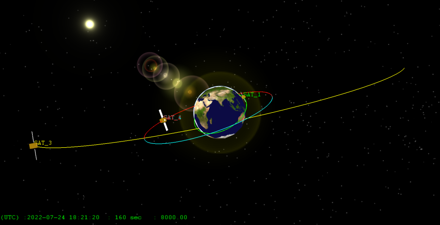

图1-1预期3D仿真结果

## 二、操作步骤

（参见案例“Demo_0101_Orbit_Basic”）

 

### 1.新建场景

启动SpaceSim软件，点击“新建场景”，输入场景名称，时间参数保持默认，点击OK完成。如图1-2所示。

图1-2 新建场景

 

### 2.添加卫星

菜单栏点击“模型”，选择“添加卫星”，如图1-3所示。 

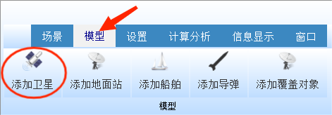

图1-3 通过菜单栏添加卫星

 

也可以在左侧的Object Viewer栏，卫星标签上右键，选择“添加卫星”，如图1-4所示。

图1-4 通过Object Viewer添加卫星

 

### 3.设置卫星参数

在Object Viewer窗口下双击所添加的卫星对象，在弹出的参数框内选择理想轨道中的“理想二体”，输入低轨道卫星的轨道参数，卫星自动命名为SAT_1，同理生成SAT_2和SAT_3卫星，分别输入中轨道和高轨道的六根数，如图1-5所示。

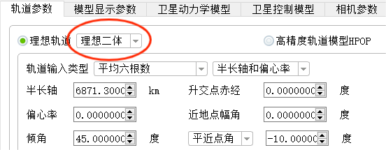

图1-5 设置卫星轨道参数

 

补充：对于中轨道卫星，由于具有偏心率，是椭圆轨道，也可通过设置近地点和远地点（轨道高度）来代替半长轴和偏心率参数（如图1-6所示），用该方法生成卫星SAT_4进行对比。

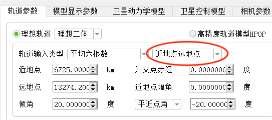

图1-6 通过轨道高度设置卫星轨道参数

 

可以在“卫星设置-模型显示参数”栏中，修改卫星名称和运行轨道颜色，便于分辨各卫星的运动，如图1-7所示。

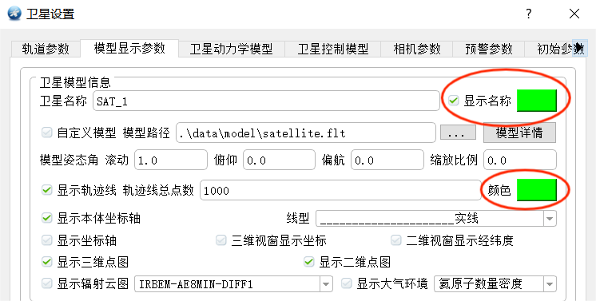

图1-7 修改卫星名称和轨迹颜色

 

可以在“卫星设置-初始参数”栏中，修改卫星初始姿态参数以及显示缩放大小，如图 1-8所示。

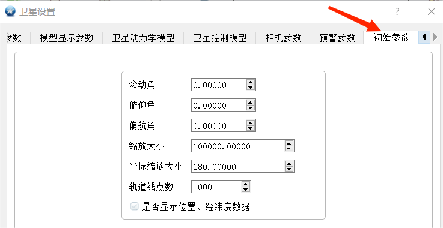

图 1-8 修改卫星姿态与缩放参数

 

### 4.添加输出

在Object Viewer栏中双击“输出（Output）”，如图1-9所示。

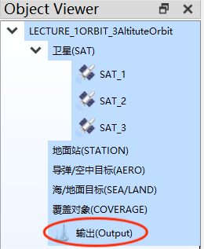

图1-9 选中输出（Output）

选中所要输出的对象（此处以SAT_1为例），在轨道一栏中选择“惯性系位置速度”，点击选择输出，如图1-10所示。

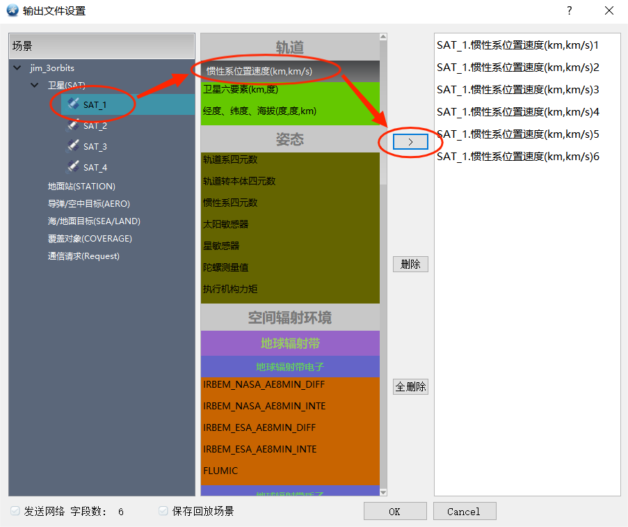

图1-10 选择输出参数

 

### 5.仿真过程

在“场景”栏下点击“开始仿真”按钮，播放仿真动画，如图1-11所示。

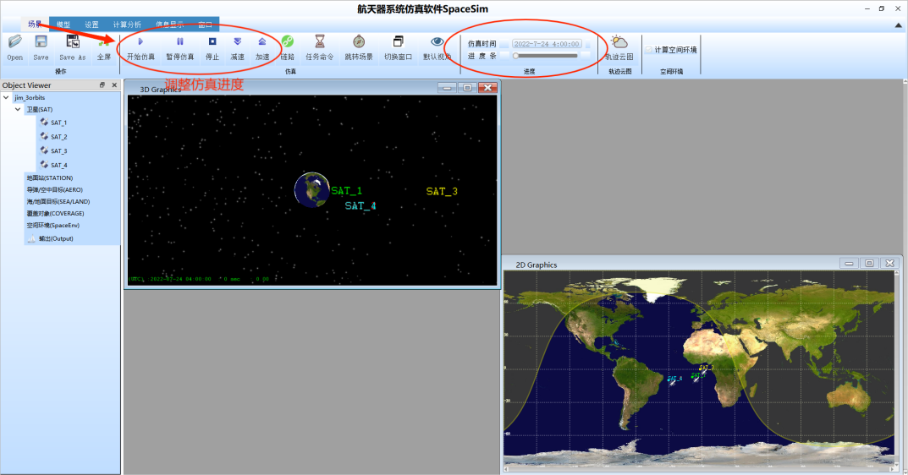

图1-11 动画仿真演示

 

通过演示控制台可以调整动画仿真进度，包括演示动画的播放速度和播放重置等。

## 三、结果分析

### 1.仿真结果

动画仿真的结果如图1-12、图1-13所示。

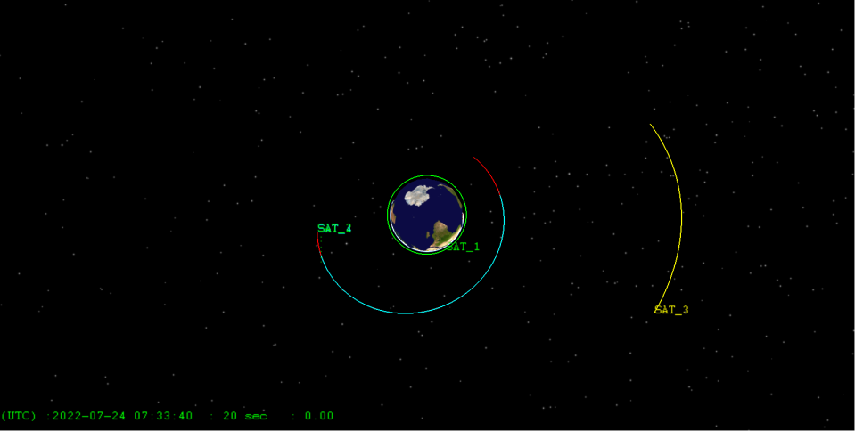

图1-12 仿真结果3D

 

图1-13 仿真结果2D

 

进入SpaceSim的安装目录，进入下列文件夹：

..\SpaceSim\scenes\LECTURE_1ORBIT_3AltituteOrbit\Output，找到输出的报告文件，如图1-14所示。

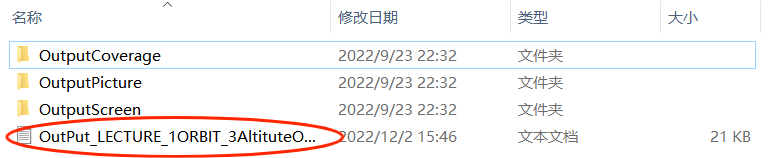

图1-14 输出文件路径

 

查看输出文件，文件输出结果如图1-15所示。

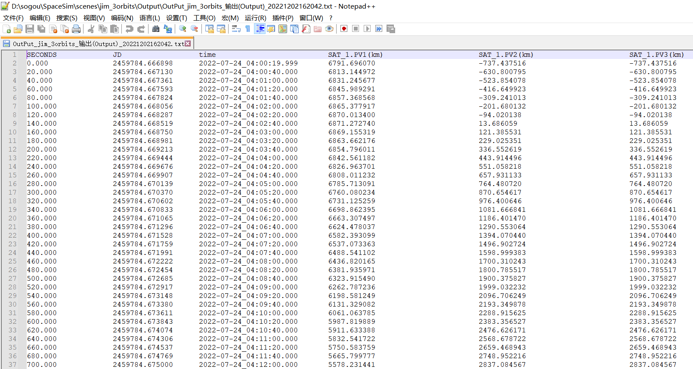

图1-15 查看输出报告

 

### 2.仿真分析

本次仿真任务通过构建低、中、高三种不同高度的轨道，模拟不同轨道类型的航天器运行的基本情况，从而对不同轨道的航天器在轨运行的基本特征（如在轨的位置、速度）有基本的了解。

 

# 案例2 地球同步静止轨道

## 一、任务要求

### 1.实验目的

（1）熟悉SpaceSim软件中地球同步静止轨道（即GEO轨道）的两种生成方式。

（2）通过仿真结果分析地球同步静止轨道特点。

 

### 2.实验内容

生成一条地球同步静止轨道，要求卫星定点经度与哈尔滨经度（126.63°）相同，观察其星下点轨迹。

轨道设计：

1.地球同步静止轨道为圆轨道，轨道参数：半长轴42166.3 km，轨道倾角0°，近地点幅角、真（平）近点角均为0°。

2.升交点赤经确定：由卫星定点的经度λ和仿真开始时刻决定升交点赤经（升交点到春分点的角距）=仿真时刻格林尼治到春分点的角距+卫星定点经度到格林尼治的角度。
$$
\Omega=\theta_{T_0} + \lambda
$$

${\theta}_{T_0}$——$T_0$时刻GMST对应的角度（单位度)

$\lambda$——卫星定点经度（单位度)

本次任务中仿真开始时刻为：2022年7月24日04：00：00，则

$$
\Omega=\theta_{T_0}+\lambda=1.8634^o+126.63^o=128.4934^o
$$

### 3.预期结果

地球同步静止轨道为高轨圆轨道，运行周期与地球自转同步，星下点轨迹应为一个点，其预期仿真结果大致如图 2-1所示。

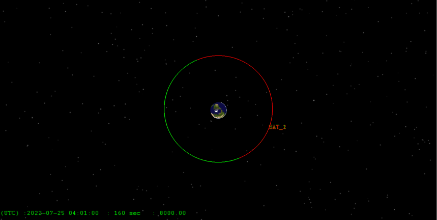

图 2-1 地球同步静止轨道仿真预期结果

 

## 二、操作步骤

（参见案例“Demo_0102_Orbit_GEO”）

 

### 1.新建场景

启动SpaceSim软件，点击“新建场景”，输入场景名称。由于本次仿真中卫星的升交点赤经值由仿真时间计算所得，需要将仿真时间与案例中统一，仿真开始时刻设置为：2022/7/24_04:00:00，具体设置如图 2-2所示。

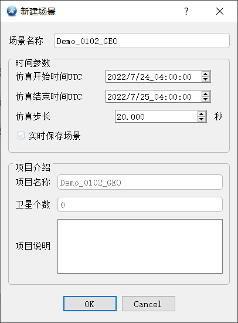

图 2-2 新建场景

 

### 2.设置卫星参数

在场景中添加一颗卫星，默认命名为SAT_1，设置其参数如下：半长轴42166.3 km，偏心率0，轨道倾角0°，升交点赤经128.4934°，近地点幅角、真（平）近点角0°，完成参数设置如图 2-3所示。

图 2-3 卫星参数设置

 

补充：由于参数中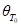的值随着仿真时间的变化而变化，因而升交点赤经的值设置较为繁琐，SpaceSim中提供了更加便捷的设置方案。在轨道设置中选择地球同步静止轨道，输入卫星定点经度（126.63°），如图 2-4所示。

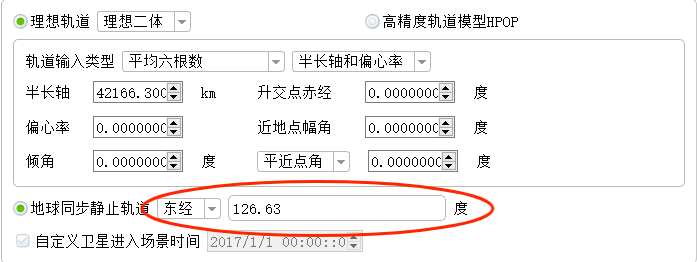

图 2-4 简便卫星参数设置

 

通过该方法设置的地球同步静止轨道卫星，SpaceSim会自动调整其轨道参数，维持所设置的定点经度。用此方法生成SAT_2进行对比。

可以在“卫星设置-模型显示参数”栏中，选择“二维视窗显示经纬度”，如图 2-5所示，以便于观察地球同步静止轨道卫星的星下点位置变化情况。

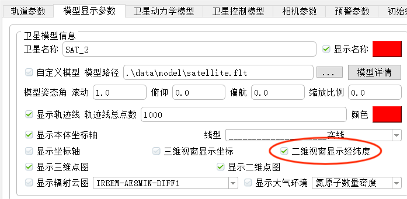

图 2-5 添加经纬度显示

 

### 3.仿真过程

点击“开始仿真”按钮，如图 2-6所示，播放仿真动画。

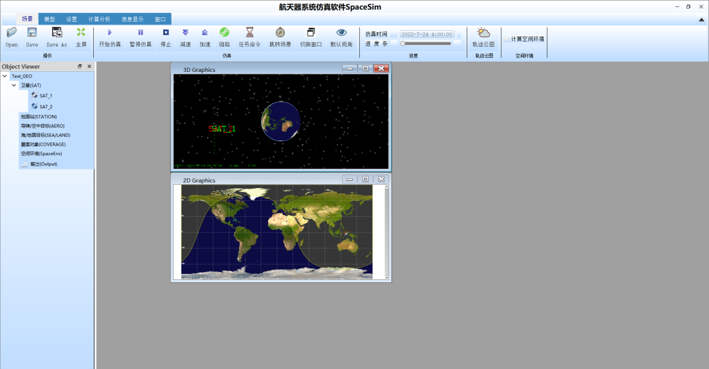

图 2-6 动画仿真演示

 

## 三、结果分析

### 1.仿真结果

仿真结果如图 2-7、图 2-8所示。

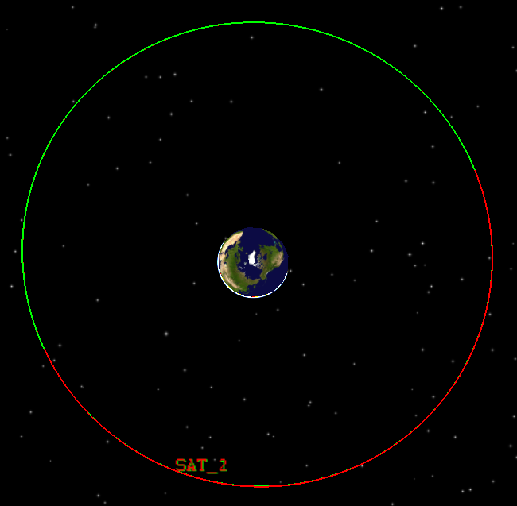

图 2-7 仿真结果3D

 

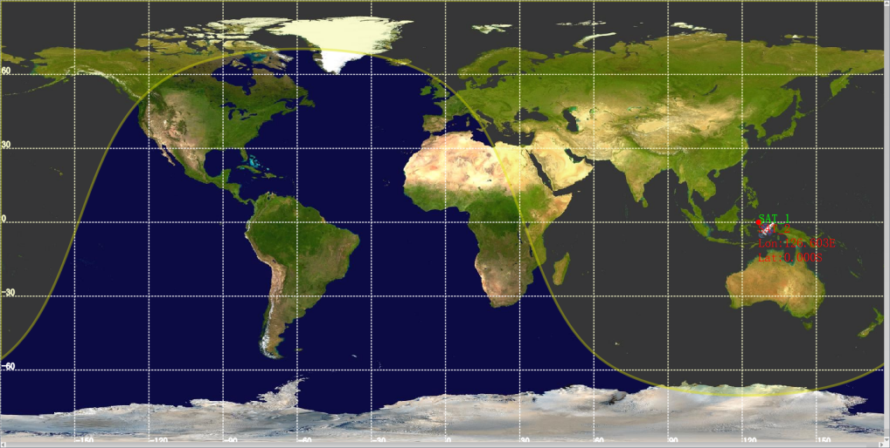

图 2-8 仿真结果2D

 

### 2.仿真分析

本次实验通过构建地球同步静止轨道，观察和了解其星下点轨迹的性质。从模拟结果可以看出，静止轨道的星下点基本保持不变，静止在赤道上方某一位置。

然而，同时也可以看出，由于地球摄动力等因素的存在，地球同步静止轨道的星下点并非绝对静止。随着仿真时间的增加，静止轨道卫星的星下点位置也在缓慢地发生着变化。

 

# 案例3 两体模型与HPOP模型精度对比

## 一、任务要求

### 1.实验目的

（1）熟悉SpaceSim中不同仿真模型的仿真精度和差异

（2）了解不同仿真模型之间差异的来源，对J2摄动、J4摄动及HPOP模型中摄动力有初步的认识

 

### 2.实验内容

在SpaceSim平台中分别通过理想二体模型、J2模型、J4模型和HPOP模型生成4种卫星轨道，通过仿真分析观察不同精度模型下卫星的运动情况。

卫星的轨道参数如下：半长轴6871 km，偏心率0（圆轨道），轨道倾角45°，升交点赤经0°，近地点幅角0°，真（平）近点角0°。

 

### 3.预期结果

由于不同模型之间存在仿真精度的差异，因而在经过足够长的时间之后，4种卫星轨道间应该开始出现分离，如图 3-1所示。

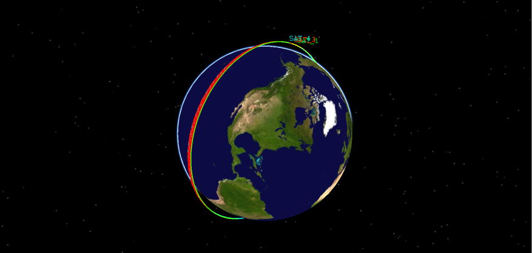

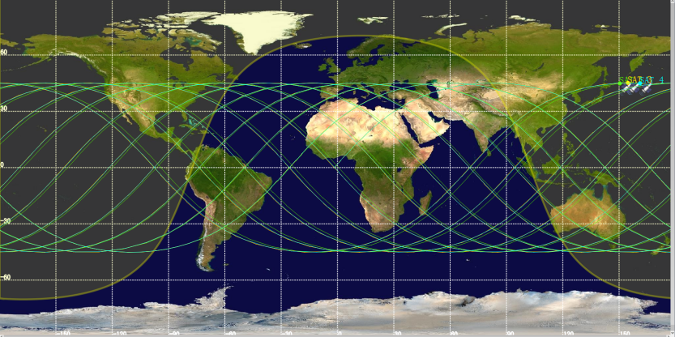

图 3-1 卫星轨道出现分离

 

## 二、操作步骤

（参见案例“Demo_0103_Orbit_ModelCom”）

 

### 1.新建场景

启动SpaceSim软件，点击“新建场景”，输入场景名称，仿真时间保持默认，设置完毕如图 3-2所示。

图 3-2 新建场景

 

### 2.设置卫星参数

在场景中插入4颗卫星，保持默认命名。4颗卫星的轨道参数设置均如下：半长轴6871 km，偏心率0（圆轨道），轨道倾角45°，升交点赤经0°，近地点幅角0°，真（平）近点角0°。完成设置如图 3-3所示。

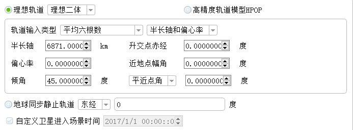

图 3-3 设置卫星参数

 

其中，SAT_1~3这3颗卫星的仿真模型选择“理想轨道”，在“理想轨道”后的类型中分别选择“理想二体”、“J2摄动”、“J4摄动”，如图 3-4所示。    

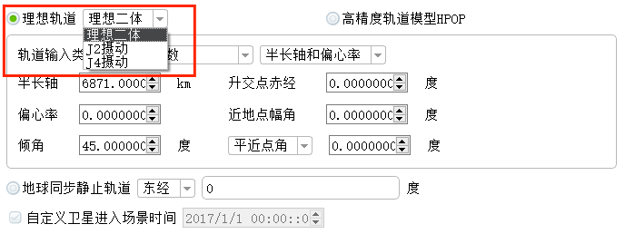

图 3-4 “理想轨道”仿真模型

 

而SAT_4卫星的仿真模型选择“高精度轨道模型HPOP”，如图 3-5所示。

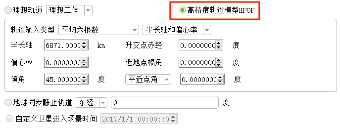

图 3-5 HPOP模型

 

### 3.添加输出

在Object Viewer栏中双击“输出（Output）”，将4颗卫星的“惯性系位置速度”和“经度、纬度、海拔高度”输出成文件，如图 3-6所示，便于后续的分析。

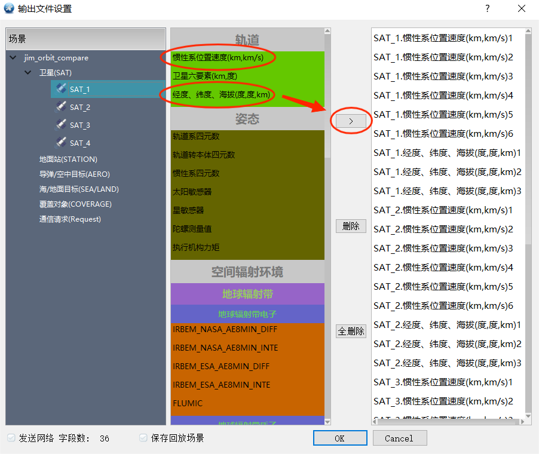

图 3-6 选择输出参数

 

### 4.仿真过程

点击“开始仿真”，播放仿真动画，如图 3-7所示，运行至动画结束。注意观察4颗卫星轨道的变化情况。

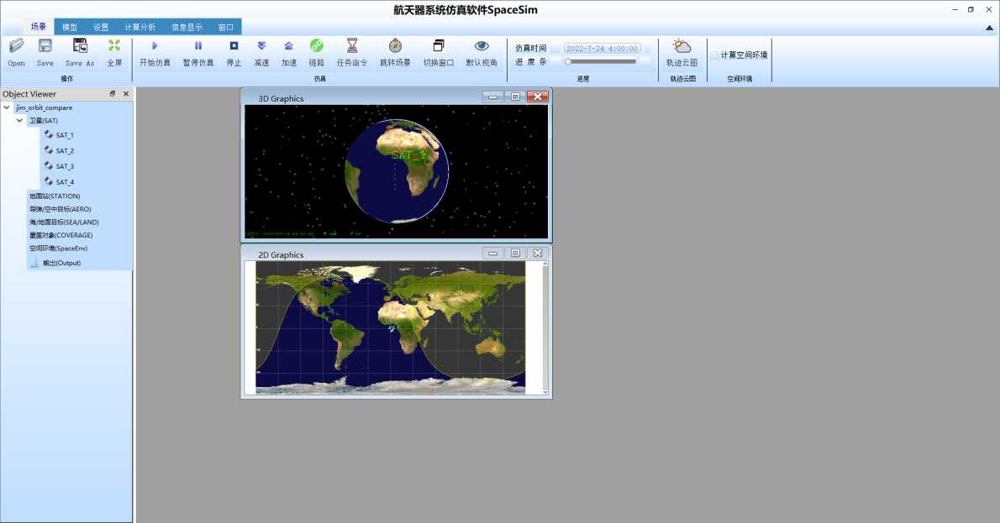

图 3-7 动画仿真演示

 

## 三、结果分析

### 1.仿真结果

动画仿真的结果如图 3-8、图 3-9所示。

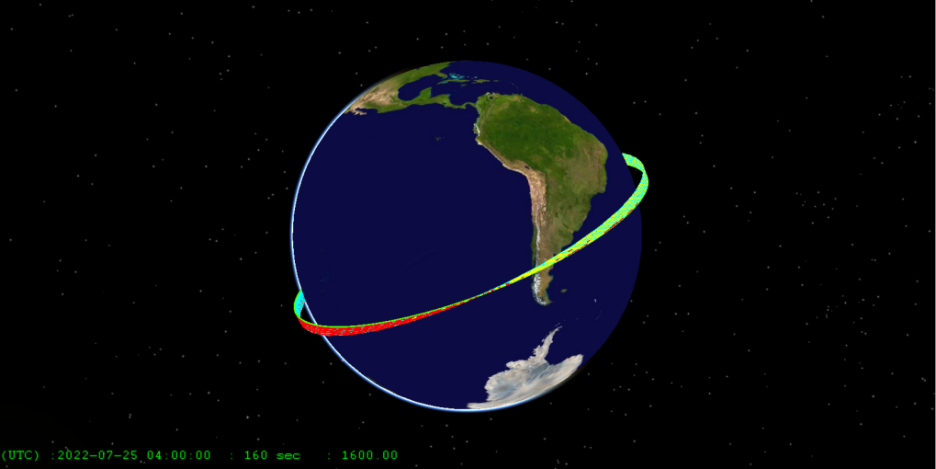

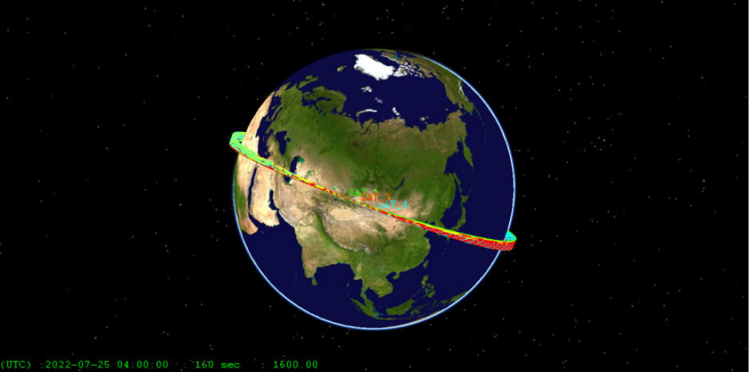

图 3-8 仿真结果3D

 

图 3-9 仿真结果2D

文件输出结果如图 3-10所示。

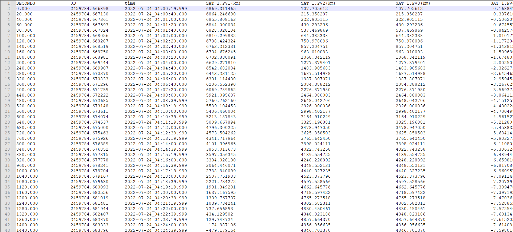

图 3-10 输出结果

 

### 2.仿真分析

从动画仿真结果可以看出，随着仿真时间的延长，4颗卫星的轨道逐渐与原有的轨道发生偏离，在不同摄动力作用下轨道的变化也不同，最终出现了如图 3-9所示的轨道分离。

将输出文件的数据导入matlab，并绘制对比图样，得到如图 3-11、图 3-12、图 3-13所示的结果。

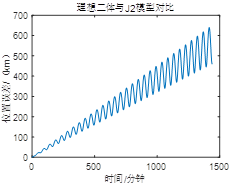

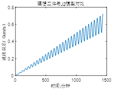

 

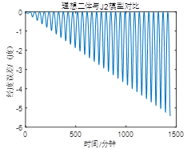

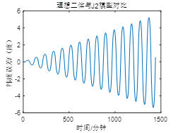

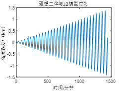

图 3-11 理想二体与J2模型对比

 

仿真一天的最大位置误差达到650 km，最大速度误差超过0.7 km/s；经度误差约5°，纬度误差5°，高度误差约1.4km。 

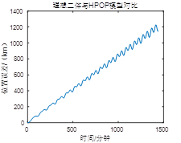

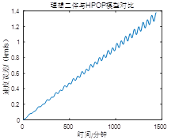

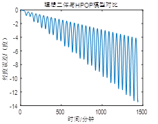

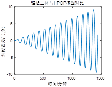

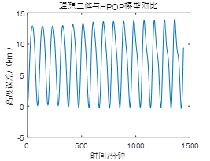

图 3-12 理想二体与HPOP模型对比 

仿真一天的最大位置误差达到1200km，最大速度误差超过1.4km/s；经度误差约13°，纬度误差9°，高度误差约14km。

 

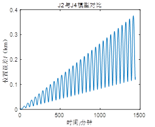

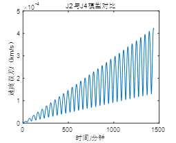

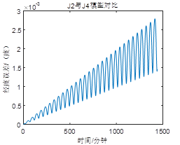

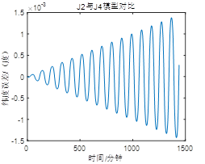

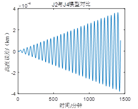

图 3-13 J2模型与J4模型对比

 

仿真一天的最大位置误差不到0.4km，最大速度误差不到0.5m/s；经度误差不到0.003°，纬度误差不到0.015°，高度误差不到0.4m。 

思考题：对于中轨道和高轨道卫星，理想二体模型、J2模型、J4模型与HPOP模型在轨道预报方面精度方面会有什么样的差异呢？

# 案例4 太阳同步轨道设计及仿真

## 一、任务要求

### 1.实验目的

（1）熟悉SpaceSim中太阳角的输出功能。

（2）掌握太阳同步轨道的设计与验证方法。

 

### 2.实验内容

设计一条太阳同步轨道，要求轨道高度800km，偏心率为0，降交点地方时为18:00:00，在SpaceSim中完成模拟仿真。 

轨道设计：

轨道半长轴为：$a=800+6378.137km=7178.137km$;

轨道倾角的余弦为：$cosi=\frac{a^{7/2}\Omega_{SunSyn}(1-e^2)^2}{3{R_E}^2J_2\sqrt\mu}=-0.1495$

其中，$\Omega_{SunSyn}=0.9856(^o/day)$,是太阳同步轨道面的漂移速率。

可知轨道倾角：$i=98.6^o$

升交点赤经由降交点地方时确定，仿真开始时间为4:00:00，故有：
$$
\Omega=\theta_{T_0}+(\theta_{LDTN}-\theta_{GMST})-180^o=1.8634^o+15^o\times(18-4)-180^o=31.8634^o;
$$
近地点幅角和真（平）近点角均取为0°。

 

### 3.预期结果

太阳同步轨道平面绕地球自转轴的旋转方向和角速度与地球绕太阳公转的方向和平均角速度相同，因而轨道平面和太阳始终保持相对固定的取向。

预期结果如图 4-1所示，该轨道的轨道平面应始终与太阳光线保持固定的夹角。

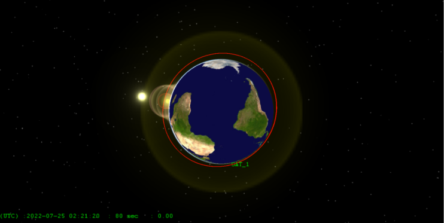

图 4-1 太阳同步轨道

## 二、操作步骤

（参见案例“Demo_0104_Orbit_SunSyn”）

 

### 1.新建场景

启动SpaceSim软件，点击“新建场景”，输入场景名称。本次仿真中卫星的升交点赤经值由仿真时间计算所得，需要将仿真时间与案例中统一，仿真开始时刻设置为：2022/7/24_04:00:00。

由于太阳同步轨道变化速度慢，需要较长的仿真时间才能观察到较为明显的现象，案例中结束时刻设置为：2022/8/24_04:00:00，可根据需要自行延长或缩短，完成设置如图 4-2所示。

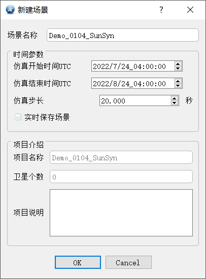

图 4-2 新建场景

 

### 2.设置卫星参数

在场景中添加一颗卫星，保持默认命名SAT_1。

设置轨道参数如下：半长轴7178.137 km，偏心率0，轨道倾角98.6°，升交点赤经31.8634°，近地点幅角、真（平）近点角0°，完成设置如图 4-3所示。

注意要将轨道模型修改为J2摄动。

图 4-3 太阳同步轨道参数设置

 

### 3.添加输出

在Object Viewer栏中双击“输出（Output）”，将卫星的“卫星六要素”和“太阳角”数据输出成文件，如图 4-4所示，后续可利用输出数据进一步分析太阳同步轨道的性质。

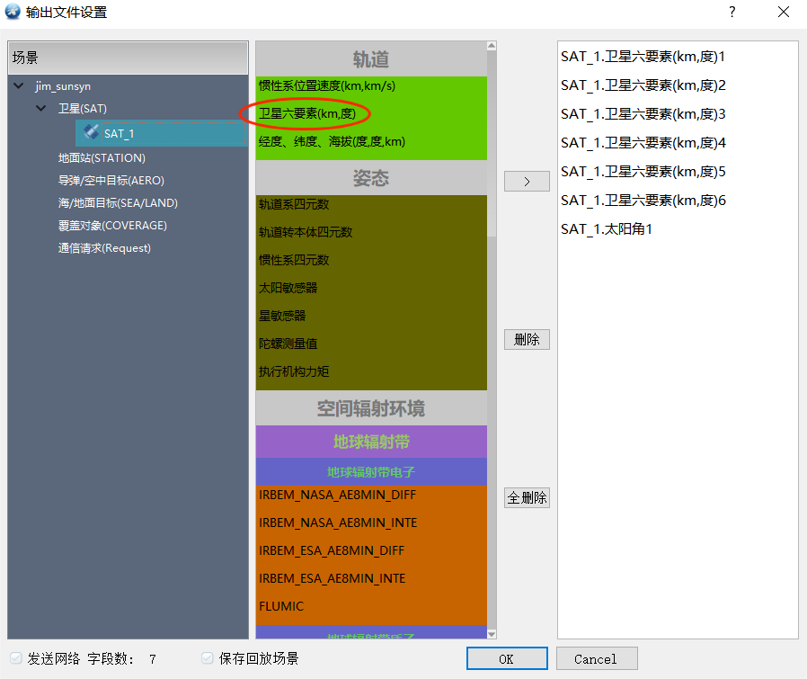

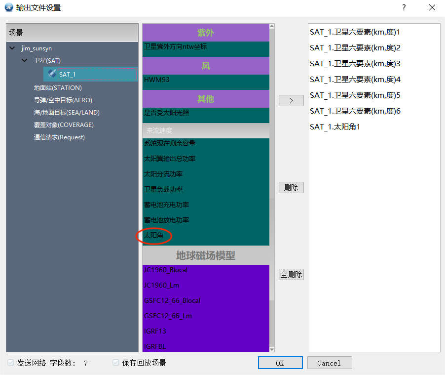

图 4-4 选择输出参数

 

### 4.仿真过程

点击“开始仿真”，播放仿真动画。在模拟仿真过程中，太阳的位置会发生变化，建议将视角调整到视图边缘，如图 4-5所示的位置，便于观察太阳的移动以及与轨道面之间的相对关系。

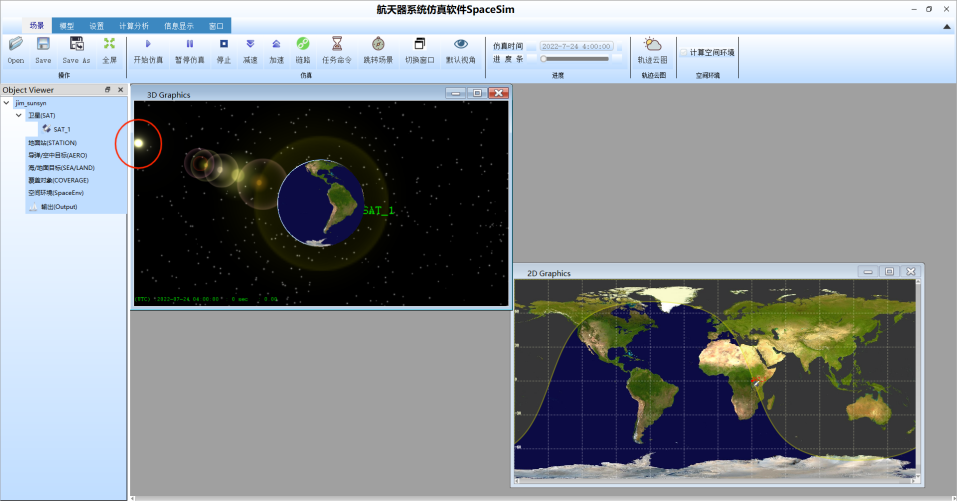

图 4-5动画仿真演示

 

## 三、结果分析

### 1.仿真结果

动画仿真结果如图 4-6、图 4-7所示。

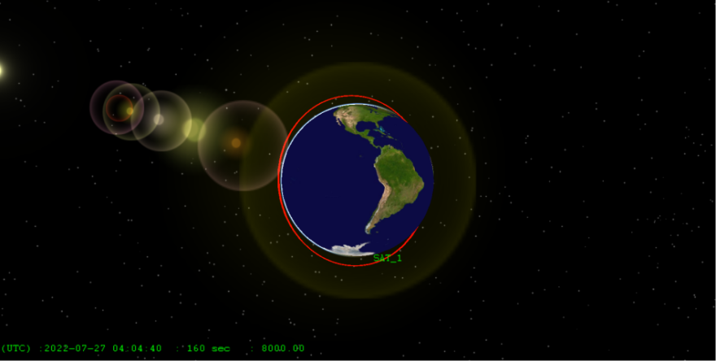

图 4-6 仿真结果3D

 

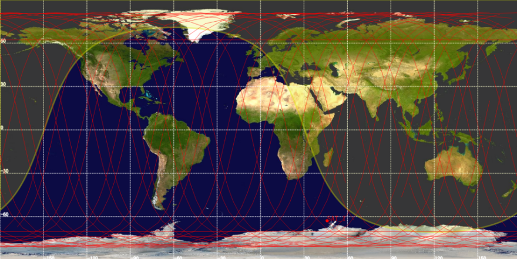

图 4-7 仿真结果2D

 

输出文件如图 4-8所示。

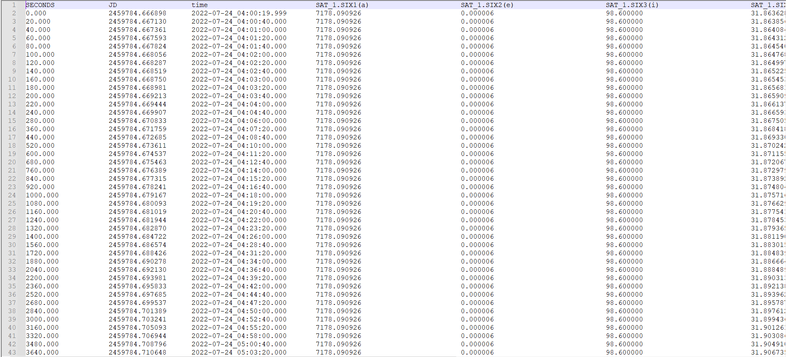

图 4-8 输出文件

 

### 2.仿真分析

从图 4-6的动画仿真结果可以看出，随着时间变化，太阳位置逐渐改变，而太阳同步轨道的轨道面也随之变化，太阳方向和轨道面之间夹角基本保持恒定。这与预期结果基本吻合。

将图 4-8所示的输出文件导入matlab等分析软件，绘制分析图样，得到图 4-9、图 4-10所示的结果。

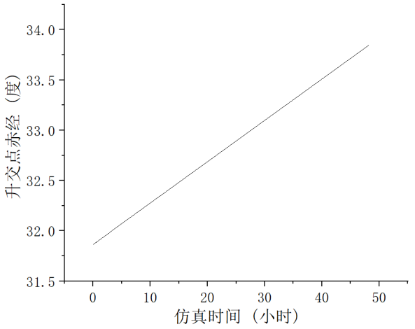

图 4-9 升交点赤经2天的变化

 

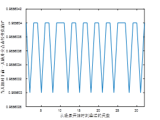

图 4-10 升交点赤经一个月的变化率

可以看到，升交点赤经的变化值维持在0.9856°（向东）左右，这与地球公转速度基本相同，因此轨道平面与太阳方向的夹角总体上保持不变。

但实际中由于轨道倾角和地球公转带来的变化，导致Z方向会产生变化，进而导致太阳角取值的小范围变化。

# 案例5 冻结轨道设计及仿真——前苏联莫尔尼亚（Molniya）闪电轨道

## 一、任务要求

### 1.实验目的

（1）了解莫尔尼亚（Molniya）闪电轨道的参数与轨道特性。

（2）掌握闪电轨道的设计思想和方法

 

### 2.实验内容

设计一条冻结轨道，要求其在北半球上空的滞留时间尽可能的长，轨道周期为12小时，近地点高度500 km，观察星下点特点。

 

轨道设计：

冻结轨道的总体设计要求可概括为：近地点辐角对时间变化为零，偏心率对时间变化为零。

具体表示如下：

$$
d\omega/dt = \frac{3nJ_2R^2}{a^2(1-e^2)^2}  (1-5/4)sin^2i
$$

$$
\times[1+\frac{J_3R}{2J_2a(1-e^2)} - \frac{sin^2i-ecos^2i}{sini}\frac{sin\omega}{e}] = 0
$$

$$
\frac{de}{dt} = \frac{-3nR^3J_3sin(i)}{2a^3(1-e^2)^2}(1-\frac{5}{4}sin^2i)cos(\omega) = 0
$$

忽略摄动，令其为0，则公式中的关系可简化为：$1-\frac{5}{4}sin^2i=0$，则轨道倾角等于63.4或116.6度，本次任务取轨道倾角为63.4°；

轨道近地点在轨道平面内不改变位置，为了使卫星在北半球的留空时间尽可能的长，取其近地点幅角为270°；

轨道半长轴为：

$a=\sqrt[3]{\frac{{\mu}T^2}{4\pi^2}}=26610.2km;$

离心率为：$e=1-\frac{h_p+R_E}{a}=0.7415;$

升交点赤经和真（平）近点角均取为0°。

 

### 3.预期结果

根据设计目标，闪电轨道应当在北半球上空的滞留时间尽可能的长，其星下点轨迹长时间停留在北半球高纬度地区，而在南半球及北半球低纬地区则运动较快。

预期仿真结果应当如图 5-1所示。

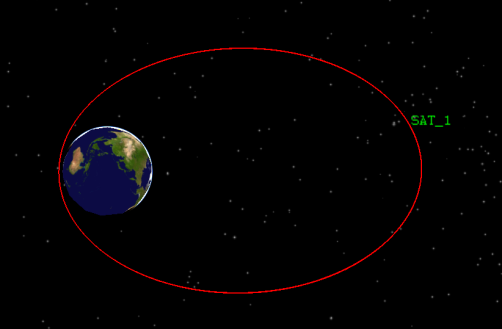

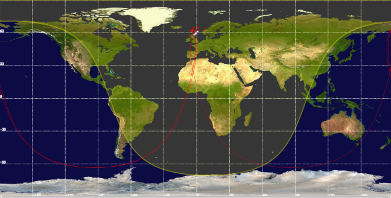

图 5-1 闪电轨道预期仿真结果

 

## 二、操作步骤

（参见案例“Demo_0105_Orbit_FrozenMolniya”）

 

### 1.新建场景

启动SpaceSim软件，点击“新建场景”，输入场景名称，其他设置保持默认。

 

### 2.设置卫星参数

在场景中插入一颗卫星，保持默认命名SAT_1。

设置轨道参数如下：半长轴26610.2 km，偏心率0.7415，轨道倾角63.4°，升交点赤经0°，近地点幅角270°，真（平）近点角0°，设置完成如图 5-2所示。

注意将轨道模型修改为J2摄动。

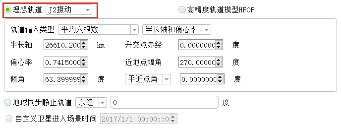

图 5-2 闪电轨道卫星参数设置

 

### 3.仿真过程

点击“开始仿真”，播放仿真动画，注意观察卫星星下点的运动特点。

 

## 三、结果分析

### 1.仿真结果

动画仿真结果如图 5-3、图 5-4所示。

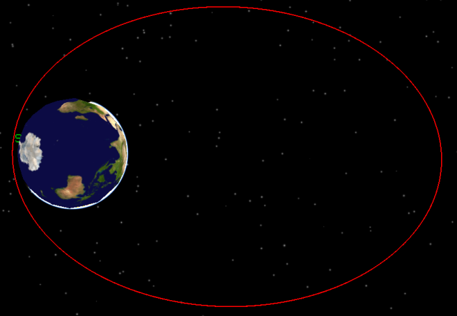

图 5-3闪电轨道卫星仿真结果3D

 

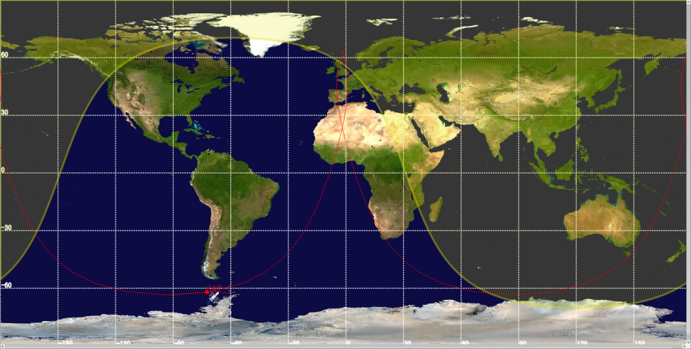

图 5-4闪电轨道卫星仿真结果2D

 

### 2.仿真分析

从图 5-3、图 5-4的动画仿真结果可以看出，闪电轨道卫星在北半球上空运行速度慢，滞留时间较长，其星下点轨迹长时间停留在北半球高纬度地区；而与之相反，在南半球及北半球低纬地区上空则运动较快，很好的满足了闪电轨道卫星对北半球高纬地区的覆盖需求。

# 案例6 冻结轨道设计及仿真——美国海卫-1卫星轨道

## 一、任务要求

### 1.实验目的

（1）掌握除闪电轨道以外的冻结轨道设计方法与轨道特性。

（2）掌握海卫-1卫星轨道的设计思想和方法

 

### 2.实验内容

1972年，NASA启动Seasat卫星（海洋卫星，简称海卫）项目。

要求轨道高度控制在858 km~761 km区间内，高度变动控制±50 m/s，要求偏心率越小越好。

 

轨道设计：

依照任务要求，需要设计一条参数符合要求的冻结轨道。

已知冻结轨道的总体设计要求为：近地点辐角对时间变化为零，偏心率对时间变化为零。

具体表示如下：

$$
\frac{d\omega}{dt} = \frac{3nJ_2R^2}{a^2(1-e^2)^2}(1-\frac{5}{4}sin^2(i))
$$

$$
\times[1+\frac{J_3R}{2J_2a(1-e^2)} - \frac{sin^2i - ecos^2i}{sin(i)} \times \frac{sin\omega}{e}] = 0
$$

$$
\frac{de}{dt} = \frac{-3nR^3J_3sin(i)}{3a^3(1-e^2)^2}(1-\frac{5}{4}sin^2i)cos\omega = 0
$$

考虑地球扁率$J2$和$J3$的叠加影响，如果$\omega=90^o$或者270°，则$cos\omega$为0，恒有$\frac{de}{dt}=0$；

为使得$\frac{d\omega}{dt}=0$，可以令式中$[1+\frac{J_3R}{2J_2a{(1-e^2)}}-\frac{sin^2i-ecos^2i}{sini}\frac{sin\omega}{e}]=0$，对于1000公里以下的近地轨道，把$w=90^o$代入并忽略偏心率的高阶小量，可以得到：

$$
e=\frac{sin(i)}{cos(i)cot(i) - \frac{2J_2a}{J_3R}}
$$

当偏心率、倾角和轨道半长轴成一定关系，这个轨道的拱线偏心率就能固定，不需要临界倾角，且经计算，偏心率很小。 

美国发射的海卫-1卫星，就采用了以上设计方案，其具体的轨道参数如下：

轨道倾角：108º；

远地点高度：799 km；

近地点高度：775 km；

周期：101 min；

升交点赤经：0°；

近地点幅角：90°；

真（平）近点角：0°

 

### 3.预期结果

海卫-1卫星轨道偏心率很小，是一个近圆轨道。同时，轨道倾角为108º，属于逆行轨道，预期仿真结果应当如图 6-1、图 6-2所示。

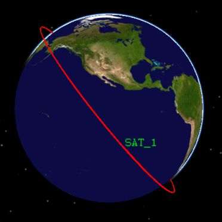

图 6-1 海卫-1卫星轨道预期结果3D

 

图 6-2 海卫-1卫星预期结果2D

 

## 二、操作步骤

（参见案例“Demo_0106_Orbit_FrozenSeasat1”）

 

### 1.新建场景

启动SpaceSim软件，点击“新建场景”，输入场景名称，其他设置保持默认。

 

### 2.设置卫星参数

在场景中插入一颗卫星，保持默认命名SAT_1。

该卫星采用近远地点设置轨道，轨道参数如下：远地点高度799 km，近地点高度775 km，轨道倾角108º，升交点赤经0°，近地点幅角，90°，真（平）近点角：0°，设置完成如图 6-3所示。

注意将轨道模型修改为J4摄动。

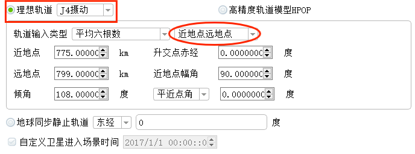

图 6-3 海卫-1参数设置

 

### 3.添加输出

将“经度、纬度、海拔”输出成文件，便于后续的进一步分析。

 

### 4.仿真过程

点击“开始仿真”，播放仿真动画。

 

## 三、结果分析

### 1.仿真结果

动画仿真结果如图 6-4、图 6-5所示。

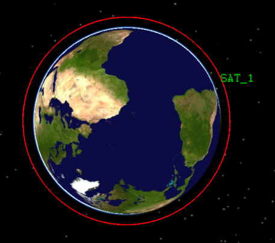

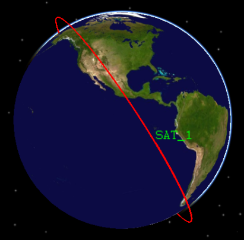

图 6-4 海卫-1仿真结果3D

 

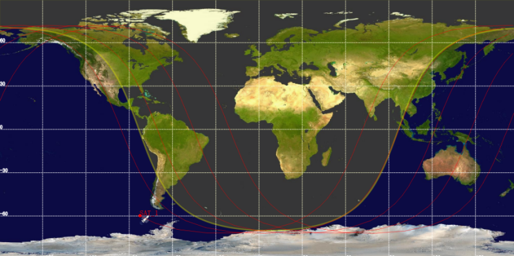

图 6-5 海卫-1仿真结果2D

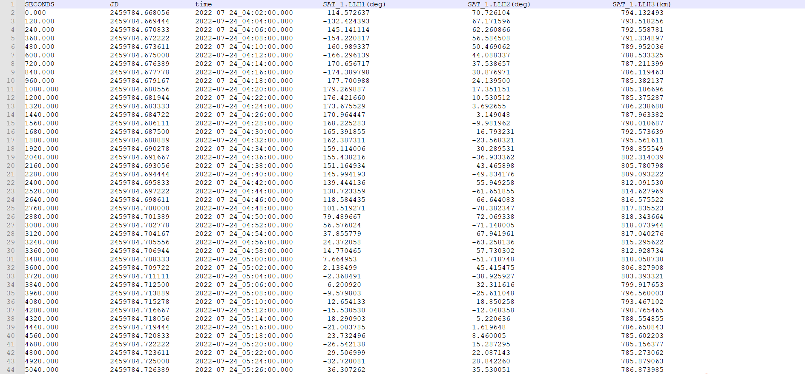

图 6-6 海卫-1仿真输出文件

 

### 2.仿真分析

从图 6-4可以看出，海卫-1卫星轨道偏心率很小，是一个近圆轨道。同时，轨道倾角为108º，属于逆行轨道。

将输出文件的结果导入分析软件中，可得图 6-7所示的结果。

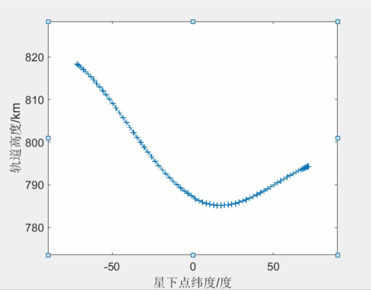

图 6-7 海卫-1卫星轨道高度变化情况

 

从图 6-7可以看出，随着星下点纬度的变化，海卫-1卫星的轨道高度在780~820 km之间变化，高度变化小于40 km，满足海卫-1卫星的轨道设计要求。

# 案例7 冻结轨道设计与仿真——冻结轨道参数对比

## 一、任务要求

### 1.任务目的

了解近地点幅角漂移对轨道星下点纬度的影响以及冻结轨道的优势。

 

### 2.实验内容

以海卫-1卫星轨道的参数为基础，分别研究近地点幅角漂移5°，25°，90°时，轨道高度与近地点纬度之间的关系。

 

轨道参数如下：

轨道倾角：108º；

远地点高度：799 km；

近地点高度：775 km；

升交点赤经：0°；

近地点幅角：90°（无漂移），85°（漂移5°），65°（漂移25°），0°（漂移90°）；

真（平）近点角：0°

 

### 3.预期结果

4颗卫星的幅角存在明显差异，在轨道上分别运行，预期结果应如图 7-1所示，后续更详细的研究需通过其他分析软件完成。

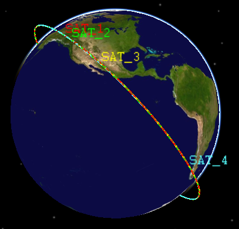

图 7-1 冻结轨道参数对比预期结果

 

## 二、操作步骤

（参见案例“Demo_0107_Orbit_FrozenOmegaCom”）

 

### 1.新建场景

启动SpaceSim软件，点击“新建场景”，输入场景名称，其他设置保持默认。

 

### 2.设置卫星参数

在场景中插入4颗卫星，默认命名为SAT_1，SAT_2，SAT_3，SAT_4。在卫星设置中修改卫星参数。

4颗卫星均采用近远地点进行轨道参数设置，具体参数如下：近地点高度775 km，远地点高度799 km，倾角108度，升交点赤经0度，真（平）近点角0度。近地点幅角按照预定漂移程度依次设置。

SAT_1为无漂移冻结轨道，近地点幅角为90度；SAT_2漂移5度，所以近地点幅角为85度；SAT_3漂移25度，所以近地点幅角为65度；SAT_4漂移90度，所以近地点幅角为0度。

将轨道模型修改为J4摄动。

设置完毕时如图 7-2、图 7-3、图 7-4、图 7-5所示。

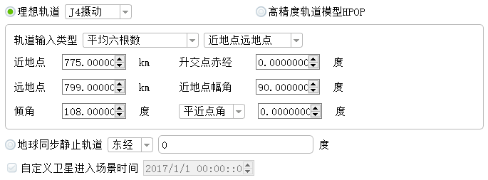

图 7-2 SAT_1参数设置

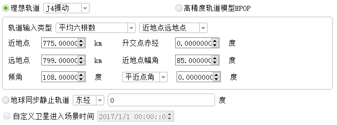

图 7-3 SAT_2参数设置

 

图 7-4 SAT_3参数设置

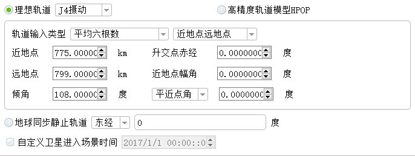

图 7-5 SAT_4参数设置

 

### 3.添加输出

将4颗卫星的“经度、纬度、海拔”添加到输出，用于后续的分析。

 

### 4.仿真过程

点击“开始仿真”，播放仿真动画。

 

## 三、结果分析

### 1.仿真结果

4颗卫星的空间分布如图 7-6所示。

图 7-6 卫星空间分布

 

星下点运动情况如图 7-7所示，可以看到，4颗卫星轨道的星下点轨道已经出现了较大程度的偏离。

查看输出文件，如图 7-8所示。

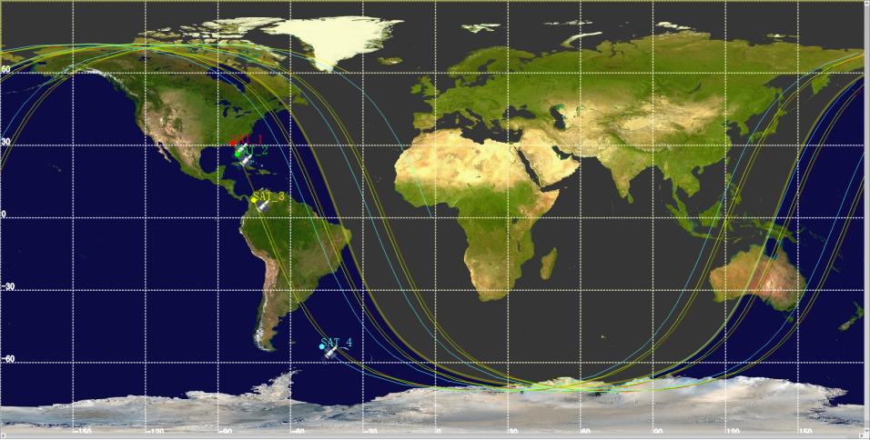

图 7-7 卫星星下点运动轨迹

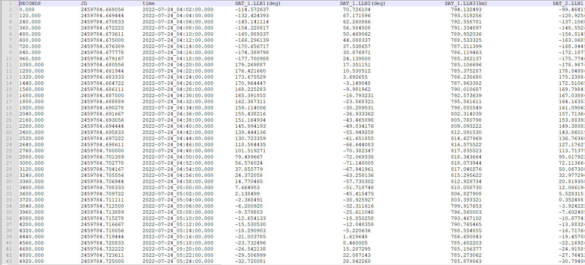

图 7-8 输出文件

 

### 2.仿真分析

将输出文献的结果导入分析软件中，绘制所示的“星下点纬度-轨道高度”分析图样。

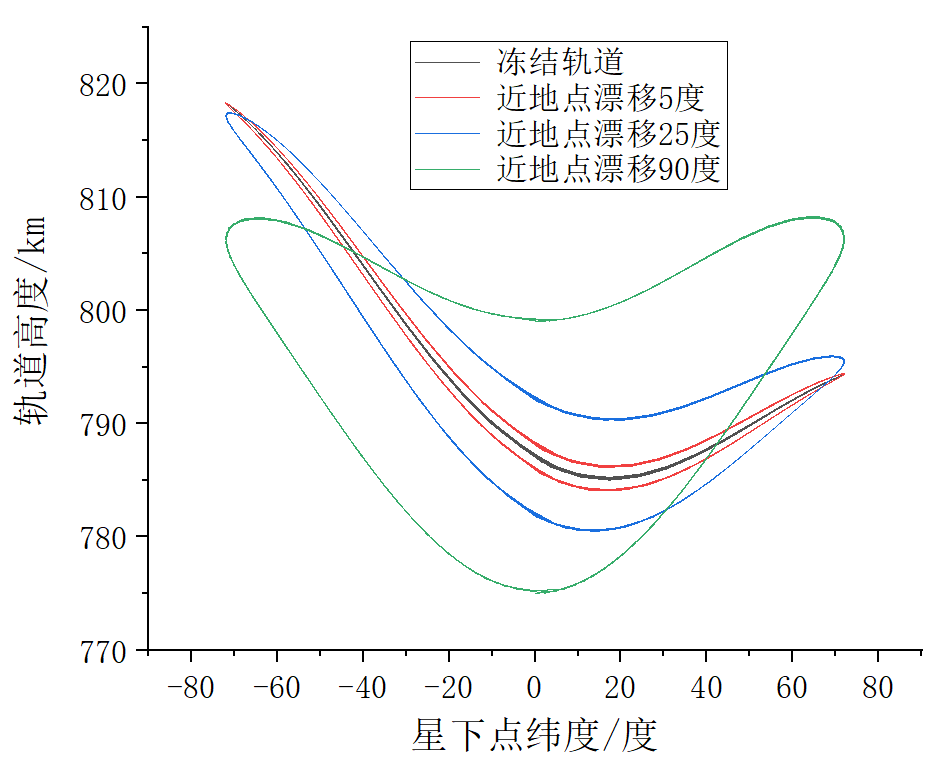

图 7-9星下点纬度-轨道高度图

 

可以看到，随着近地点幅角漂移（拱线漂移）程度的增加，轨道高度随星下点纬度的变化就越剧烈，这对于海卫-1的工作情况是非常不利的。因此，为了保证卫星持续、高效地工作，有必要采用冻结轨道来保证卫星的工作状态，达到预期的工作效果。

 

# 案例8 回归轨道设计及仿真

## 一、任务要求

### 1.实验目的

（1）学习回归轨道的概念和基本性质

（2）掌握回归轨道的设计方法以及星下点特性

 

### 2.实验内容

设计一条回归轨道，要求轨道高度在400 km左右，轨道倾角98°，每运行31圈星下点轨迹重复，第一圈起始位置的星下点经度为0°。

 

轨道设计：

（1）初步计算

根据轨道高度400 km可得半长轴为6778.137 km；

轨道周期为：$T=2\pi\sqrt{\frac{a^3}{\mu}}=92.56min$;

于是，每天运行圈数为$1440/T=15.5574$,即：$\frac{N}{D}=15.5574$。

其中：

是卫星每一次重复星下点轨迹运行的圈数，此处为31圈

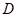为地球自转圈数

此处通过计算可得，$D=1.9926$day。因为N、D为既约整数，所以取$D=2day$。轨道每天运行圈数为：$\frac{N}{D}=15.5$

 （2）精确参数

由上一步可知：$\frac{N}{D}=15.5$，则：

精确的轨道周期：$T=\frac{1440}{15.5}=92.9032min$;

轨道半长轴为：$a=\sqrt[3]{\frac{{\mu}T^3}{4\pi^2}}=6794.8631km$;

考虑J2摄动后，半长轴为：$a=a+\frac{1}{J_2\mu}\left[\frac{4{\Omega}a^3}{3R_{\epsilon}}\right]-\frac{J_2R_\epsilon^2}{a}=6788.884km$;

升交点赤经为：$\Omega=\theta_{T_0}+\lambda=1.8634^o+0^o=1.8634^o$;

取近地点幅角、真（平）近点角为；

 

### 3.预期结果

回归轨道的星下点轨迹周期性出现重叠现象，即经过一定时间后，星下点轨迹又重新回到原来通过的路线。根据任务要求，回归轨道卫星应当在31圈后回到初始路线，预期结果如图 8-1所示。

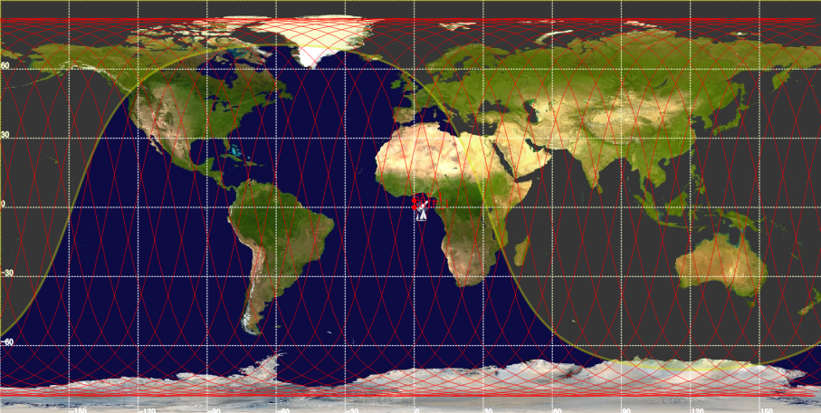

图 8-1 预期仿真结果

 

## 二、操作步骤

（参见案例“Demo_0108_Orbit_Repeat”）

 

### 1.新建场景

启动SpaceSim软件，点击“新建场景”，输入场景名称，仿真开始时刻设置为：2022/7/24_04:00:00，由于卫星的回归周期为2天，故需要将结束时间设置为：2022/7/26_04:00:00。

 

### 2.设置卫星参数

在场景中添加一颗卫星，保持默认命名SAT_1。

双击卫星对象进入属性设置，设置轨道参数如下：半长轴6794.8631 km，偏心率0，轨道倾角98º，升交点赤经1.8634º，近地点幅角、真（平）近点角为0º，设置完毕如图 8-2所示。

将轨道模型修改为J2摄动。

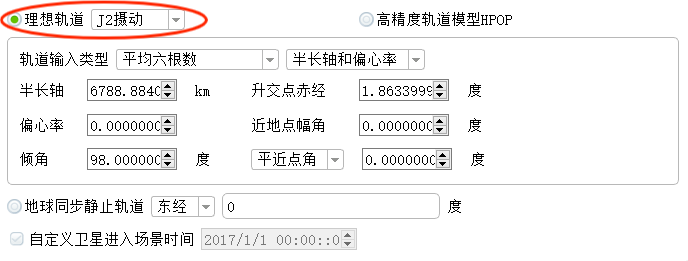

图 8-2 回归轨道卫星参数设置

 

在“模型显示参数中”，将轨迹线总点数修改为10000，便于后续轨迹线的观察，如图 8-3所示。

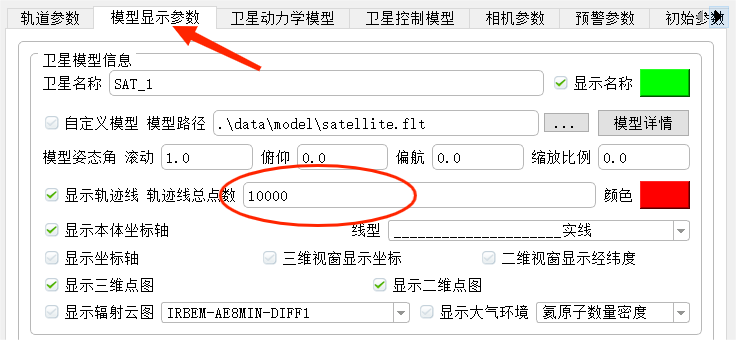

图 8-3 修改轨迹线点数

 

### 3.添加地面目标

为了更好地观察卫星的回归特性，需要在场景中添加一个地面目标，记录卫星的初始路径。

菜单栏点击“模型”，选择“添加船舶”，如图 8-4所示。

图 8-4 通过菜单栏添加船舶

 

也可以在左侧的Object Viewer栏，“海/地面目标”标签上右键，选择“添加船舶”，如图 8-5所示。

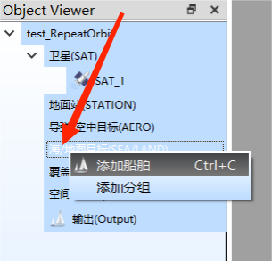

图 8-5 通过Object Viewer栏添加船舶

 

点击图标添加船舶，将时间设置为仿真开始时间，即2022/7/24, 04:00:00，经纬度均设置为0，如图 8-6所示。

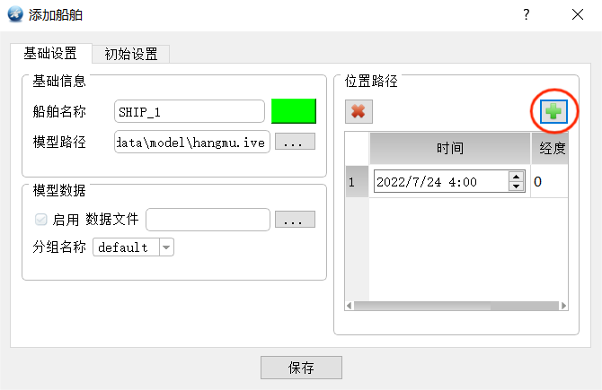

图 8-6 设置船舶参数

 

### 4.添加输出

在“输出（Output）”中将“经度、纬度、海拔”输出成文件，便于后续的进一步分析。

 

### 5.仿真过程

点击“开始仿真”，播放仿真动画，持续至仿真结束。注意观察结束时卫星与船舶的位置关系。

 

## 三、结果分析

### 1.仿真结果

卫星的星下点轨迹如图 8-7所示。

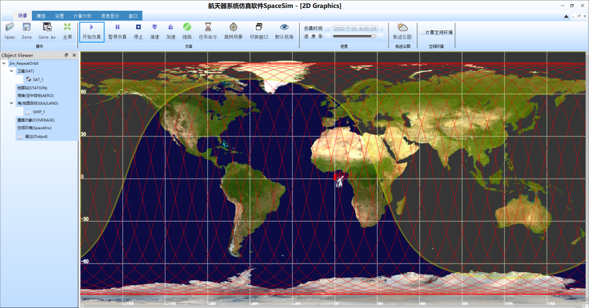

图 8-7 回归轨道星下点轨迹

 

### 2.仿真分析

从图 8-7可以看出，卫星在经过两天的运动后，又与船舶（即初始位置）重合，星下点轨迹周期性出现重叠现象，符合回归轨道的设计要求。

将输出文件导入分析软件，绘制分析图样，得到图 8-8所示的结果

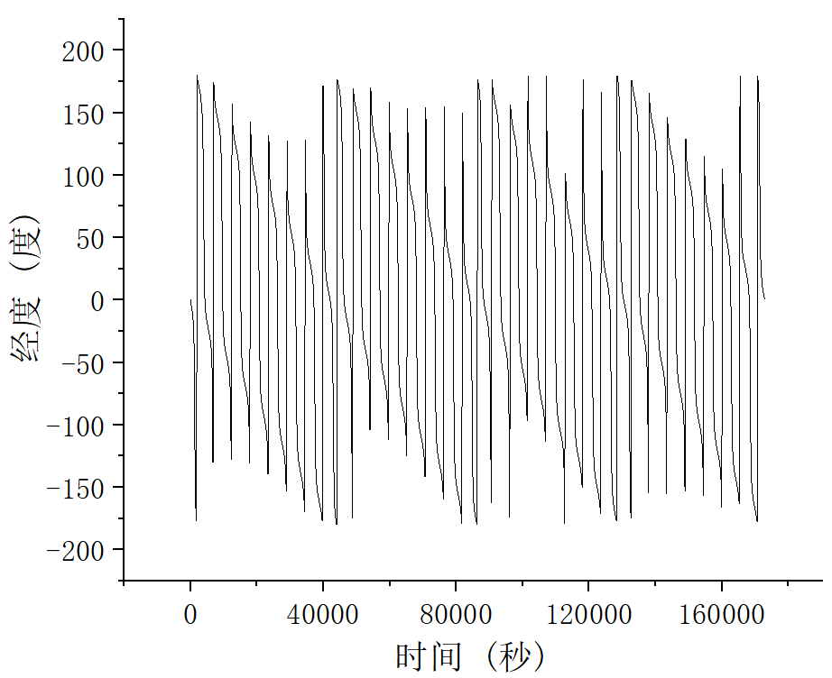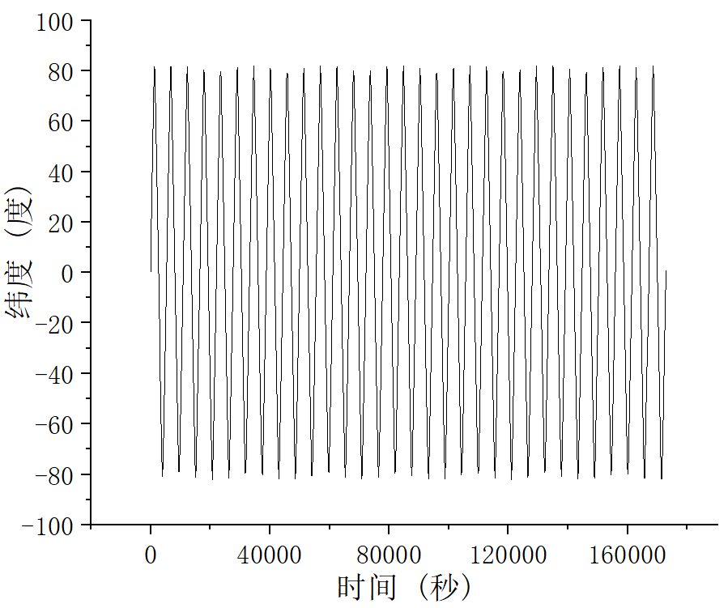

图 8-8 星下点轨迹变化情况

 

由图 8-8可见，2天后，星下点经纬度回归至0。

 

# 案例9 单脉冲变轨

## 一、任务要求

### 1.实验目的

（1）熟悉SpaceSim中利用速度脉冲指令方式进行单脉冲变轨。

（2）了解在近地点与远地点进行单脉冲变轨对轨道形状的影响。

 

### 2.实验内容

在场景中生成3颗卫星，其轨道参数如下：

半长轴为：$a=16371km$;

偏心率为：$e=0.2$;

轨道倾角、升交点赤经、近地点幅角、真近点角均取为$0^o$。

 其中：

卫星1恒沿上述轨道运行；

卫星2在轨道近地点进行单脉冲加速，脉冲大小为500m/s;

卫星3在轨道远地点进行单脉冲加速，脉冲大小为500m/s。

观察3颗卫星的运动情况。

 

### 3.预期结果

仿真结果三维显示效果如所示，展示不同变轨方式之间的差异。

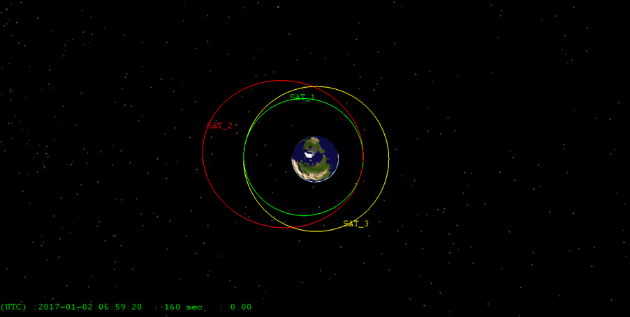

图 9-1 预期仿真结果3D视图

 

## 二、操作步骤

（参见案例“Demo_0201_Trans_Monopulse”）

 

### 1.新建场景

点击“新建场景”，输入场景名称。由于单脉冲变轨需要指定变轨时间，故仿真时间需与案例中保持一致：仿真开始时刻为：2017/1/01_12:00:00，结束时刻为：2017/1/05_12:00:00。

 

### 2.设置卫星参数

在场景中添加3颗卫星，保持默认命名SAT_1，SAT_2，SAT_3。

设置3颗卫星的轨道参数如下：半长轴16371 km，偏心率0.2，轨道倾角、升交点赤经、近地点幅角、真（平）近点角均为0°，设置完毕如图 9-2所示。

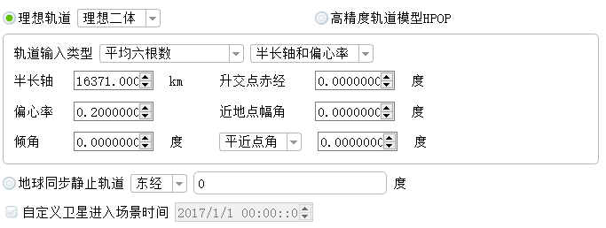

图 9-2 轨道参数设置

 

为了便于后续3颗卫星的辨识，可自行修改3颗卫星名称和轨道的颜色。

 

### 3.添加任务命令

在“场景”栏下点击“任务命令”，进入指控命令窗口，如图 9-3所示。

指令名称保持默认（也可自行修改）。

将执行时间修改为：2017-01-01_17:47:26.045

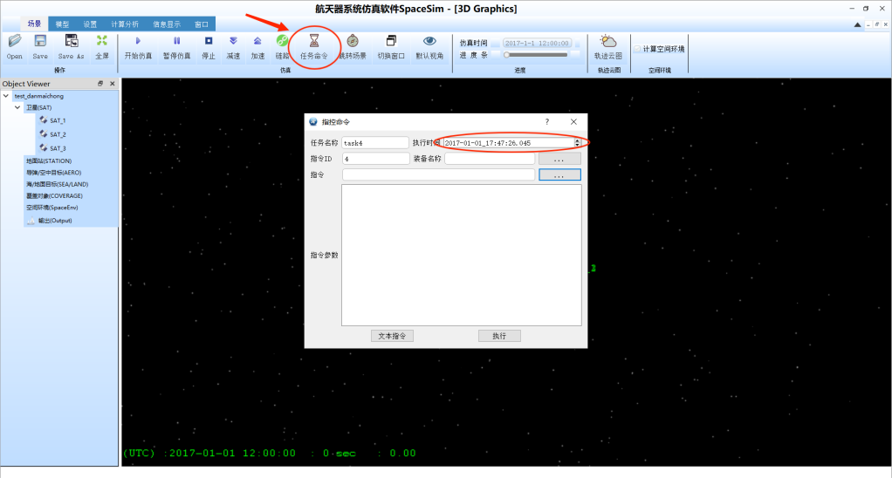

图 9-3 指控命令窗口

 

点击指令条目后的按钮，进入指控命令表，如图 9-4所示。

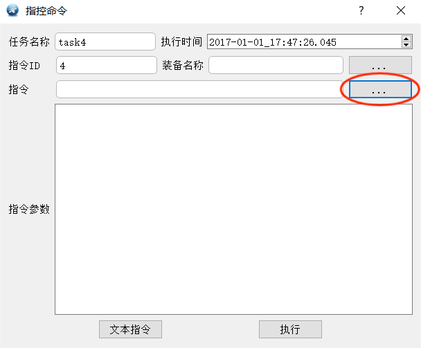

图 9-4打开指控命令表

 

双击“速度增量变轨”指令，如图 9-5所示。

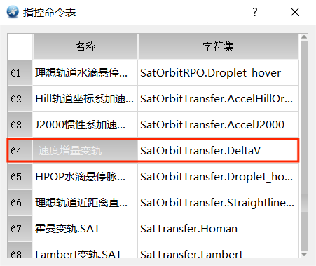

图 9-5 选择指令

 

点击装备名称的按钮，进入装备表，如图 9-6所示。

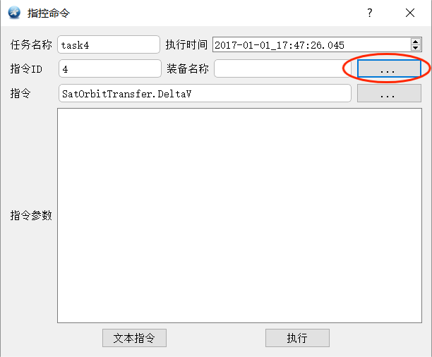

图 9-6 进入装备表

 

选择SAT_2卫星，如图 9-7所示。

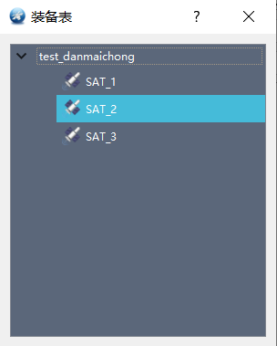

图 9-7 选择卫星对象

 

在“指令参数”中输入“0,500,0”，参数为J2000坐标系下x,y,z方向的速度增量（m/s），逗号用英文逗号，如图 9-8所示。

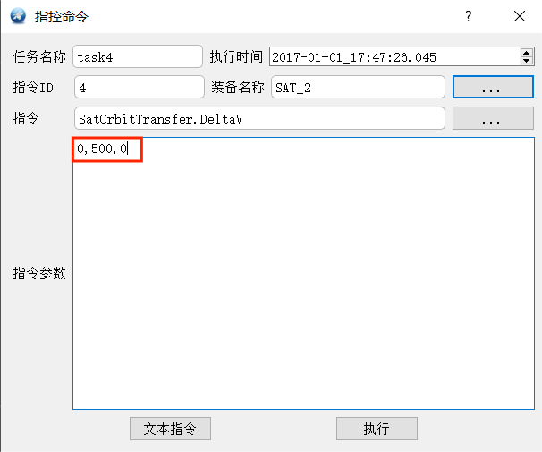

图 9-8 设置指令参数

 

用同样的方式为SAT_3添加速度增量变轨指令，将执行时间修改为：2017-01-01_20:41:09.067，指令参数修改为“0,-500,0”。

 

在“窗口”栏下点击“指令窗口显示”，打开指令窗口，如图 9-9所示。用户可在该窗口中查看任务命令，也通过快捷操作添加或删除命令。

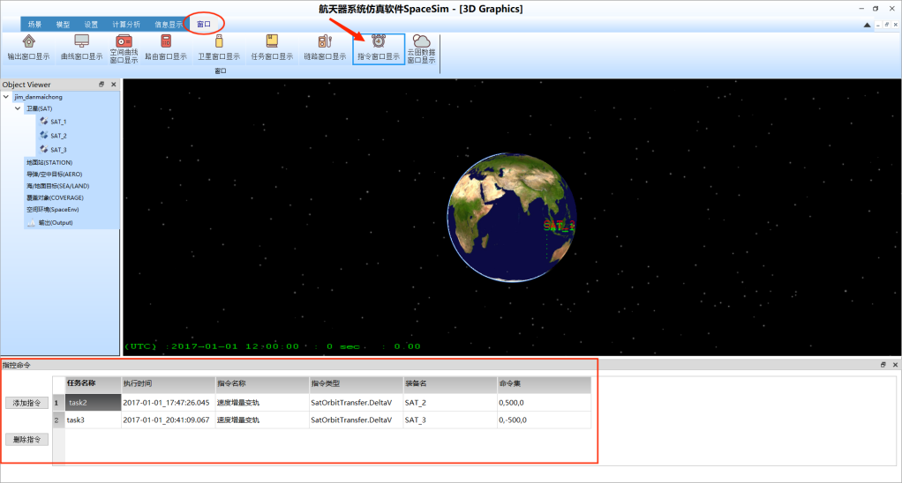

图 9-9 打开指令窗口

 

### 4.仿真过程

点击“开始仿真”，播放仿真动画。

 

## 三、仿真结果

### 1.仿真结果

动画仿真结果如图 9-10所示。

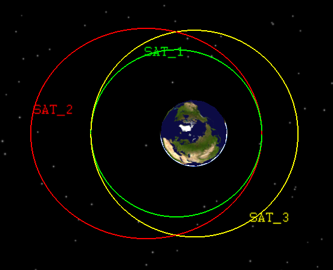

图 9-10 单脉冲变轨仿真结果

 

### 2.仿真分析

从仿真结果中可以看出：

（1）在远地点变轨可使椭圆轨道变圆，而在近地点变轨可使椭圆轨道变扁。

（2）变轨前后的轨道一定有交点。

 

 

 

# 案例10 霍曼变轨

## 一、任务要求

### 1.实验目的

（1）熟悉SpaceSim中利用速度脉冲指令方式进行霍曼变轨的方法

（2）掌握霍曼转移的原理与脉冲参数计算方法，了解霍曼转移轨道的变换特征

 

### 2.实验内容

将卫星由轨道高度为15000公里、倾角为0°的圆轨道，通过霍曼转移到地球同步静止轨道。

 

轨道设计：

（1）初始圆轨道

轨道半径为：$r_1=6378+15000=21378km$

轨道周期为：$T_1=2\pi\sqrt{\frac{r_1^3}{\mu}}=31107.265s=8h38min27.265s$

在轨速度为：$v_1=\sqrt{\frac{\mu}{r_1}}=4.3180271km/s$

（2）目标静止轨道

轨道半径为：$r_2=6378+35786km=42164km$  

在轨速度为：$v_2=\sqrt{\frac{\mu}{r_2}}=3.0746664km/s$  

 （3）转移轨道

转移轨道半长轴为：$a=\frac{r_1+r_2}{2}=31771km$  

转移轨道周期为：$T=2\pi\sqrt{\frac{a^3}{\mu}}=56358.256s=15h39min18.256s$ 

转移时间为：$t=\frac{T}{2}=28179.128s=7h49min39.128s$ 

近地点速度为：$v_p=\sqrt{\frac{2\mu}{r_1}-\frac{\mu}{a}}=4.9744014km/s$ 

远地点速度为：$v_a=\sqrt{\frac{2\mu}{r_2}-\frac{\mu}{a}}=2.5221220km/s$ 

 （3）两次脉冲速度增量

$$
{\Delta}v_p = v_p-v_1 = 656.374m/s
$$

$$
{\Delta}v_a = v_2 - v_a = 552.545m/s
$$

转移过程如图 10-1所示。

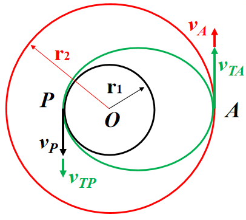

图 10-1 霍曼转移过程

 

令卫星绕地球旋转一周后开始霍曼转移，则首先需要根据轨道半径计算出轨道周期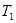，进而得到第一次脉冲时刻为$T_0+T_1$ ，速度增量为${\Delta}v_p$ ，$T_0$为系统初始时刻。

第二次脉冲时刻为$T_0+T_1+\frac{T}{2}$，速度增量为${\Delta}v_a$。

 

### 3.预期结果

预期仿真结果如图 10-2所示，其中，处于较低轨道的卫星1通过霍曼转移轨道转移至地球同步静止轨道。

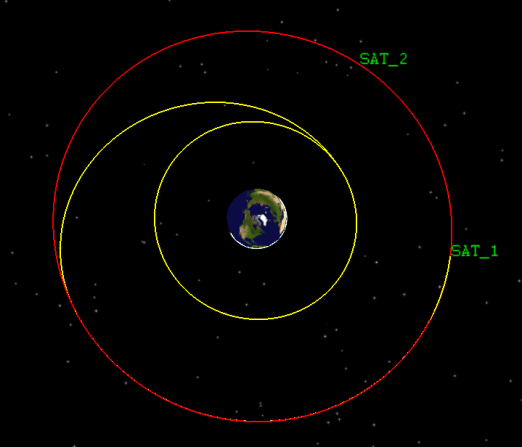

图 10-2 霍曼转移轨道

 

## 二、操作步骤

（参见案例“Demo_0202_Trans_Hohmann”）

 

### 1.新建场景

打开SpaceSim软件，点击“新建场景”，输入场景名称，时间参数保持默认（仿真开始时刻为：2017/1/01_12:00:00，结束时刻为：2017/1/05_12:00:00），点击“OK”完成。

 

### 2.设置卫星参数

在场景中添加一颗卫星，默认命名为SAT_1，在弹出的参数框内选择理想轨道，修改半长轴为21378 km，其他参数设置为0，具体参数如图 10-3所示。

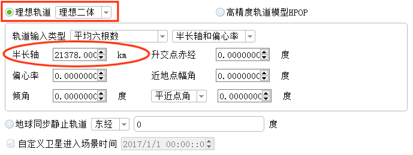

图 10-3 设置卫星参数

 

为了便于对比，将SAT_1的轨道颜色改为黄色。

为了显示直观，再添加一颗卫星在目标轨道（地球同步静止轨道）上，默认命名为SAT_2，半长轴设置为42164 km，轨道颜色设置为红色，具体设置如所示。

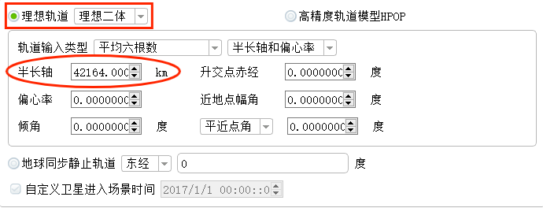

图 10-4地球同步静止轨道卫星参数

 

如图 10-5所示，SAT_1和SAT_2两颗卫星星下点一致，只有轨道高度不同。

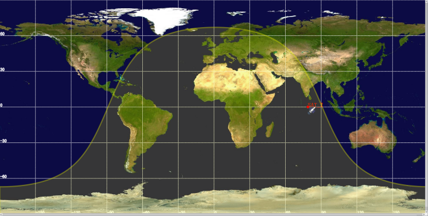

图 10-5 星下点位置对比

### 3.添加任务命令

为SAT_1添加任务指令：

将执行时间修改为：2017-01-01_20:38:27.265，选择“速度增量变轨”指令，装备对象选择为SAT_1，指令参数设置为“0,656.374,0”，任务名称自动生成，点击“执行”，如图 10-6所示。

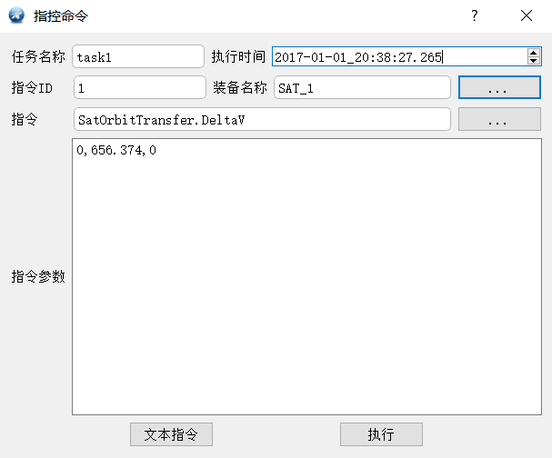

图 10-6 添加任务指令

 

同理，为SAT_2添加任务指令：

将执行时间修改为：2017-01-02_04:28:06.393，选择“速度增量变轨”指令，装备对象选择为SAT_2，指令参数设置为“0,-552.545,0”。

指令添加完毕后，指控命令栏显示所有指令的详细信息，如发现错误，可以选中该条指令，点击“删除指令”，再点击“添加指令”重新添加即可。指令无误即可开始仿真。

 

### 4.添加输出

在Object Viewer栏中双击“输出（Output）”，如图 10-7所示，将SAT_1的“惯性系位置速度”和“卫星六要素”输出成文件。

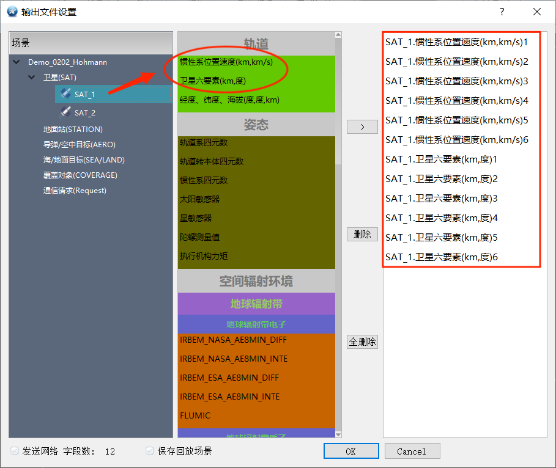

图 10-7 添加输出

 

### 5.仿真过程

点击“开始仿真”，播放仿真动画。SAT_1将在运行一周后进入霍曼转移轨道，注意观察变轨过程。

 

## 三、结果分析

### 1.仿真结果

动画仿真结果如图 10-8所示。

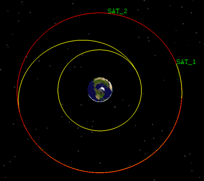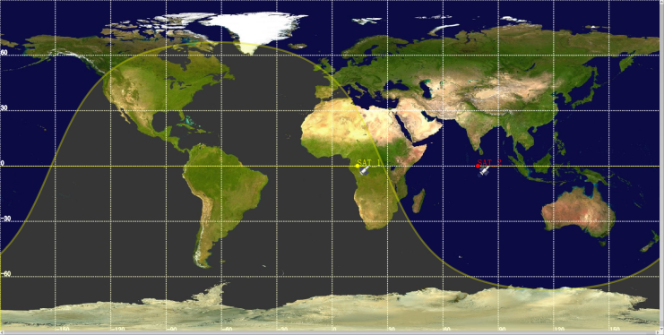

图 10-8 霍曼变轨仿真结果

 

文件输出结果如图 10-9所示。

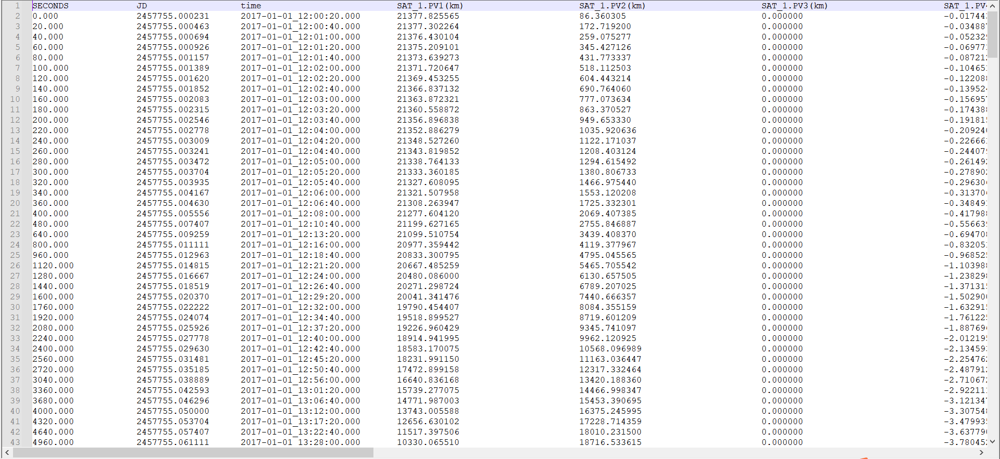

图 10-9 文件输出结果

 

### 2.仿真分析

如图 10-8的仿真结果所示， 霍曼变轨的两次都是切向变轨，不含径向分量。第一次变轨将圆变为椭圆，第二次变轨将椭圆变为圆。

将图 10-9所示文件输出结果导入分析软件，绘制图 10-10、图 10-11、图 10-12所示的分析图样。

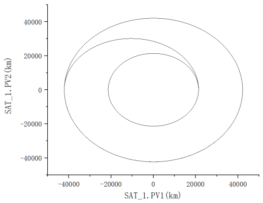

图 10-10XY位置坐标图

 

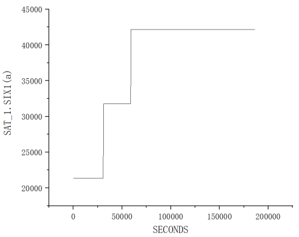

图 10-11 半长轴随时间变化

 

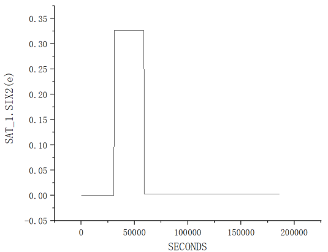

图 10-12 偏心率随时间变化

 

 

 

 

# 案例11 双椭圆三脉冲变轨仿真

## 一、任务要求

### 1.实验目的

（1）熟悉SpaceSim中利用速度脉冲指令方式进行双椭圆变轨的方法。

（2）掌握双椭圆三脉冲变轨原理与脉冲参数计算方法，了解双椭圆三脉冲变轨的轨道变换特征。

 

### 2.实验内容

利用双椭圆三脉冲变轨方法，将卫星从7000 km高的近地圆轨道，转移到35000 km高的圆轨道上。

 转移轨道设计：

轨道1、轨道2半长轴和偏心率分别为$a_1$，$a_2$，$e_1$，$e_2$，双椭圆公共远地点地心距$r_A$，两圆轨道半径$r_1$，$r_2$，且$r_A>r_2$，如图 11-1所示。

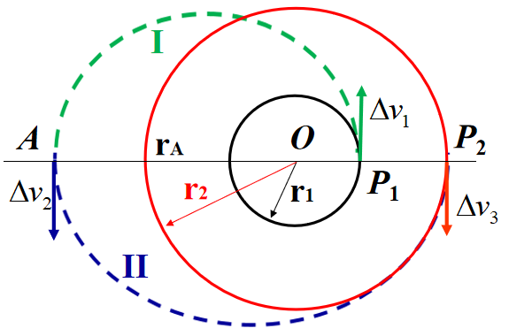

图 11-1 双椭圆变轨

$$
a_1 = \frac{1}{2}(r_1 + r_A), e = \frac{r_1 - r_A}{r_1 + r_A}
$$

$$
a_2 = \frac{1}{2}(r_2 + r_A), e = \frac{r_A-r_2}{r_A+r_2}
$$

$P_1$,$A$,$P_2$点速度增量分别为：

$$
{\Delta}v_1 = \sqrt\frac{\mu}{r_1}(\sqrt\frac{2r_A}{r_A+r_1}-1)
$$

$$
{\Delta}v_2 = \sqrt\frac{\mu}{r_A}(\sqrt\frac{2r_2}{r_A+r_2}-\sqrt\frac{2r_1}{r_A+r_1})
$$

$$
{\Delta}v_3 = \sqrt\frac{\mu}{r_2}(\sqrt\frac{2r_A}{r_A+r_2}-1)
$$

双椭圆转移速度总增量为：

$$
{\Delta}v = \sqrt\frac{\mu}{r_1}(\sqrt\frac{2r_A}{r_A+r_1} - 1) + \sqrt\frac{\mu}{r_A}\left[\sqrt\frac{2r_2}{r_A+r_2}-\sqrt\frac{2r_1}{r_A+r_1})\right] + \sqrt\frac{\mu}{r_2}(\sqrt\frac{2r_A}{r_A+r_2}-1)
$$
 本次任务中，取双椭圆公共远地点地心距$r_A=50000km$

计算可得：

$$
{\Delta}v_1 = 2448.9km/s
$$

$$
{\Delta}v_2 = -1163km/s
$$

$$
{\Delta}v_3 = -285.7km/s
$$

$$
{\Delta}v = 3897.6km/s
$$

### 3.预期结果

双椭圆转移过程中，卫星先转移到一个远地点比预定轨道高的过渡椭圆轨道，在到达过渡轨道远地点时，继续采用单脉冲变轨进入新的转移轨道，预计结果如图 11-2所示。

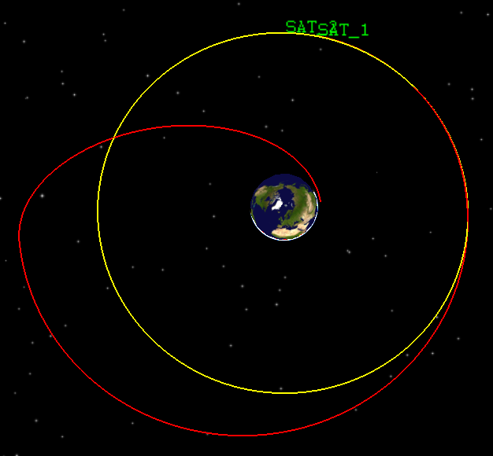

图 11-2 双椭圆转移预期结果

 

## 二、操作步骤

（参见案例“Demo_0203_Trans_DoubleEllipse”）

 

### 1.新建场景

点击“新建场景”，输入场景名称。由于速度增量变轨需要指定变轨时间，故仿真时间需与案例中保持一致：仿真开始时刻为：2017/1/01_12:00:00，结束时刻可自行设置，案例中设置为：2017/1/05_12:00:00。

 

### 2.设置卫星参数

在场景中插入两颗卫星，保持默认命名为SAT_1,SAT_2。

分别设置两颗卫星的轨道参数：SAT_1为半径7000 km的圆轨道（偏心率为0），其余参数均为0；SAT_2为半径35000 km的圆轨道，其余参数也均为0。

将轨道模型修改为高精度轨道模型HPOP。

 

### 3.添加任务指令

打开指令窗口，为卫星任务指令。

将各次脉冲时间和大小按指令形式整理成表格，如表 11-1所示。

表 11-1 SAT_1速度脉冲表格

| 历元UTC时刻             | 事件           | 速度增量矢量m/s(X,Y,Z) |
| ----------------------- | -------------- | ---------------------- |
| 2017-01-01_12:00:00.000 | 第一次速度脉冲 | 0,2448.9,0             |
| 2017-01-01_18:39:01.000 | 第二次速度脉冲 | 0,-1163,0              |
| 2017-01-02_06:45:39.000 | 第三次速度脉冲 | 0,-285.7,0             |

 

任务命令添加完毕如图 11-3所示。

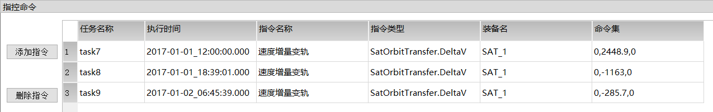

图 11-3 任务命令添加

 

### 4.仿真过程

点击“开始仿真”，播放仿真动画，注意观察变轨过程。

 

## 三、结果分析

### 1.仿真结果

3D仿真结果如图 11-4所示。

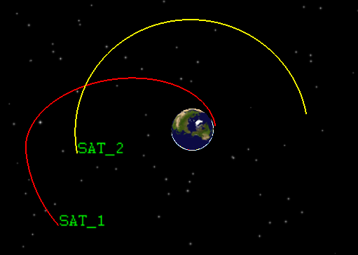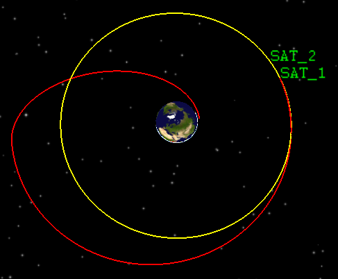

图 11-4 双椭圆三脉冲变轨仿真结果3D

 

### 2.仿真分析

如图 11-4所示，双椭圆三脉冲变轨通过三次脉冲成功将卫星由小圆轨道转移到大圆轨道，顺利完成了实验目标。

# 案例12 相位调整仿真

## 一、任务要求

### 1.实验目的

（1）熟悉SpaceSim中利用速度脉冲指令方式进行卫星相位调整的方法。

（2）掌握相位调整原理与脉冲参数计算方法，了解相位调整前后轨道变换特征。

 

### 2.实验内容

有三颗轨道倾角为0°的圆轨道卫星，通过对其中的两颗卫星分别施加两次速度径向脉冲从而调整这三颗卫星处于轨道上的相对位置。具体要求如下所示。

（1）轨道高度为20000 km

（2）三颗卫星初始位置完全相同（仅为观察调整效果设置，无需考虑这三颗卫星互相碰撞等问题）

（3）要求将三颗卫星调整为三颗卫星间距离相同，即卫星间相位差为120°

（4）要求一颗卫星通过加速调整轨道位置，另一颗卫星通过减速调整轨道位置

 

相位调整原理：

目标位于航天器前方相位$\theta$角，进行相位调整时，首先减少一个速度增量${\Delta}v_1$进入比原轨道半径小的椭圆过渡轨道，周期缩短，运行一个周期回到起点后再增加一个速度增量${\Delta}v_2$进入原轨道，如图 12-1所示。

 ${\Delta}v_1$与${\Delta}v_2$大小相等，方向相反：

$$
{\Delta}v_1 = {\Delta}v_2 = \sqrt{\mu\left[\frac{2}{r}-\frac{1}{a_m}\right]} - \sqrt{\frac{\mu}{r}}
$$

平近点角增加$2\pi$，轨道历元增加$(1-\frac{\theta}{2\pi})T_0$

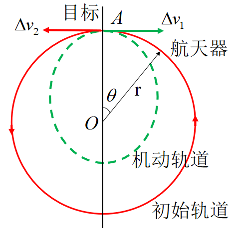

图 12-1 相位调整示意图

 

计算相关参数：

轨道半径为：$r=R+h=6371+20000km=26371km$

（1）对相位角领先基准卫星120°的卫星使用减速变轨

设该卫星为卫星1，原轨道周期为42619s；

由于相位角需领先基准卫星120°，需变轨后卫星运行一周期后到达原位置时，基准卫星运行240°；

因此能够算出卫星变轨后轨道周期为28413s；

则半长轴为20125.1km；

卫星1过渡轨道远地点到地心距离为26371km，可算出过渡轨道在该点速度为3228.6m/s，原轨道速度为3887.8m/s；

则速度脉冲大小为659.2m/s；

 

（2）对相位角落后基准卫星120°的卫星使用加速变轨

设该卫星为卫星2，由于相位角需落后基准卫星120°，需变轨后卫星运行一周期后到达原位置时，基准卫星运行480°

因此可计算得到，变轨后轨道周期为56825s

则半长轴为31946km

卫星2过渡轨道近地点高度为到地心距离为26371km，可算出过渡轨道在该点速度为4213.4m/s，原轨道速度为3887.8m/s

则速度脉冲大小为325.6m/s

 

综上，卫星1使用减速变轨，在变轨位置先施加减速脉冲，运行一周后施加加速脉冲，大小均为659.2m/s；卫星2使用加速变轨，在变轨位置先施加加速脉冲，运行一周后施加减速脉冲，大小均为325.6m/s。

### 3.预期结果

仿真过程结束后，三颗卫星若夹角为120°，沿着同一轨道运行，则说明对卫星1和卫星2的相位调整成功，预期结果如所示。

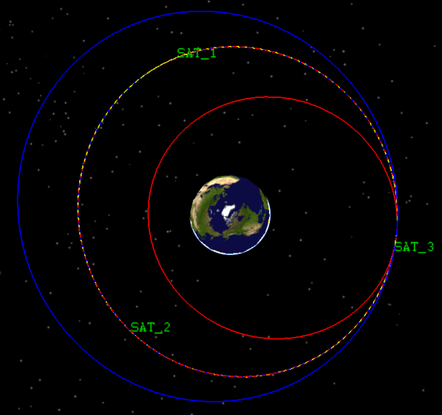

图 12-2 相位调整预期结果

 

## 二、操作步骤

（参见案例“Demo_0204_Trans_PhaseAdjust”）

 

### 1.新建场景

点击“新建场景”，输入场景名称。由于速度增量变轨需要指定变轨时间，故仿真时间需与案例中保持一致：仿真开始时刻为：2017/1/01_12:00:00，结束时刻可自行设置，案例中设置为：2017/1/05_12:00:00。

 

### 2.设置卫星参数

在场景中插入三颗卫星，保持默认命名为SAT_1,SAT_2，SAT_3。设置三颗卫星的轨道参数如下：轨道半径26371 km，偏心率为0（圆轨道），其他参数均为0。

将轨道模型修改为高精度轨道模型HPOP。

参数设置完毕如图 12-3所示。

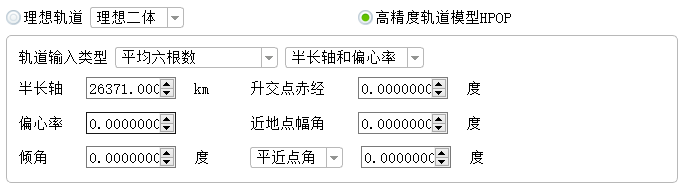

图 12-3 卫星参数设置

 

### 3.添加任务指令

打开指令窗口，为卫星添加任务指令。

将各次脉冲时间和大小按指令形式整理成表格，如表 12-1、表 12-2所示。

表 12-1 SAT_1速度脉冲表格

| 历元UTC时刻             | 事件           | 速度增量矢量m/s(X,Y,Z) |
| ----------------------- | -------------- | ---------------------- |
| 2017-01-01_12:00:00.000 | 仿真开始       |                        |
| 2017-01-01_12:00:00.000 | 第一次速度脉冲 | (0,-659.2,0)           |
| 2017-01-01_19:53:33.000 | 第二次速度脉冲 | (0,659.2,0)            |
| 2017-01-05_12:00:00.000 | 仿真结束       |                        |

 

表 12-2 SAT_2速度脉冲表格

| 历元UTC时刻             | 事件           | 速度增量矢量m/s(X,Y,Z) |
| ----------------------- | -------------- | ---------------------- |
| 2017-01-01_12:00:00.000 | 仿真开始       |                        |
| 2017-01-01_12:00:00.000 | 第一次速度脉冲 | (0,325.6,0)            |
| 2017-01-02_03:47:05.000 | 第二次速度脉冲 | (0,-325.6,0)           |
| 2017-01-05_12:00:00.000 | 仿真结束       |                        |

 

任务命令添加完毕如图 12-4所示。

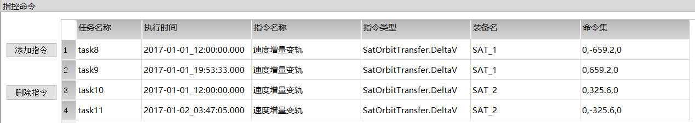

图 12-4 任务命令添加

 

### 4.仿真开始

点击“开始仿真”，播放仿真动画，可在3D视窗中观察到整个动态仿真过程，当变轨指令被触发后，“指控命令”窗中的该条指令会变为绿色，注意观察变轨过程。

 

## 三、结果分析

### 1.仿真结果

如图 12-5所示，经过相位调整后，三颗卫星夹角为120°，沿着同一轨道运行，说明对卫星1和卫星2的相位调整成功。

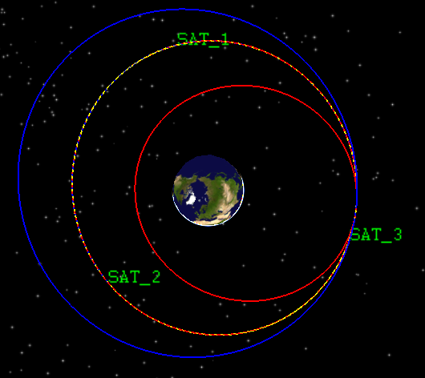

图 12-5 相位调整仿真结果

 

### 2.仿真分析

从图 12-5能够观察到，仿真过程结束后，三颗卫星夹角为120°，沿着同一轨道运行，对卫星1和卫星2的相位调整成功。

# 案例13 异面转移仿真

## 一、任务要求

### 1.实验目的

（1）熟悉SpaceSim中利用速度脉冲指令方式进行卫星异面转移的方法。

（2）掌握异面转移原理与脉冲参数计算方法，了解异面转移轨道变换特征。

 

### 2.实验内容

有一处于近地圆轨道上的卫星，轨道高度为200 km，轨道倾角为0°，在赤道面以北按逆时针转动。轨道面与赤道面交线为软件默认坐标系（J2000坐标系）的x轴即地心朝向春分点方向。2017年1月1日中午12:00:00卫星位于赤道面内x轴正方向，要求通过三次脉冲将变轨为冻原轨道。

第一次变轨后卫星进入近地点高度为200 km，远地点高度与目标轨道相同的转移轨道，第二次变轨为卫星在转移轨道运行半个周期后，在轨道远地点处对卫星施加速度脉冲从而转移改变卫星近地点高度，第三次变轨改变轨道倾角。冻原轨道具体要求如下所示：

（1）轨道倾角为63.4°

（2）轨道半长轴为42164km

（3）轨道离心率0.2

（4）轨道近地点幅角270°

（5）升交点赤经与真（平）近点角无特殊要求，可自行选取（案例中采用升交点赤经90°，真（平）近点角0°）

 

变轨参数计算：

（1）第一次变轨

已知冻原轨道半长轴为42164km，冻原轨道离心率为0.2

则：

轨道近心点距离为：$r_p = a(1-e) = 33731.2km$

轨道远心点距离为：$r_a = a(1+e) = 50596.8km$

 第一次变轨前轨道半径为6571km

此时，卫星轨道速度为：$v=\sqrt{\frac{\mu}{r}}=7785.5m/s$

第一次变轨后轨道近心点到地心距离为6571km，轨道远心点到地心距离为50596.8km

计算可得，卫星在近心点速度为：$v=10362m/s$，则第一次变轨脉冲大小为2576.5m/s。

 

（2）第二次变轨

第二次变轨前轨道近心点到地心距离为6571km，轨道远心点到地心距离为50596.8km，轨道周期为48094s，航天器在轨道远心点速度为1345.7m/s。

变轨后轨道近心点距离为33731.2km，轨道远心点距离为50596.8km，航天器在轨道远心点速度为2510.5m/s。

则速度脉冲大小为1164.8m/s

 

（3）第三次变轨

冻原轨道近地点幅角为270°，需要在与短半轴垂直处即正半焦弦处变轨，该点到地心距离为$a(1-e^2) = 40477.4km$，能够计算出该点速度大小为3200.2m/s，由动量矩$h=rvcos\beta$守恒可以计算出该点速度方向。

由时间公式$\sqrt{\frac{\mu}{a^3}}t_p =\psi - esin\psi $可知，由近心点运行到该点时间为16092s

为方便观察，设置为从远心点运行半周期后进行变轨，则第二次脉冲到第三次脉冲总时间为59174s

 

### 3.预期结果

经过3次速度脉冲变轨后，航天器由原有的近地轨道成功转移到冻原轨道上，其中，第一、二次变轨改变了轨道形状，第三次变轨改变了轨道平面，预期变轨结果如图 13-1所示。

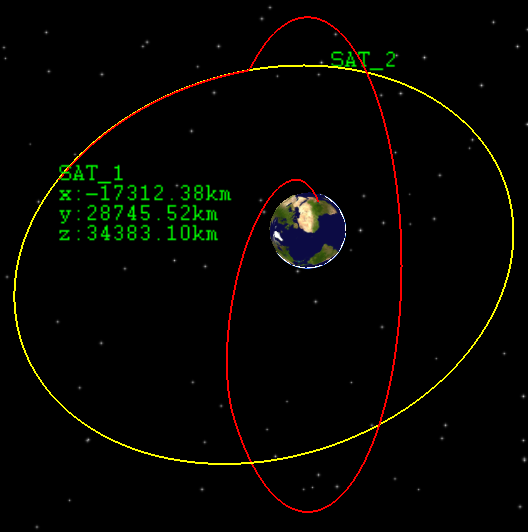

图 13-1 异面转移预期结果

 

## 二、操作步骤

（参见案例“Demo_0205_Trans_DiffPlane”）

 

### 1.新建场景

点击“新建场景”，输入场景名称。由于速度增量变轨需要指定变轨时间，故仿真时间需与案例中保持一致：仿真开始时刻为：2017/1/01_12:00:00，结束时刻可自行设置，案例中设置为：2017/1/05_12:00:00。

 

### 2.设置卫星参数

在场景中插入2颗卫星，默认命名为SAT_1、SAT_2，设置卫星参数如下：

SAT_1最初位于近地圆轨道上，轨道半径6571 km，偏心率为0（圆轨道），其他参数均为0。

SAT_2位于目标冻原轨道上，为椭圆轨道，轨道半长轴42164 km，偏心率0.2，轨道倾角63.4°，升交点赤经90°，近地点幅角270°，真（平）近点角0°。

将2个卫星的轨道模型均设置为高精度轨道模型HPOP。

 

### 3.添加任务指令

打开指令窗口，为卫星SAT_1添加任务指令。

各次脉冲时间和大小按指令形式整理如表 13-1所示。

表 13-1 SAT_1速度脉冲表格

| 历元UTC时刻             | 事件           | 速度增量矢量m/s(X,Y,Z) |
| ----------------------- | -------------- | ---------------------- |
| 2017-01-01_12:00:00.000 | 仿真开始       |                        |
| 2017-01-01_12:00:00.000 | 第一次速度脉冲 | (0,2576.5,0)           |
| 2017-01-01_18:39:01.000 | 第二次速度脉冲 | (0,-1164.8,0)          |
| 2017-01-02_11:07:01.000 | 第三次速度脉冲 | (1733,0.3,2805.9)      |
| 2017-01-05_12:00:00.000 | 仿真结束       |                        |

 

任务指令添加完毕如图 13-2所示。

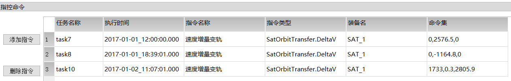

图 13-2 任务指令添加

 

### 4.仿真开始

点击“开始仿真”，播放仿真动画，注意观察卫星每一次施加脉冲后轨道的变化情况。

 

## 三、结果分析

### 1.仿真结果

如图 13-3所示，卫星第一次变轨后进入远地点高度与目标轨道相同的转移轨道。第二次变轨为卫星在转移轨道运行半个周期后，在轨道远地点处对卫星施加速度脉冲从而转移改变卫星近地点高度。从远地点运行半周期后，进行第三次变轨，在转移轨道与目标轨道的交点处施加速度脉冲，改变轨道倾角。

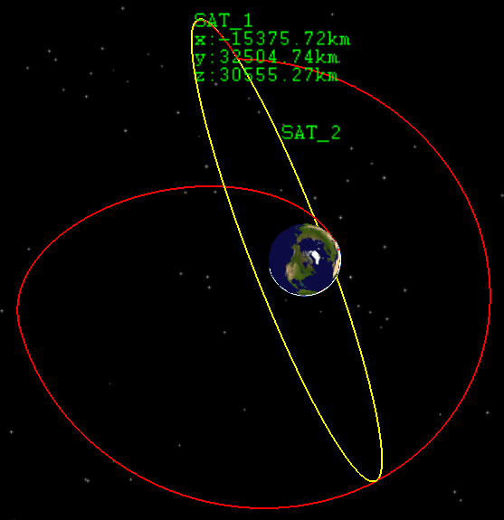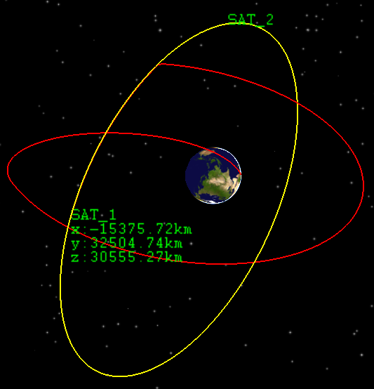

图 13-3 异面转移仿真结果

 

### 2.仿真分析

由图 13-3可以看出，最终卫星1与卫星2轨迹重叠，证实仿真正确有效，能够真实反映异面变轨情况，变轨成功。

同时，也可以看出，初始速度越高，变轨所需要的脉冲就越大，为节省燃料，应尽量选择速度低时变轨。

# 案例14 兰伯特转移仿真 

## 一、任务要求

### 1.实验目的

（1）熟悉SpaceSim中的轨道变轨计算功能，在已知初末状态下卫星的位置速度以及变轨持续时间情况下，采用兰伯特原理计算变轨脉冲参数并将其添加为指令的全过程。

（2）了解兰伯特变轨的特点。

 

### 2.实验内容

卫星从轨道1（半长轴7000km，轨道倾角53°）通过兰伯特变轨至轨道2（半长轴9000km，轨道倾角33°），观察转移时间对兰伯特变轨的影响。

 

### 3.预期结果

在转移时间适当的情况下，卫星应当能够实现平滑和准确的变轨，如图 14-1所示。

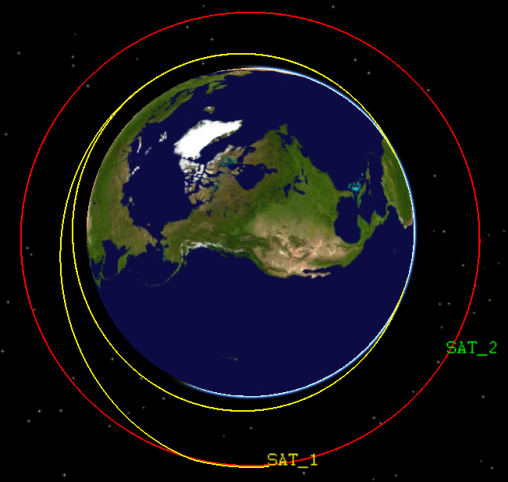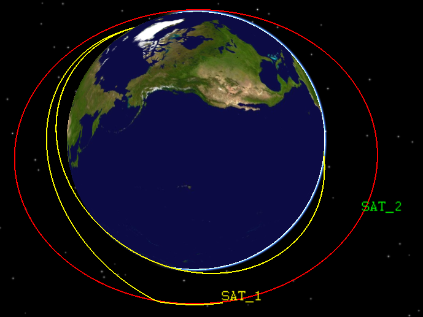

图 14-1 兰伯特变轨预期结果

 

## 二、操作步骤

（参见案例“Demo_0206_Trans_Lambert”）

 

### 1.新建场景

点击“新建场景”，输入场景名称。本次仿真中初次变轨时刻可自行设置，但由于兰伯特变轨的计算需要获取变轨开始和结束时的卫星准确状态，故建议仿真时间与案例中保持一致：仿真开始时刻为：2017/1/01_12:00:00，结束时刻可自行设置，案例中设置为：2017/1/05_12:00:00。

 

### 2.设置卫星参数

在场景中插入2颗卫星，默认命名为SAT_1、SAT_2，设置卫星参数如下：

SAT_1轨道半径7000 km，偏心率0（圆轨道），轨道倾角53°，其他参数均为0。

SAT_2轨道半径9000 km，偏心率0（圆轨道），轨道倾角33°，其他参数也均为0。

 

### 3.添加任务命令

在菜单栏点击“计算分析”，选择“轨道变轨计算”，进入轨道变轨计算窗口，如图 14-2所示。

图 14-2 打开变轨计算窗口

 

轨道变轨计算窗口的参数分布如图 14-3所示。

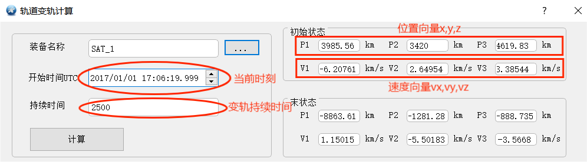

图 14-3 轨道变轨计算窗口

 

仿真过程中，在任意时刻暂停，进入轨道变轨计算窗口，选择装备名称，即可得到该时刻对应装备的位置和速度坐标。同时，在目标轨道上选择合适位置，计算出目标位置和速度坐标，通过初始状态和末状态，即可借助SpaceSim进行兰伯特变轨参数的计算。

其中，本次仿真使用计算参数如下：

装备名称：SAT_1

初次变轨时刻：2017-1-1 17:06:19.999

卫星位置向量：3985.56，3420，4619.83       km

卫星速度向量：-6.20761，2.64954，3.38544    km/s

目标位置向量：-8863.61，-1281.28，-888.735  km

目标速度向量：1.15015，-5.50183，-3.5668 km/s

变轨时间将决定第二次脉冲时刻，也决定轨迹形状。

 

本次任务分为三次仿真，持续时间分别为1500s，2500s，3500s，其他参数均相同，以观察时间对兰伯特问题结果的影响。

设置好变轨参数后，点击“计算”按钮，SpaceSim将自行计算得到合适的变轨参数。选中计算结果，点击“添加指令”，就可将变轨指令自动添加至指令窗口，如图 14-4、图 14-5所示。

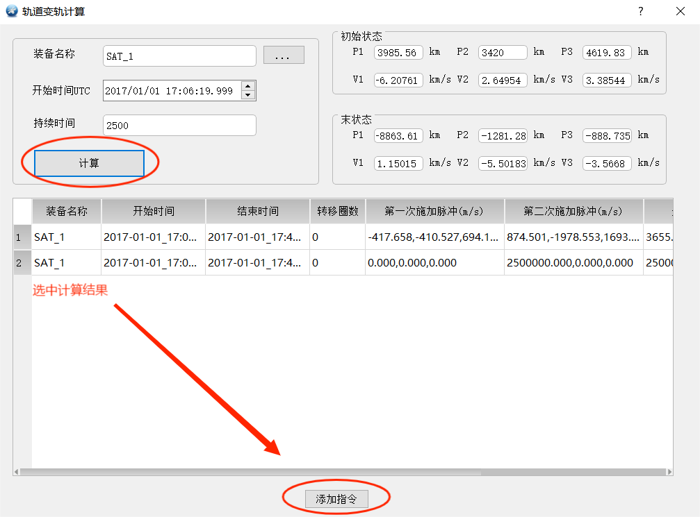

图 14-4 添加指令

 

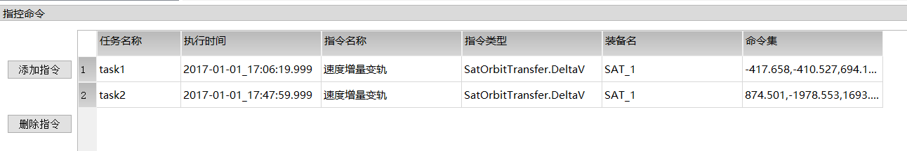

图 14-5 指令窗口

 

### 4.仿真开始

点击“开始仿真”，播放仿真动画，注意观察卫星变轨过程及过渡轨道形状。

 

## 三、结果分析

### 1.仿真结果

兰伯特变轨结果如图 14-6、图 14-7、图 14-8所示。

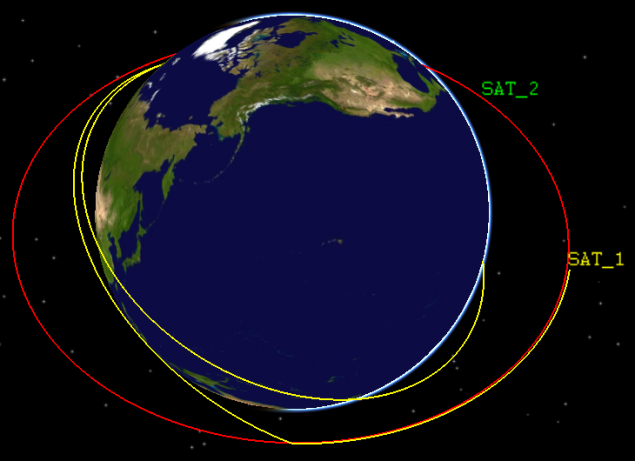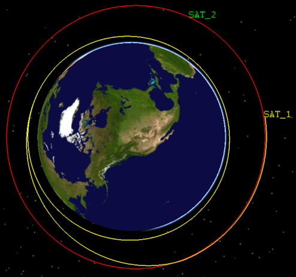

图 14-6 兰伯特变轨结果（持续时间2500s）

 

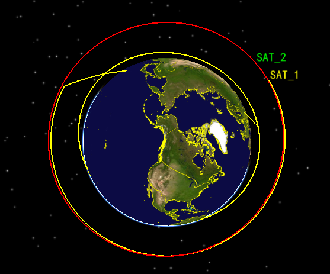

图 14-7 兰伯特变轨结果（持续时间1500s）

 

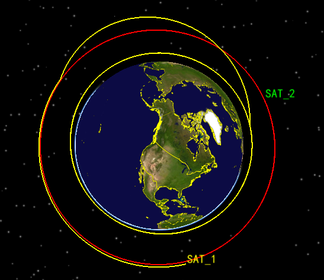

图 14-8 兰伯特变轨结果（持续时间3500s）

 

### 2.仿真分析

从图 14-6、图 14-7、图 14-8三个仿真结果可以看出，在兰伯特变轨中，持续时间不仅影响转移轨道周期，同时还会对转移轨道形状和迭代计算误差产生较大影响。因而在兰伯特变轨问题中，变轨的始末状态，持续时间都应经过合理的设计和优化，以保证航天器实现平滑、准确地完成变轨。

# 案例15 姿态机动仿真

## 一、任务要求

### 1.实验目的

（1）熟悉SpaceSim中的对日定向和对地定向指令，以及给卫星添加天线。

（2）了解卫星对日定向和对地定向的卫星天线指向特点，以及卫星通过姿态机动指令进行姿态变换的原理。 

### 2.实验内容

有一颗处于15000 km圆轨道上的卫星，处于对地工作模式。现通过姿态机动使卫星从对地定向转为对日定向模式，经过若干时间后，再次通过姿态机动从对日定向转为对地定向。 

### 3.预期结果

在本次仿真中，卫星首先通过姿态机动从对地定向转为对日定向模式，此时卫星保持对日指向，如图 15-1所示。随后，卫星再次通过姿态机动，从对日定向转变为对地定向模式，结果如图 15-2所示。

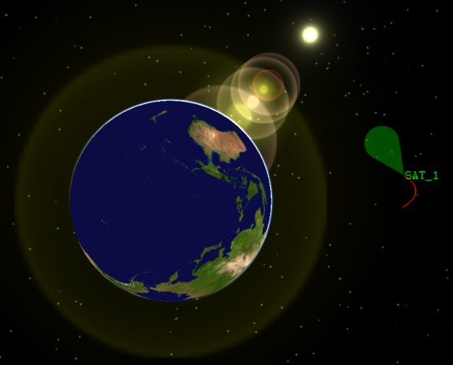

图 15-1 卫星对日定向预期结果 

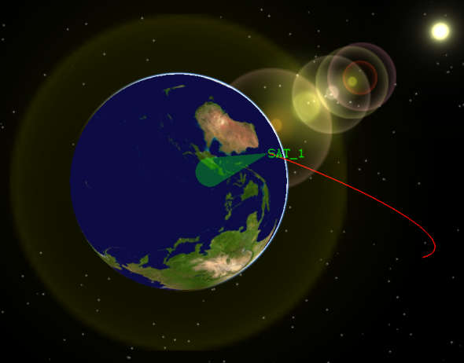

图 15-2 卫星对地定向预期结果

## 二、操作步骤

（参见案例“Demo_0301_Atti_DirSunEarth”） 

### 1.新建场景

点击“新建场景”，输入场景名称，其他参数保持默认。 

### 2.设置卫星参数

在场景中添加一颗卫星，保持默认命名SAT_1。

由于本次仿真主要考察卫星的姿态机动情况，故对卫星的轨道参数不作硬性要求，建议卫星轨道半长轴取在中高轨位置，以便于观察卫星的姿态变化情况。案例中采取的轨道参数如下：半长轴15000 km，偏心率为0的圆轨道，其他参数均为0。

将轨道模型设置为高精度轨道模型HPOP。 

### 3.添加天线

为了更加直观地观察卫星姿态的变化，需要在仿真中添加天线波束，用以表现卫星的姿态。

在卫星SAT_1上右键选择“添加天线”，如图 15-3所示。

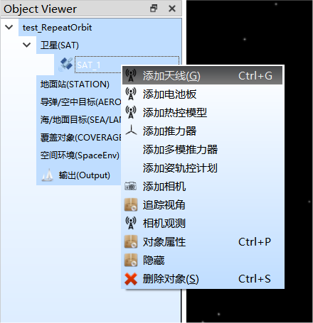

图 15-3 为卫星添加天线 

进入天线设置界面，为了使天线波束更加明显，可以修改波束的锥角为10°左右，如图 15-4所示。

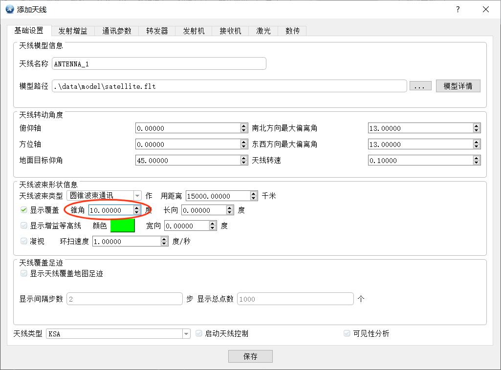

图 15-4 天线设置

 

### 4.添加任务命令

打开指令窗口，为卫星SAT_1添加任务指令。

仿真开始20 min后，SAT_1执行“对日定向模式”（无指令参数），从最初的对地定向转为对日定向。

卫星转为对日定向后30 min，SAT_1执行“对地定向模式”，从对日定向转回对地定向。

任务指令添加完毕如图 15-5所示。

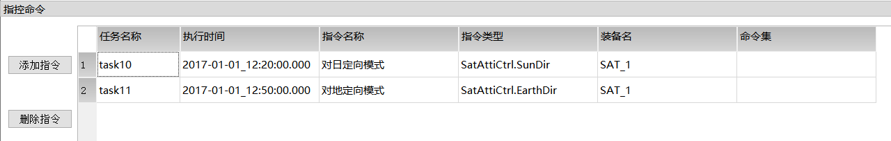

图 15-5 任务指令添加

 

### 5.仿真开始

点击“开始仿真”，播放仿真动画，在仿真过程中留意卫星天线波束的指向情况，适时掌握卫星的姿态信息。

 

## 三、结果分析

### 1.仿真结果

仿真开始20 min后，卫星顺利从对地定向转为对日定向，此时卫星的天线波束指向太阳，如图 15-6所示。

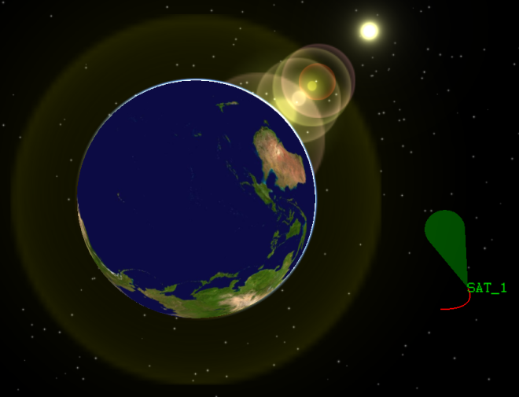

图 15-6 卫星对日定向

 

随后30 min，卫星再次执行姿态机动，从对日定向转为对地定向，卫星天线波束也随之指向地心，如图 15-7所示。

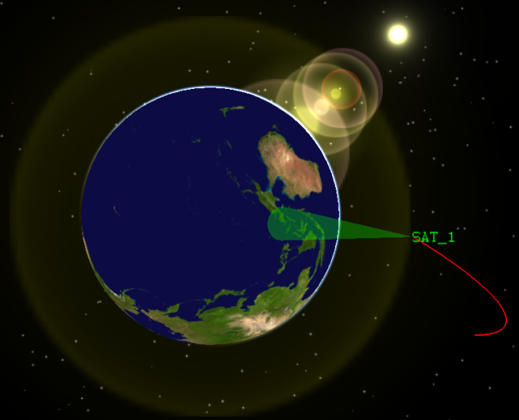

图 15-7 卫星对地定向

 

### 2.仿真分析

如图 15-6和图 15-7可知，卫星通过姿态机动，完成了对日定向和对地定向的切换，顺利完成了本次仿真目标。

# 案例16 大气环境仿真（一）

## 一、任务要求

### 1.实验目的

（1）熟悉SpaceSim中的计算空间环境选项、原子氧等大气模型的基本功能，原子氧模型参数选择、模型添加、云图显示、参数输出、曲线输出等操作。

（2）了解大气环境模型的分类、内容与参数，掌握不同轨道高度下原子氧通量的变化特点。

 

### 2.实验内容

通过SpaceSim分析轨道高度500 km、800 km、2000km的原子氧通量，并绘制轨迹云图和瞬时密度曲线，考察轨道高度对原子氧通量的影响情况。

 

### 3.预期结果

原子氧通量取决于姿态、轨道高度、暴露时间和太阳活动。故在仿真中，三颗轨道高度不同的卫星，其输出的轨迹云图和瞬时密度曲线应当有明显的差异，如图 16-1、图 16-2所示。

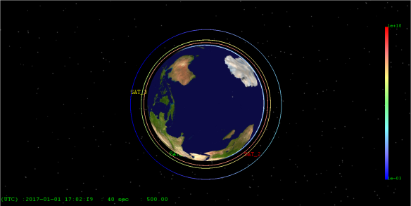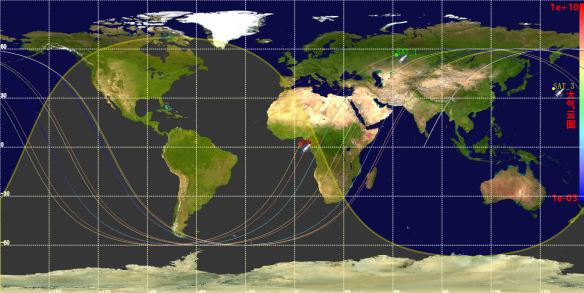

图 16-1 轨迹云图预期仿真结果

 

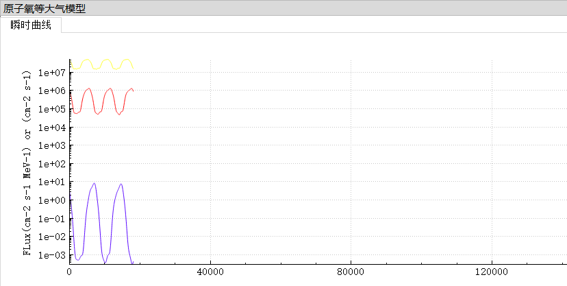

图 16-2 瞬时密度曲线预期结果

 

## 二、操作步骤

（参见案例“Demo_0401_Envi_Atmo_DiffAlti”）

 

### 1.新建场景

点击“新建场景”，输入场景名称，其他参数保持默认。

 

### 2.设置卫星参数

在场景中添加3颗卫星，保持默认命名SAT_1，SAT_2，SAT_3。

3颗卫星均为近地圆轨道，轨道参数如下：半长轴6871.3 km，7171.3 km，8371.3 km，偏心率等其他参数均为0。

将轨道模型设置为高精度轨道模型HPOP。

 

### 3.添加空间环境模型

在工具栏点击“计算空间环境”，此时，菜单栏会发生变化，增加关于空间环境等方面的相关设置，如图 16-3、图 16-4所示。

图 16-3 计算空间环境

 

图 16-4 扩展菜单栏

 

在菜单栏中点击“空间大气环境”，选中“原子氧等大气模型”，进入大气模型设置，如图 16-5所示。

图 16-5进入大气模型设置

 

在大气模型设置界面，选择大气模型NRLMSISE00，勾选“是否计算”，下属的计算参数保持默认（F10.7A为150，F10.7为150，ap取4），同时，将卫星SAT_1，SAT_2，SAT_3均加入输出，如图 16-6所示。

点击“保存”将设置的空间环境添加到场景中。

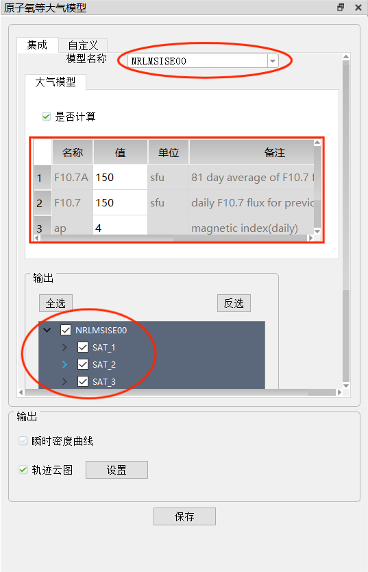

图 16-6 大气模型详细设置

 

### 4.输出设置

在大气模型设置中，勾选“轨道云图”，如图 16-7所示，点击设置进入轨道云图的输出设置界面。

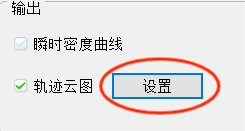

图 16-7 轨道云图输出设置

 

在轨道云图的输出设置界面，将3颗卫星的氧原子数量密度添加到轨道云图的输出中，点击“保存”，如图 16-8所示。

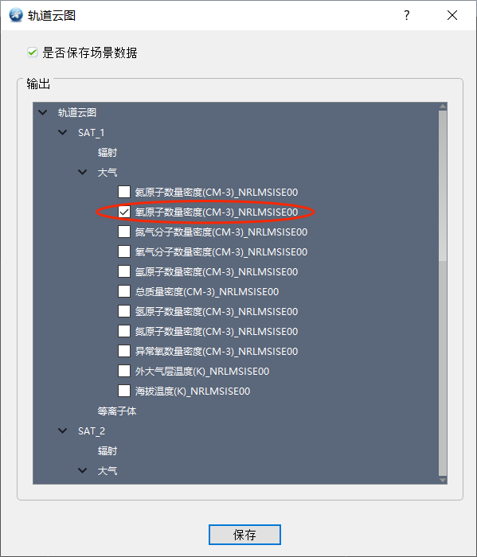

图 16-8 轨道云图输出详细设置

 

轨迹云图设置完毕后，进入瞬时密度曲线的设置。

在图 16-7所示的输出设置处，勾选“瞬时密度曲线”，进入瞬时密度曲线输出界面，如图 16-9所示。

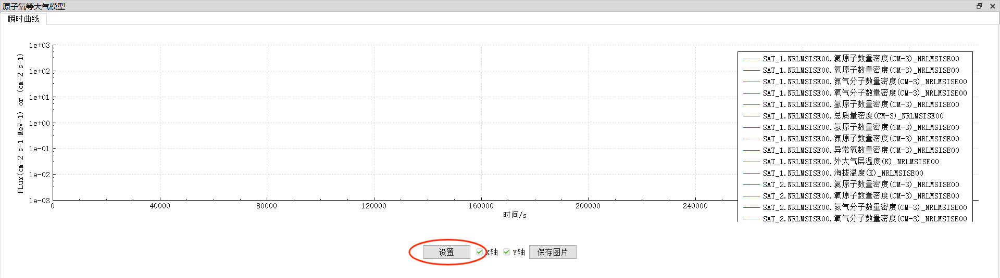

图 16-9 瞬时密度曲线输出

 

该界面在仿真过程中默认输出所有空间环境信息，线条杂乱不便于观察，点击“设置”按钮进入曲线显示设置界面。

选中SAT_1下方“氧原子数量密度”选项，点击“添加”按钮，将氧原子数量密度添加到曲线输出中。同理，用此方法将SAT_2、SAT_3的氧原子数量密度添加到输出中，添加完毕如图 16-10所示。

为便于观察输出曲线，将3颗卫星的输出曲线设置为不同颜色。

点击“确定”保存。

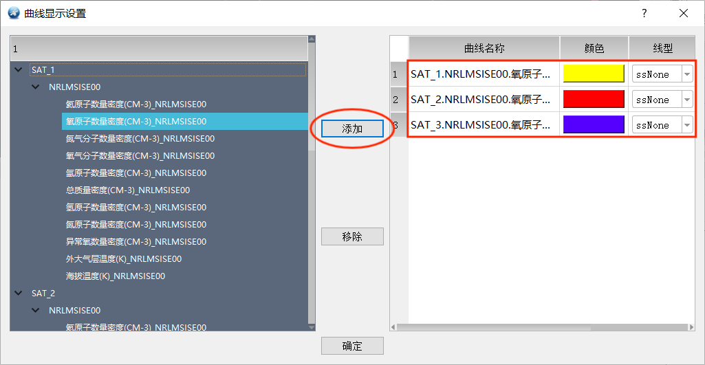

图 16-10 曲线显示设置

 

### 5.仿真开始

点击“开始仿真”，播放仿真动画。

在仿真中，卫星的轨迹颜色会随氧原子数量密度变化，注意观察轨迹云图的特点。

 

## 三、结果分析

### 1.仿真结果

轨迹云图输出结果如图 16-11、图 16-12所示。

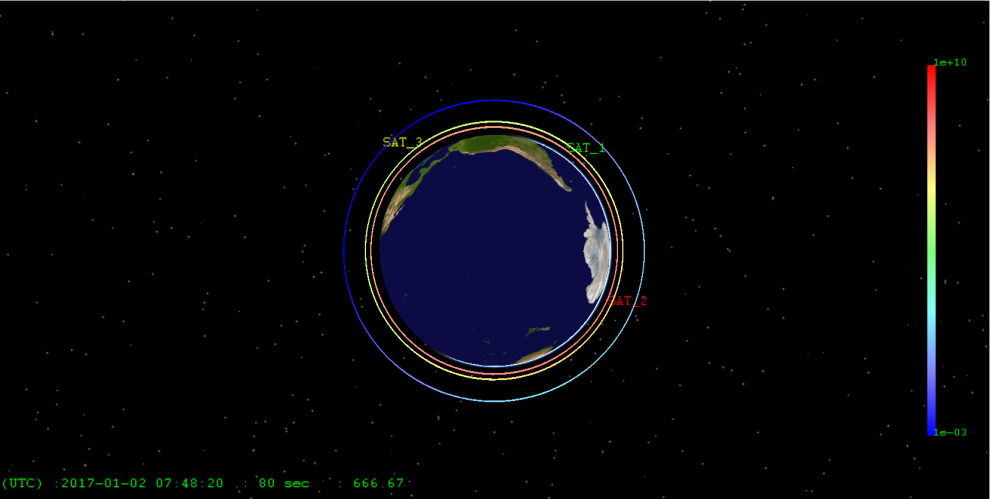

图 16-11 轨迹云图3D

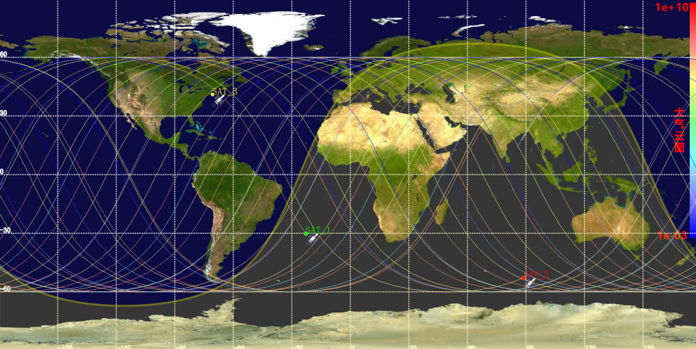

图 16-12 轨迹云图2D

 

瞬时密度曲线输出结果如图 16-13所示。

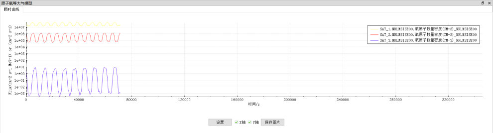

图 16-13 瞬时密度曲线

 

### 2.仿真分析

从图 16-11、图 16-12、图 16-13所示的仿真结果可以看出，随着轨道高度的提升，原子氧数量密度出现明显下降，差距可达几个数量级。

同时，图 16-13中，原子氧的瞬时密度曲线基本呈周期性变化，在向阳面瞬时密度高，在背阴面瞬时密度低，这与原子氧的特性基本吻合。

 

# 案例17 大气环境仿真（二）

## 一、任务要求

### 1.实验目的

（1）熟悉SpaceSim中大气模型的设置方法以及原子氧通量的输出方法。

（2）了解不同轨道倾角情况下的原子氧通量变化特点。

 

### 2.实验内容

通过SpaceSim分析轨道倾角98°、60°、0°的原子氧通量，并绘制瞬时密度曲线，考察轨道倾角对原子氧通量的影响情况。

 

### 3.预期结果

原子氧通量取决于姿态、轨道高度、暴露时间和太阳活动。3条轨道高度相同，仅有轨道倾角不同的轨道，原子氧通量主要取决于暴露时间和太阳活动。仿真中，3条轨道如图 17-1所示。

预期结果中，低倾角轨道所经过区域暴露时间长，太阳短波紫外线辐射将更多的氧分子分裂成原子氧，原子氧浓度原则上应当较高。

更加精确的结果待后续具体仿真。

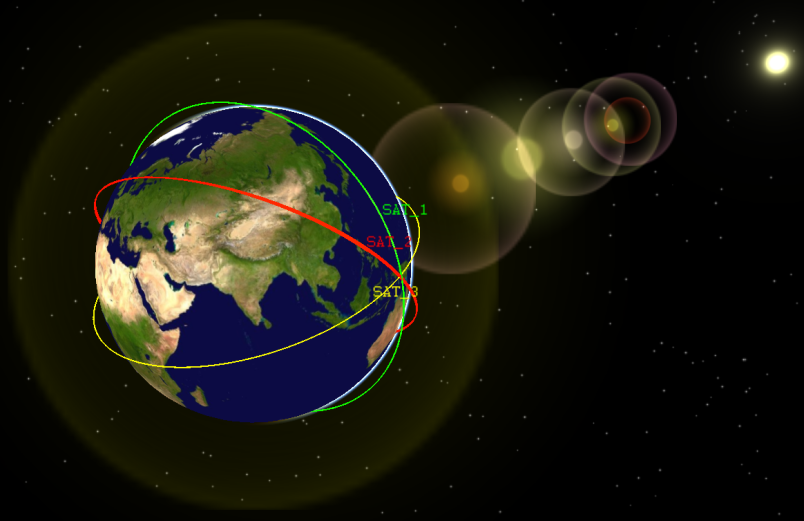

图 17-1 不同倾角的轨道

 

## 二、操作步骤

（参见案例“Demo_0402_Envi_Atmo_DiffAngle”）

 

### 1.新建场景

点击“新建场景”，输入场景名称，其他参数保持默认。

 

### 2.设置卫星参数

在场景中添加3颗卫星，保持默认命名SAT_1，SAT_2，SAT_3。

3颗卫星均为近地圆轨道，轨道参数如下：半长轴6871.3 km，偏心率0，轨道倾角分别为SAT_1：98°，SAT_2：60°，SAT_3：0°，其他参数均设置为0。

将轨道模型设置为高精度轨道模型HPOP。

 

### 3.添加空间环境模型

在工具栏勾选“计算空间环境”后，在菜单栏点击“空间大气环境”，选中“原子氧等大气模型”，进入大气模型设置。

在大气模型设置界面，选择大气模型NRLMSISE00，下属的计算参数保持默认（F10.7A为150，F10.7为150，ap取4），同时，将卫星SAT_1，SAT_2，SAT_3均加入输出。（模型选择和参数设置同案例16）

 

### 4.输出设置

在输出设置处，勾选“瞬时密度曲线”，进入瞬时密度曲线输出界面。

将SAT_1，SAT_2，SAT_3的“氧原子数量密度”添加到曲线的输出，为了便于分辨，建议分别将曲线设置为不同的颜色。

 

### 5.仿真开始

点击“开始仿真”，播放仿真动画。

 

## 三、结果分析

### 1.仿真结果

瞬时密度曲线输出结果如图 17-2所示。

其中绿色曲线：SAT_1，红色曲线：SAT_2，黄色曲线：SAT_3

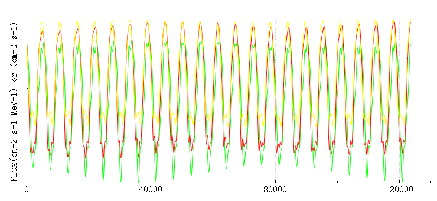

图 17-2 瞬时密度曲线

 

### 2.仿真分析

低倾角轨道所经过区域暴露时间长，太阳短波紫外线辐射将更多的氧分子分裂成原子氧。图 17-2显示，轨道倾角越低，原子氧通量越高，这与理论分析相吻合。

# 案例18 地磁场环境仿真

## 一、任务要求

### 1.实验目的

（1）熟悉SpaceSim中的添加地球磁场模型、设置模型参数、云图显示、参数输出、曲线输出等操作。

（2）了解地磁场环境模型的分类、内容与参数，掌握磁感应强度随纬度变化的特点以及准周期变化特点，了解偶极子磁力线赤道面地心距的变化特点。

 

### 2.实验内容

通过SpaceSim分析800 km近地圆轨道的磁通量，并绘制瞬时通量曲线，观察地球磁场的磁通量变化情况。

 

### 3.预期结果

地磁场在地球不同地区的分布不同，在赤道地区磁通量较小，而在两极地区则磁通量较大。因而在卫星绕地运行的过程中，瞬时磁通量应当呈现周期性变化，且在赤道地区瞬时通量低，两极地区瞬时通量高。

具体结果待后续具体仿真。

 

## 二、操作步骤

（参见案例“Demo_0403_Envi_Magni”）

 

### 1.新建场景

点击“新建场景”，输入场景名称，其他参数保持默认。

 

### 2.设置卫星参数

在场景中添加1颗卫星，默认命名为SAT_1。

卫星轨道参数如下：半长轴7171.3 km，偏心率0（圆轨道），轨道倾角为98°，其他参数均为0。

 

### 3.添加空间环境模型

在工具栏勾选“计算空间环境”后，在菜单栏点击“空间辐射环境”，选中“地球磁场”，进入地球磁场设置，如图 18-1所示。

图 18-1 进入地球磁场设置

 

在设置界面，首先在左下角选中“地球磁场”，进入地球磁场设置界面，仿真模型选择“Jensen&Cain1960”，在输出栏中将SAT_1添加至输出。

设置完毕如图 18-2所示，点击“保存”。

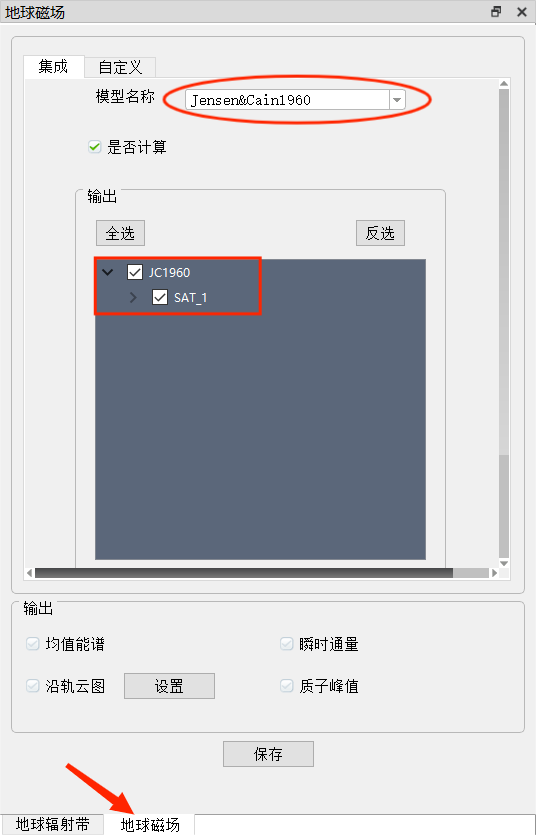

图 18-2 地球磁场详细设置

 

### 4.输出设置

在设置界面下方的输出栏中，勾选“瞬时通量”，输出瞬时通量曲线图，如图 18-3、图 18-4所示。

图 18-3 输出瞬时通量

 

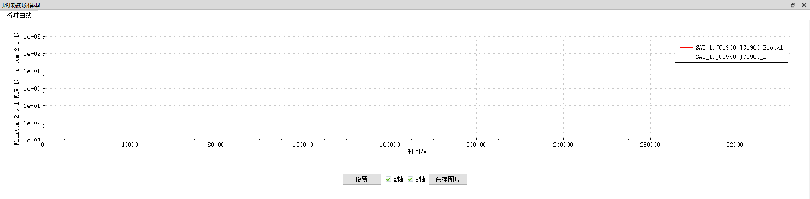

图 18-4 瞬时曲线图

 

在图 18-4所示的界面点击“设置”，进入曲线显示设置，将模型中的“JC1960_Blocal”（即磁感应强度）添加至输出，点击“确定”，设置完成如图 18-5所示。

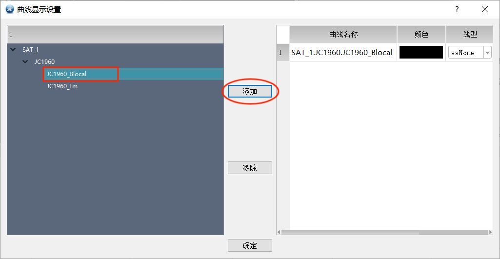

图 18-5 曲线显示设置

 

### 5.仿真开始

点击“开始仿真”，播放仿真动画。在仿真过程中，瞬时通量会随着卫星运动同步输出，注意在仿真中观察瞬时通量的变化情况。

 

## 三、结果分析

### 1.仿真结果

卫星的运行情况及对应的瞬时磁通量如图 18-6、图 18-7所示。

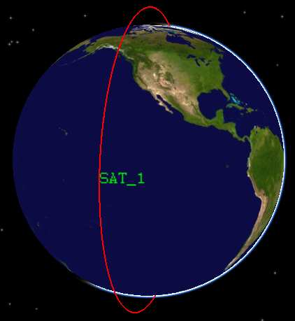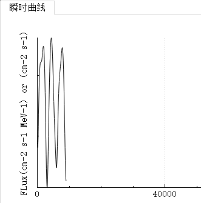

图 18-6 卫星赤道上空瞬时磁通

 

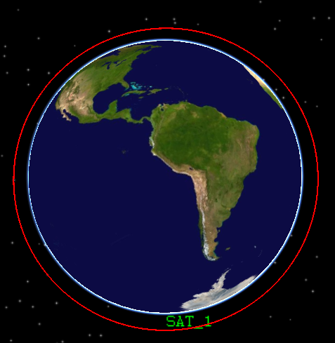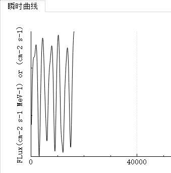

图 18-7 卫星两极上空瞬时磁通

 

### 2.仿真分析

如图 18-6、图 18-7所示，卫星在到达赤道附近时，瞬时磁通处于较低水平，而在到达两极地区时，瞬时磁通则迅速攀升至最高点，充分反映了地磁场的分布情况。

# 案例19 辐射带仿真

## 一、任务要求

### 1.实验目的

（1）熟悉SpaceSim中的添加地球辐射带模型、设置质子和电子能级参数、太阳活动情况、云图显示、参数输出、曲线输出等操作。

（2）了解地球辐射带环境模型的分类、内容与参数，掌握不同轨道高度以及南大西洋异常区的电子通量变化特点。

 

### 2.实验内容

现有2颗卫星绕地飞行。其中，卫星1处于近地点高度300 km，远地点高度35786 km的大椭圆轨道，轨道倾角60°；卫星2处于近远地点均为1000 km的近地圆轨道，轨道倾角98°。

试通过SpaceSim分析卫星所处的空间环境中能级为0.04 Mev电子的分布情况，并绘制轨迹云图和瞬时通量曲线，考察不同轨道空间辐射环境的区别。

 

### 3.预期结果

卫星1位于大椭圆轨道上，根据地球辐射带环境模型，当卫星处于近地点附近时，其电子通量值相对较小，而处于高轨位置时，电子通量则相对较大。

卫星2位于近地圆轨道，电子通量随卫星运行稳定变化，在经过特殊辐射带时，电子通量可能会出现异常增大现象。

预期辐射分布如图 19-1所示。

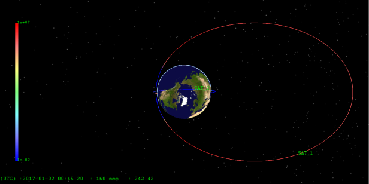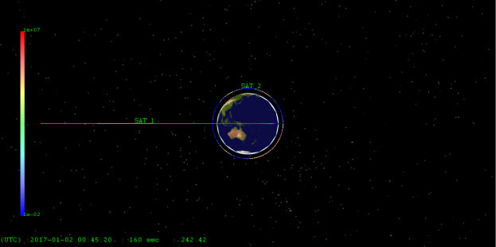

图 19-1辐射预期分布情况

 

## 二、操作步骤

（参见案例“Demo_0404_Envi_Radi”）

 

### 1.新建场景

点击“新建场景”，输入场景名称，其他参数保持默认。

 

### 2.设置卫星参数

在场景中添加2颗卫星，保持默认命名SAT_1，SAT_2。

2颗卫星采用近远地点参数进行轨道设置，具体轨道参数如下：SAT_1近地点高度300 km，远地点高度35786 km，轨道倾角6°，其他参数均为0；SAT_2近远地点高度均为1000 km，轨道倾角98°，其他参数均为0。

 

### 3.添加空间环境模型

在工具栏勾选“计算空间环境”后，在菜单栏点击“空间辐射环境”，选中“地球辐射带”，进入地球辐射带设置，如图 19-2所示。

图 19-2进入地球辐射带设置

 

在设置界面，首先在左下角选中“地球辐射带”，进入地球辐射带设置界面，电子辐射仿真模型选择“AE8-NASA”，在输出栏中将SAT_1，SAT_2添加至输出；质子辐射仿真模型选择“AP8-NASA”，同样将SAT_1，SAT_2添加至输出。勾选2种辐射模型下的“是否计算”选项，太阳低年和高年可自行选择。

设置完毕如图 19-3所示。

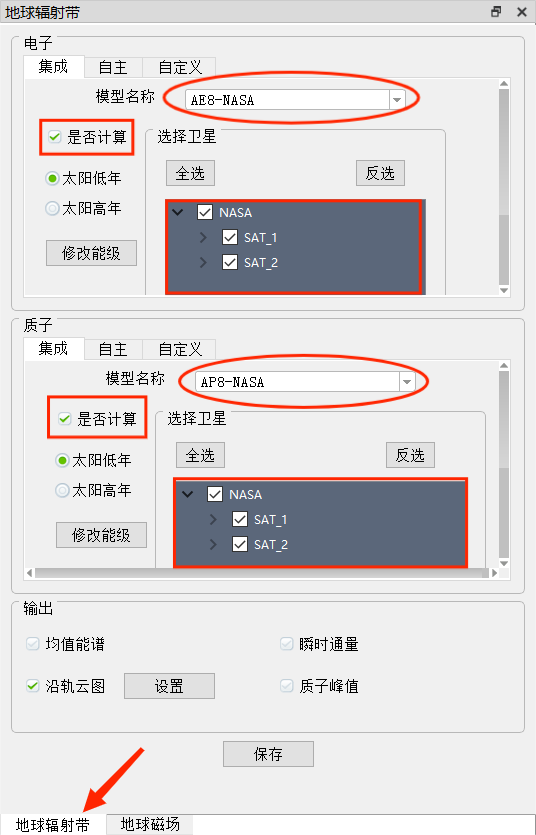

图 19-3 地球辐射带详细设置

 

### 4.输出设置

在地磁辐射带模型设置中，勾选“沿迹云图”，点击“设置”进入沿迹云图的输出设置界面。

在轨道云图的输出设置界面，将SAT_1，SAT_2的0.04 Mev电子添加到云图的输出中，点击“保存”。

具体流程如图 19-4、图 19-5所示。

图 19-4 输出沿迹云图 

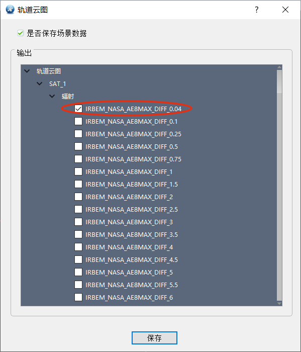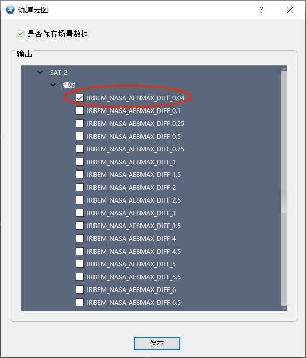

图 19-5 添加云图输出

 

沿迹云图设置完毕后，进入瞬时通量曲线的设置

在图 19-4所示的输出设置处，勾选“瞬时通量”，进入瞬时通量曲线输出界面，如图 19-6所示，点击“设置”进入显示设置。

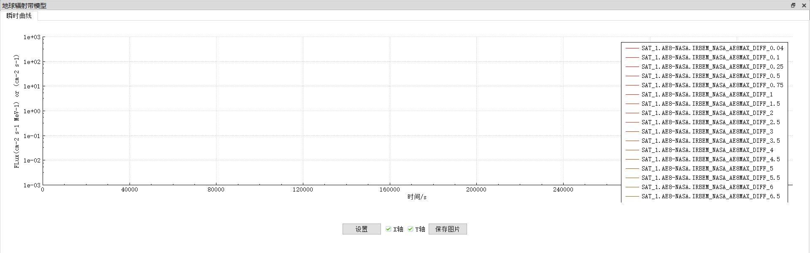

图 19-6 瞬时通量曲线图

 

在曲线显示设置中，将SAT_1和SAT_2下方0.04 Mev能级电子添加至输出中，如图 19-7所示，为便于区分，可将输出曲线设置成不同颜色。

图 19-7 曲线显示设置

 

点击“确定”保存。

 

### 5.仿真开始

点击“开始仿真”，播放仿真动画。

在仿真中，SAT_1靠近近地点及SAT_2经过南大西洋异常区时，瞬时电子通量会出现明显变化，请注意观察实验现象。

 

## 三、结果分析

### 1.仿真结果

仿真结束后，系统输出的轨迹云图如图 19-8、图 19-9所示

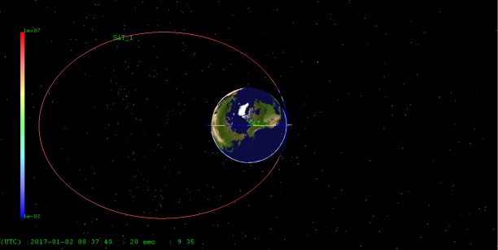

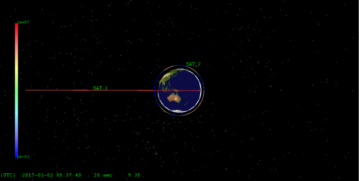

图 19-8 轨迹云图3D

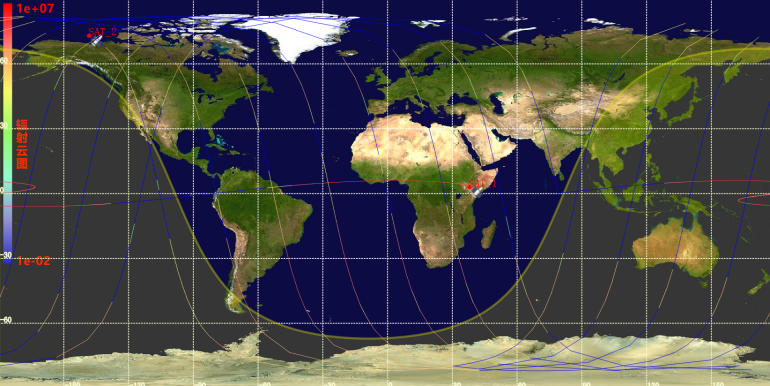

图 19-9 轨迹云图2D

 

瞬时通量曲线如图 19-10所示

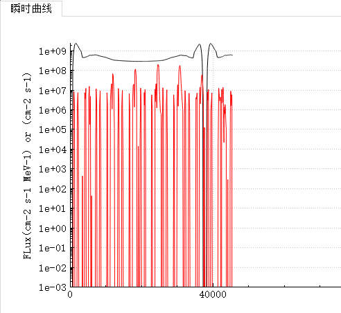

图 19-10 瞬时通量曲线

 

### 2.仿真分析

在仿真过程中，当卫星位于轨道不同位置时，其电子通量会出现明显变化。

如图 19-11所示，在SAT_1（大椭圆轨道）位于近地点附近时，其瞬时通量迅速降低至极低值，与SAT_2（近地圆轨道）基本保持一致。 

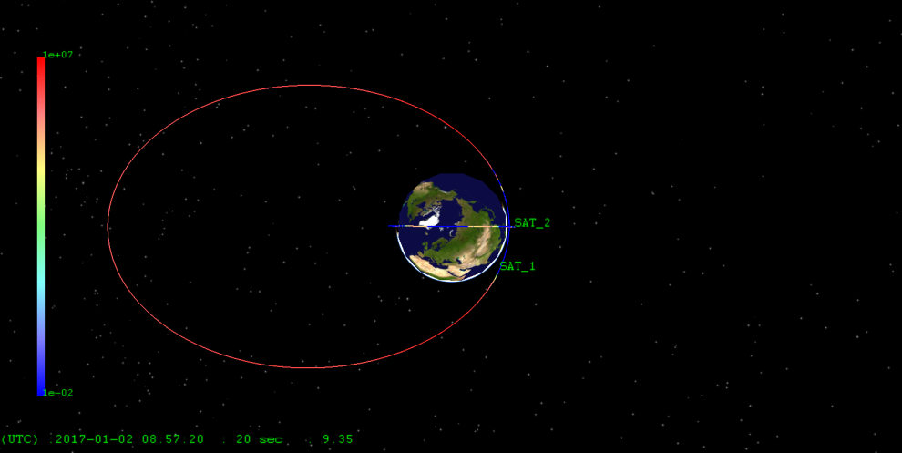

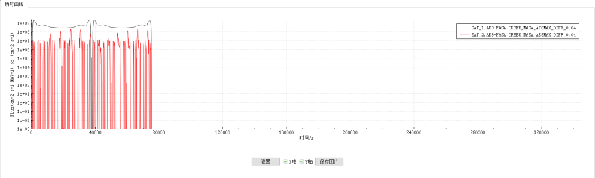

图 19-11 近地点附近瞬时通量

 

当SAT_2运行至南大西洋异常区时，其瞬时电子通量会达到最高点，如图 19-12所示。当卫星离开该区域时，瞬时通量再次下降至平均水平。

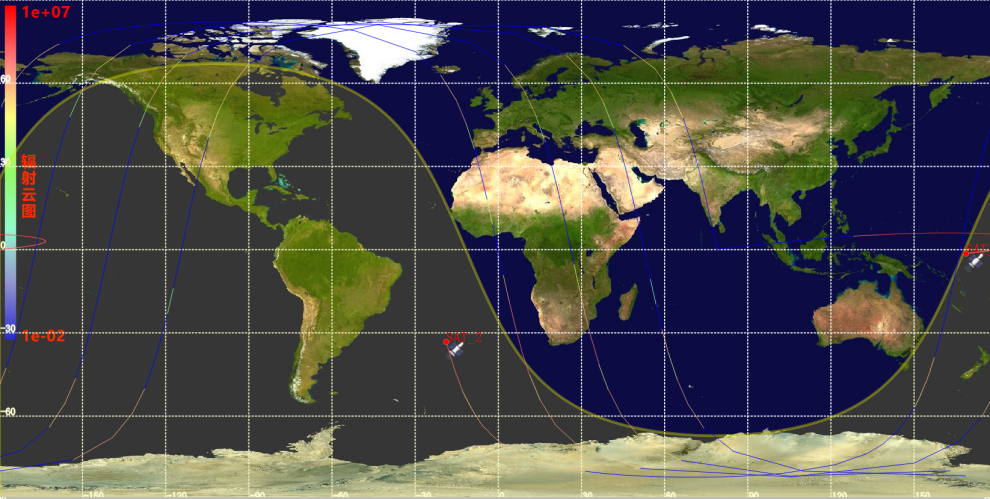

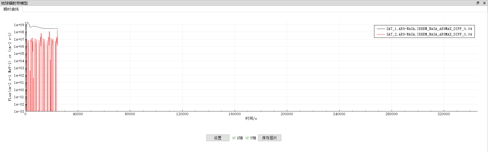

图 19-12 南大西洋异常区

 

 

# 案例20 空间碎片仿真

## 一、任务要求

### 1.实验目的

（1）熟悉SpaceSim通过读取双行元文件的形式添加卫星的方法，以及为卫星添加多模推力器、设置碰撞预警计算功能、输出碰撞概率和相对距离等操作。

（2）了解卫星SGP4轨道参数概念、双行元数据格式、双行元数据下载方法。

 

### 2.实验内容

有一卫星处于近地圆轨道上，近地点高度400 km，远地点高度5000 km，轨道倾角80°，试通过SpaceSim分析该卫星在空间碎片环境中的运行情况和碰撞概率。

 

### 3.预期结果

添加完空间碎片后，场景应当如图 20-1所示，在此空间环境中仿真卫星的运行情况。

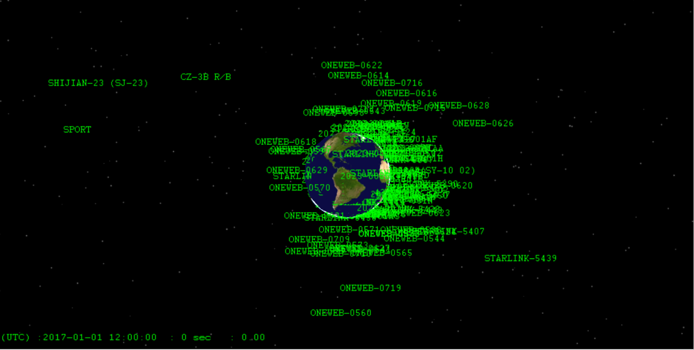

图 20-1 空间碎片环境

 

## 二、操作步骤

（参见案例“Demo_0405_Envi_Debris”）

 

### 1.新建场景

点击“新建场景”，输入场景名称，其他参数保持默认。

 

### 2.设置卫星参数

在场景中添加1颗卫星，默认命名为SAT_1。

由于本次仿真主要考察空间碎片情况，故对卫星轨道参数无特别要求，可自行合理设置。案例中所用轨道参数如下：近地点高度400 km，远地点高度5000 km，轨道倾角80°，其他参数均为0。

 

### 3.启用碰撞警告分析

在SAT_1对象上右键，选择“添加多模推力器”，如图 20-2所示，进入多模推力器设置界面。

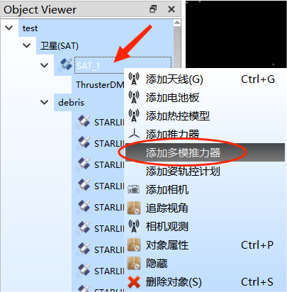

图 20-2 添加多模推力器

 

在多模推力器设置界面，勾选“是否启用碰撞警告分析”，点击“保存”，如图 20-3所示。

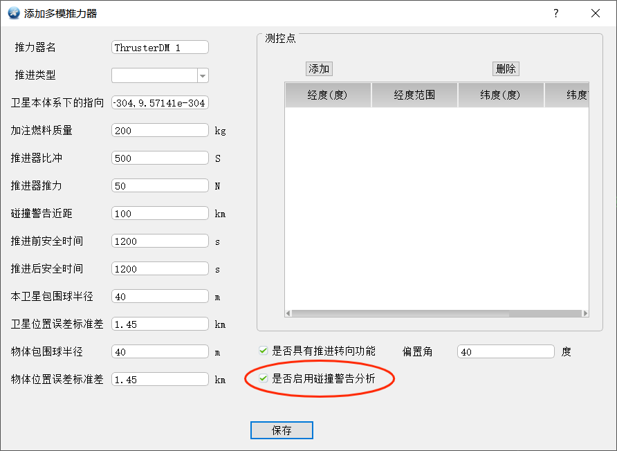

图 20-3 多模推力器设置

 

### 4.添加空间碎片

SGP系列模型是由北美防空联合司令部（NORAD）公布的轨道模型，本次仿真中采用该模型添加空间碎片。

数据下载处：https://celestrak.org/NORAD/elements/

进入网站，点击“Last 30 Days' Launches”，如图 20-4所示。

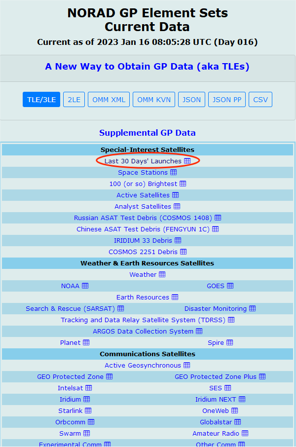

图 20-4 选择空间碎片模型

 

进入空间碎片模型参数界面，如图 20-5所示，将网页中参数全部复制，新建txt文本文件，将参数复制到文本文件中保存，并将扩展名保存为“.tle”。

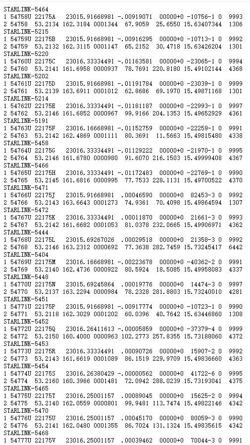

图 20-5 空间碎片SGP4轨道参数

 

返回SapceSim中，在“卫星（SAT）”选项上右键，选择“文件批量添加卫星”，如图 20-6所示。

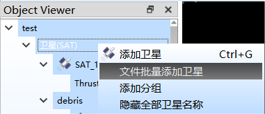

图 20-6 文件批量添加文星

 

在批量添加界面，点击“加载文件”后，选择之前保存的tle文件，如图 20-7、图 20-8所示，文件选择完毕后点击“批量添加”，软件会根据所选文件自行生成空间碎片。

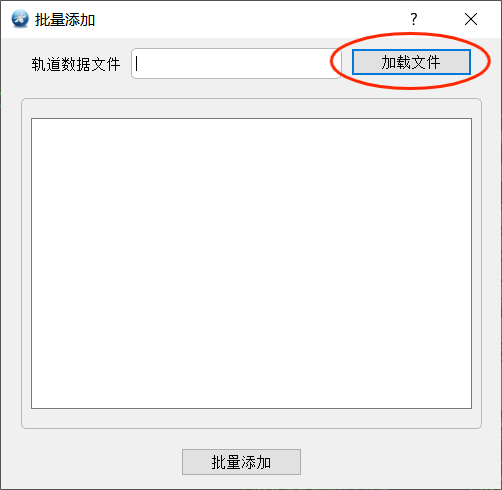

图 20-7 加载空间碎片数据文件

 

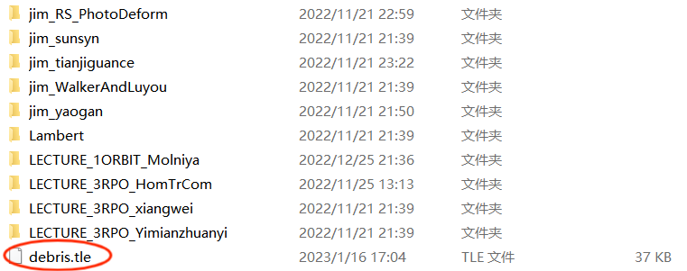

图 20-8 选择文件

 

### 5.添加输出

在输出文件设置界面，点击多模推力器“ThrusterDM_1”，将“碰撞预警卫星”和“当前距离”添加至输出，点击“OK”完成添加，如图 20-9所示。

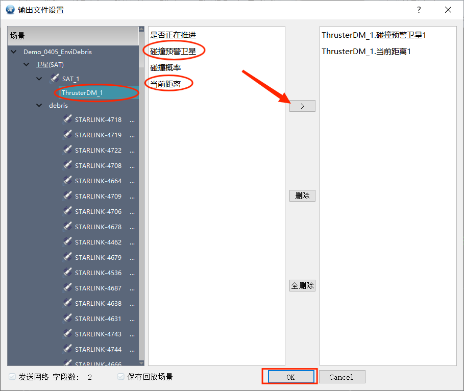

图 20-9 输出文件设置

 

### 6.仿真开始

点击“开始仿真”，播放仿真动画。

 

## 三、结果分析

### 1.仿真结果

在仿真过程中，卫星的运行情况如图 20-10所示。

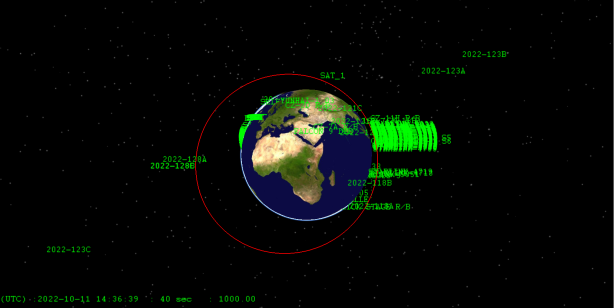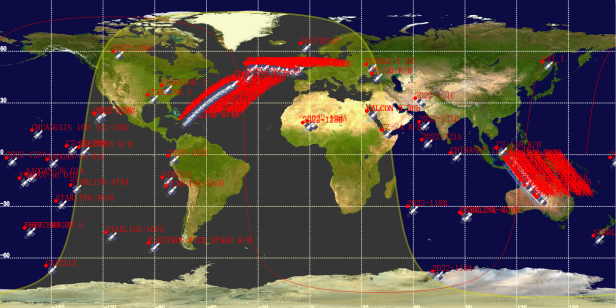

图 20-10 仿真结果展示

 

输出文件如图 20-11所示。

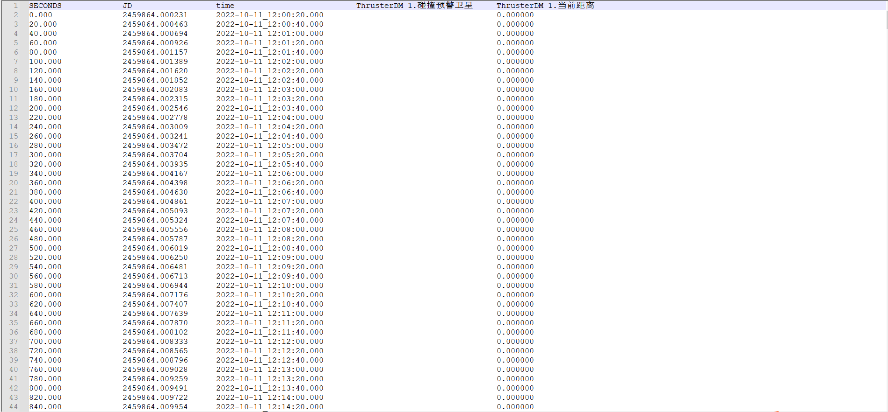

图 20-11 输出文件

 

### 2.仿真分析

通过本次仿真，应当对SGP4轨道模型有了一定的了解，并掌握输出碰撞概率和相对距离等操作。在卫星运行过程中，SpaceSim可以实时测量和估算卫星和空间碎片的相对关系，有助于空间碎片环境的分析。

# 案例21 碰撞预警仿真

## 一、任务要求

### 1.实验目的

（1）熟悉SpaceSim为卫星添加多模推力器、设置碰撞预警计算功能、输出碰撞概率和相对距离等操作。

（2）了解碰撞预警计算原则和碰撞概率与相对距离的关系。

 

### 2.实验内容

近地轨道上存在两颗卫星，距离较近。卫星1近地点高度500 km，远地点高度800 km，轨道倾角60°，其他参数均为0；卫星2近地点高度520 km，远地点高度820 km，轨道倾角60°。采用SpaceSim预测二者碰撞概率，计算相对距离。

 

### 3.预期结果

仿真中，卫星1和卫星2的相对关系应当如图 21-1所示，此时，2颗卫星相对距离很近，有相撞的风险。

具体数据待后续仿真。

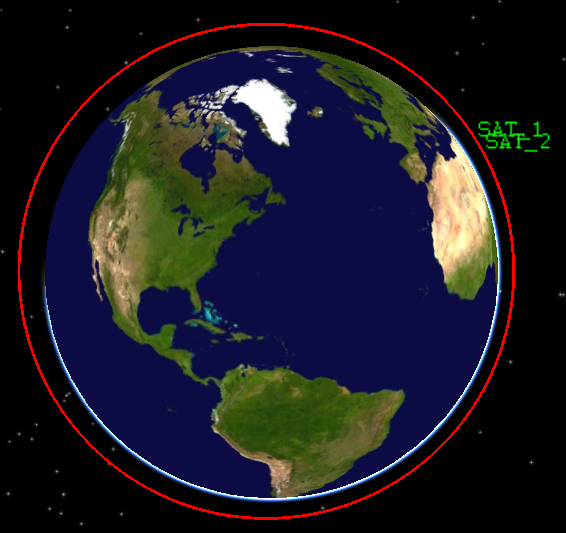

图 21-1 卫星相对关系

 

## 二、操作步骤

（参见案例“Demo_0406_EnviCollisionTest”）

 

### 1.新建场景

点击“新建场景”，输入场景名称，其他参数保持默认。

 

### 2.设置卫星参数

在场景中添加2颗卫星，默认命名为SAT_1，SAT_2。

设置卫星轨道参数如下：SAT_1近地点高度500 km，远地点高度800 km，轨道倾角60°，其他参数均为0；SAT_2近地点高度520 km，远地点高度820 km，轨道倾角60°，其他参数也均为0。

 

### 3.启用碰撞警告分析

在SAT_1对象上右键，选择“添加多模推力器”，进入多模推力器设置界面，勾选“是否启用碰撞警告分析”，点击“保存”（同案例20），添加完毕如图 21-2所示。

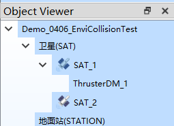

图 21-2 启用碰撞警告分析

 

### 4.添加输出

在输出文件设置界面，点击多模推力器“ThrusterDM_1”，将“碰撞预警卫星”、“碰撞概率”和“当前距离”添加至输出，点击“OK”完成添加，如图 21-3所示。

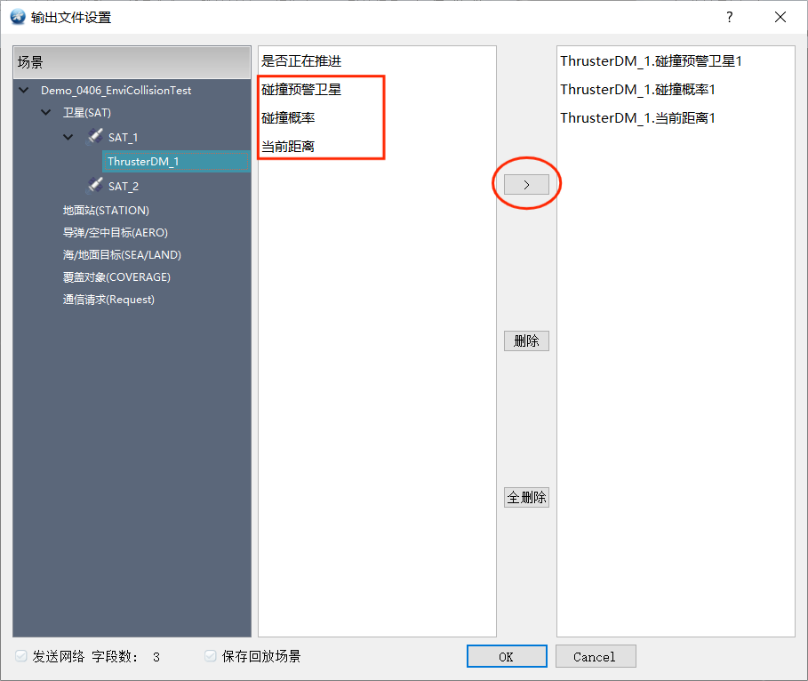

图 21-3 输出文件设置

 

### 5.仿真开始

点击“开始仿真”，播放仿真动画。

 

## 三、结果分析

### 1.仿真结果

仿真过程中，2颗卫星的相对关系如图 21-4所示。

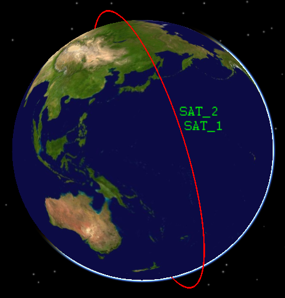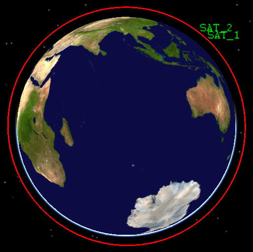

图 21-4 卫星相对关系

 

输出文件如图 21-5所示。

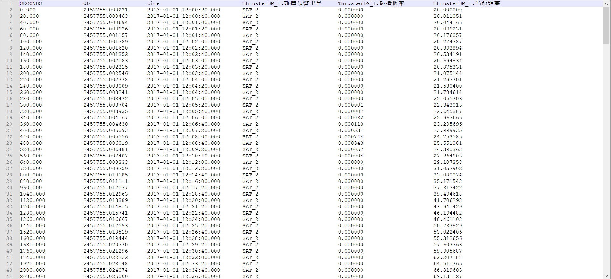

图 21-5 输出文件

 

### 2.仿真分析

将图 21-5所示的输出数据导入分析软件，并绘制分析图样，可得图 21-6所示的结果。

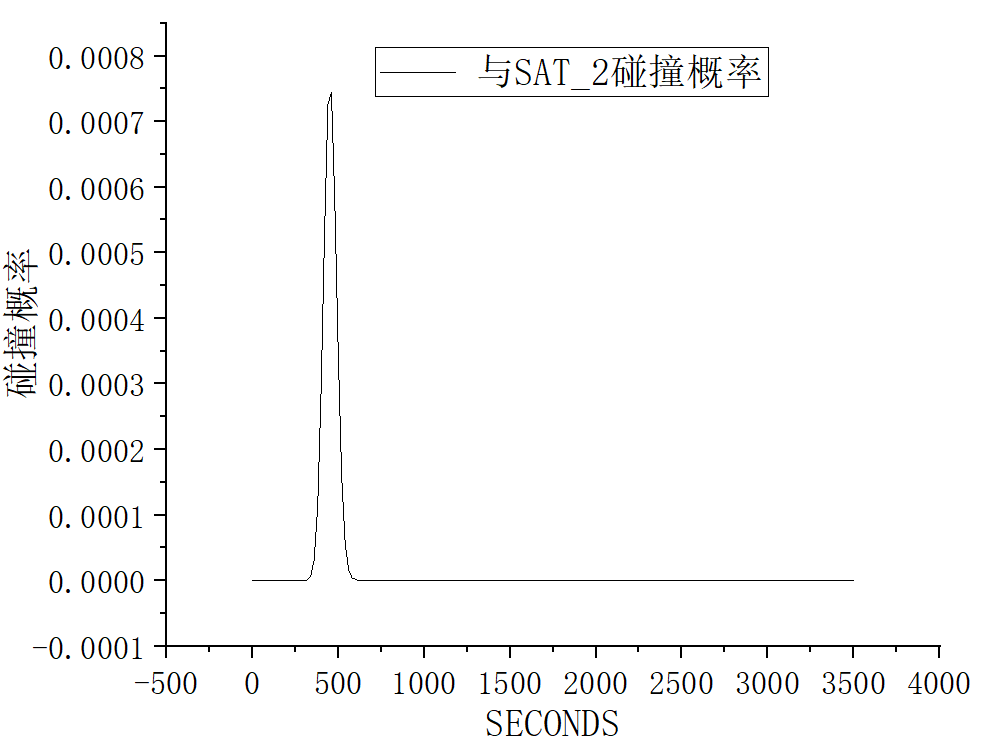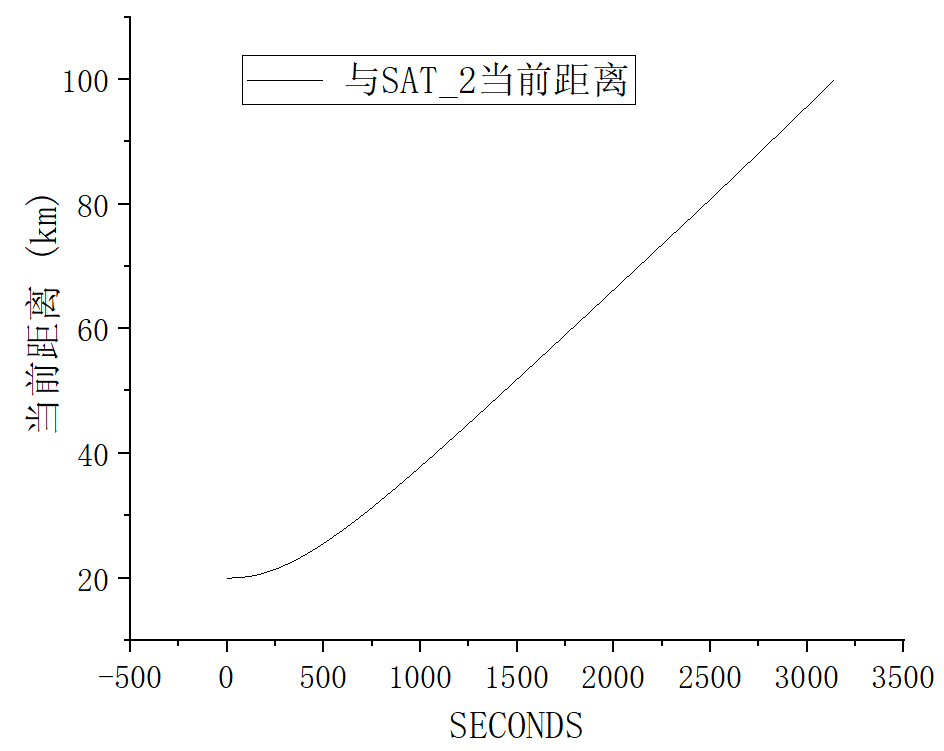

图 21-6 输出数据分析

 

由此可见，碰撞概率与一系列因素有关，并非距离越近概率越大。

# 案例22 导弹弹道仿真

## 一、任务要求

### 1.实验目的

（1）熟悉SpaceSim添加导弹和地面站的操作流程，熟悉利用指令实现导弹弹道仿真，以及输出导弹相关参数。

（2）了解弹道计算原理。

 

### 2.实验内容

在SpaceSim平台完成弹道导弹仿真任务，导弹从经度30°，纬度40°飞行至经度60°，纬度15°，生成仿真动画并观察导弹的飞行弹道。

 

### 3.预期结果

仿真中，导弹从发射经纬度至目标经纬度完成打击，经SpaceSim内部完成弹道的计算，其弹道示意图如图 22-1所示。

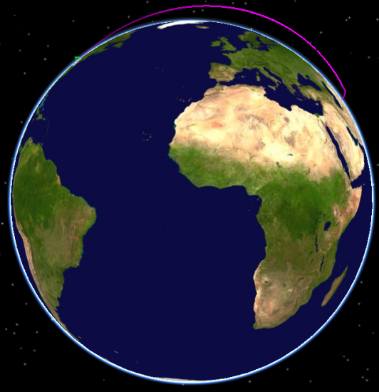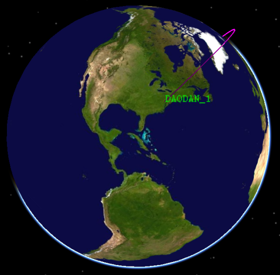

图 22-1 导弹预期弹道

 

## 二、操作步骤

（参见案例“Demo_0501_Missile_GroundTarget”）

 

### 1.新建场景

打开SpaceSim软件，点击“新建场景”，输入场景名称，时间参数保持默认，仿真步长调整为1秒，点击“OK”完成，如图 22-2所示。

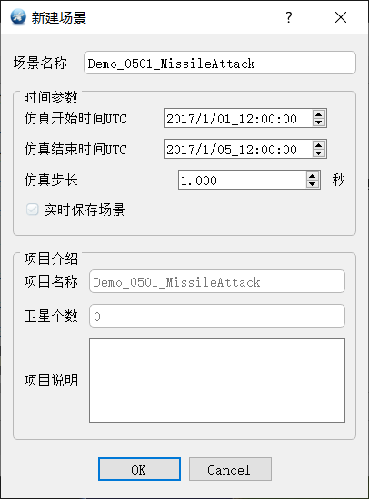

图 22-2 新建场景

 

### 2.设置导弹参数

菜单栏点击“模型”，选择“添加导弹”，如图 22-3所示，在弹出的对话框内导弹类型选择“快速交会服务”，其他参数保持默认，如图 22-4所示。

图 22-3 添加导弹

 

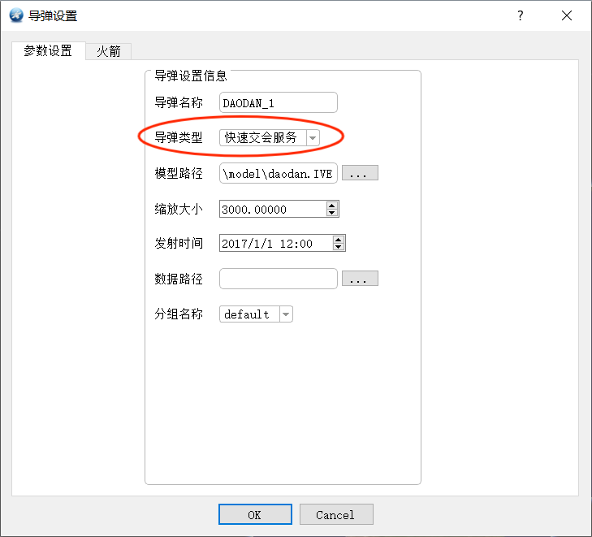

图 22-4 选择导弹类型

 

导弹类型选择完毕后，点击左上角“火箭”选项，进入导弹参数设置。根据任务分别选择火箭级数、任务类型，填写载荷质量、发动机平均推力、工作时间、点火质量、燃料加注量，并设置发射点经纬度、高度以及初速度，设置完成如图 22-5所示，点击“OK”完成设置。

导弹默认命名为DAODAN_1。

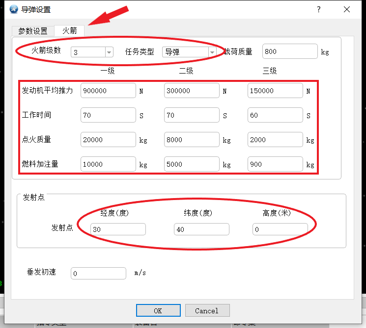

图 22-5 导弹参数设置

 

注：火箭有三种任务类型：

（1）如果是攻击任务，则任务类型选择“导弹”，为了显示直观，可在打击地点处添加“地面站”对象以作标记；

（2）如果是防御任务，则任务类型选择“快速交会”，可添加“卫星”对象，与卫星相关仿真相同；

（3）如果是运载任务，则任务类型选择“运载”即可。

 

### 3.添加任务指令

打开指令窗口，为导弹添加任务指令。

将执行时间修改为仿真开始时间，在指令栏中选择“导弹发射指令”，装备对象选择为DAODAN_1，指令参数设置为“60,15”，任务名称自动生成，点击“执行”完成任务指令添加，如图 22-6所示。

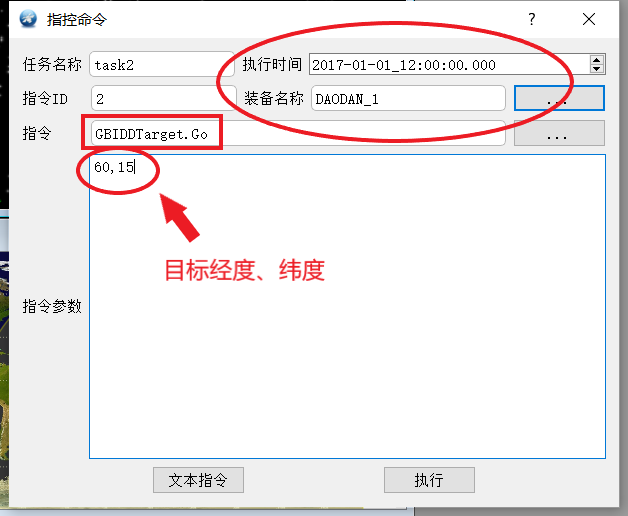

图 22-6 任务指令添加

 

### 4.添加输出

为后续分析，在仿真前可增加输出项，将DAODAN_1的“经度”、“纬度”、“高度”和“速度大小”添加至输出，添加完成如图 22-7所示。

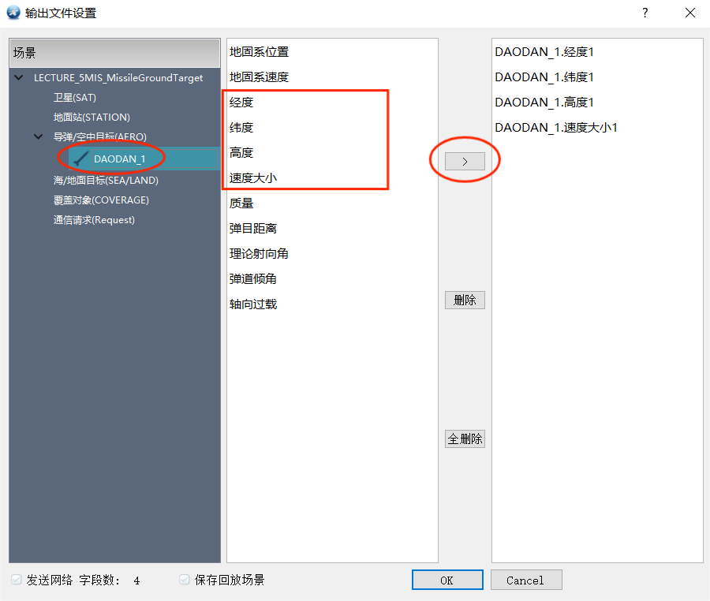

图 22-7 输出文件设置

 

### 5.仿真开始

点击“开始仿真”，播放仿真动画。

 

## 三、结果分析

### 1.仿真结果

仿真过程中，导弹的弹道如图 22-8所示，飞行过程如图 22-9所示。

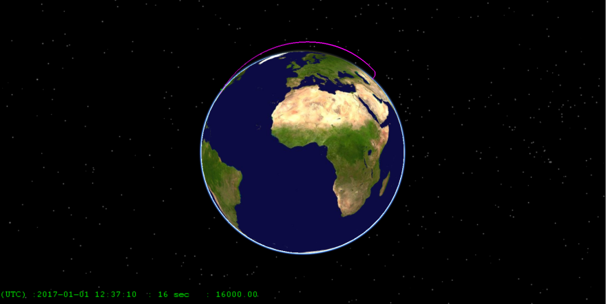

图 22-8 导弹弹道

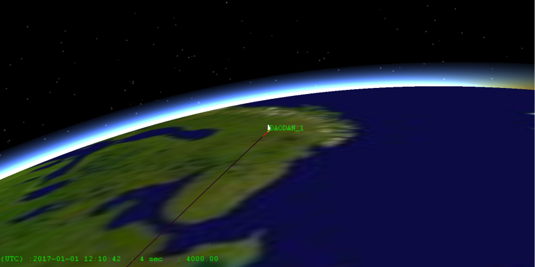

图 22-9 导弹飞行中

 

输出文件如图 22-10所示。

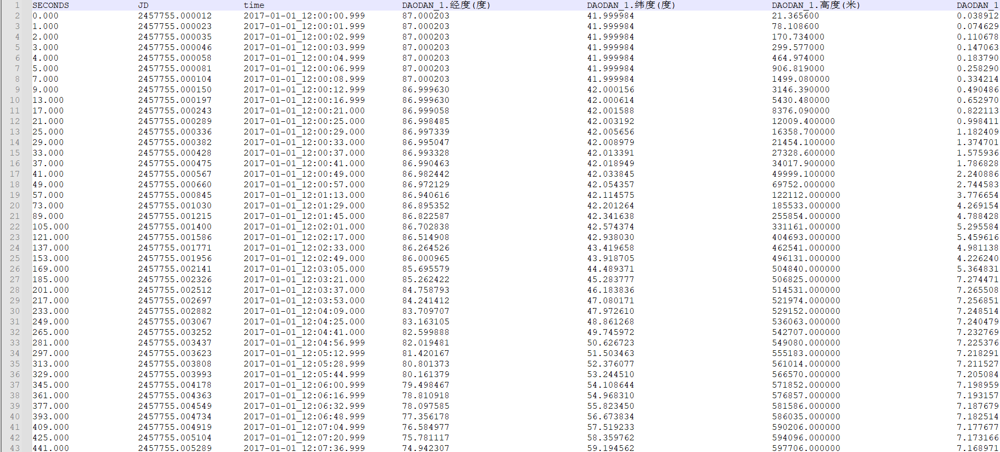

图 22-10 输出文件

 

### 2.仿真分析

本次仿真实现了导弹从弹道计算到发射、打击目标的全过程，基本达到了任务目标。

 

# 案例23 快速交会及制导仿真

## 一、任务要求

### 1.实验目的

（1）熟悉SpaceSim利用指令实现导弹快速拦截功能。

（2）了解导弹与卫星快速交会原理。

 

### 2.实验内容

在近地圆轨道上存在一颗卫星，轨道高度500 km，轨道倾角40°，现要发射一颗导弹与该卫星快速交会。导弹发射点位于经度80°，纬度35°，通过SapceSim完成弹道计算和仿真过程。

 

### 3.预期结果

仿真中，导弹从发射点位发射，经过弹道计算完成对指定航天器的快速交会任务，理想效果图如图 23-1所示。

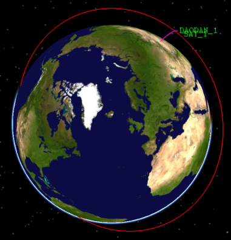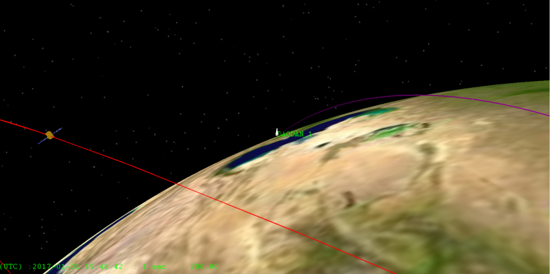

图 23-1 快速交会仿真预期结果

 

## 二、操作步骤

（参见案例“Demo_0502_Missile_SpaceTarget”）

 

### 1.新建场景

打开SpaceSim软件，点击“新建场景”，输入场景名称，时间参数保持默认，仿真步长调整为1秒，点击“OK”完成。

 

### 2.设置卫星参数

在场景中添加一颗卫星，默认命名为SAT_1。

SAT_1轨道参数如下：半长轴7378.3 km，偏心率0，轨道倾角40°，其他参数均为0。

 

### 3.设置导弹参数

在场景中添加一颗导弹，默认命名为DAODAN_1。

进入导弹设置，在“参数选择”界面，选择导弹类型为“快速交会服务”，其他参数均保持默认，如图 23-2所示。

图 23-2选择导弹类型

 

点击左上角“火箭”选项，进入导弹参数设置。根据任务分别选择火箭级数、任务类型，填写载荷质量、发动机平均推力、工作时间、点火质量、燃料加注量，并设置发射点经纬度、高度以及初速度，设置完成如图 23-3所示。

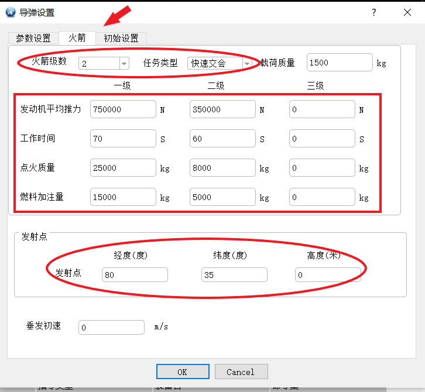

图 23-3 导弹参数设置

 

### 4.添加任务指令

打开指令窗口，为导弹添加任务指令。

将执行时间修改为仿真开始时间，在指令栏中选择“动能弹发射指令”，装备对象选择为DAODAN_1，指令参数设置为“SAT_1”（即目标航天器），任务名称自动生成，点击“执行”完成任务指令添加，如图 23-4所示。

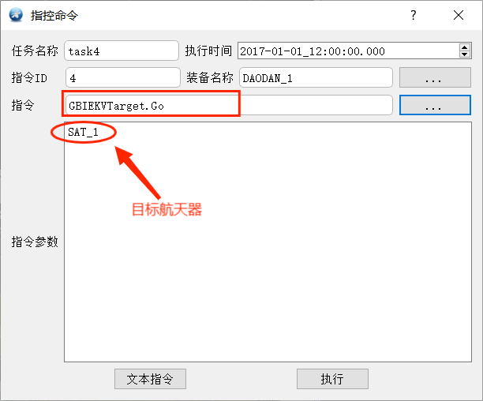

图 23-4 添加任务命令

 

### 5.仿真开始

点击“开始仿真”，播放仿真动画。导弹将在卫星运行第2圈期间发射，注意减小仿真步长，观察实验现象。

 

## 三、结果分析

### 1.仿真结果

仿真过程中，导弹的弹道如图 23-5所示，飞行过程如图 23-6所示。

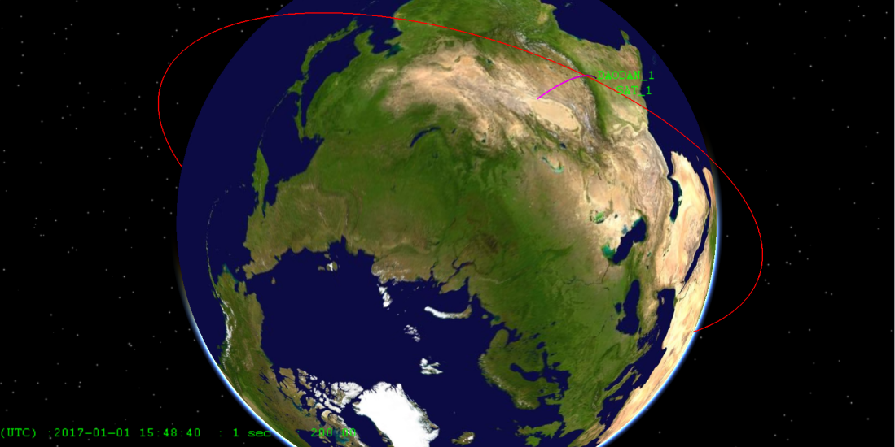

图 23-5 导弹弹道展示 

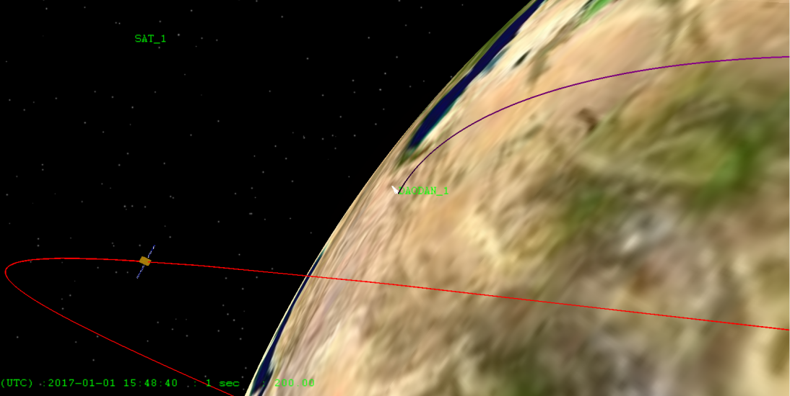

图 23-6 导弹飞行过程

 

### 2.仿真分析

本次仿真任务实现了导弹与卫星快速交会从弹道计算、发射到交会全过程，达成了实验目标。

# 案例24 火箭运载仿真

## 一、任务要求

### 1.实验目的

（1）熟悉SpaceSim利用指令实现火箭运载功能。

（2）了解火箭发射入轨过程。

 

### 2.实验内容

在东经100°，北纬41°发射一枚火箭，将卫星送入轨道高度500 km，轨道倾角98°的近地圆轨道上。通过SapceSim完成计算和仿真过程。

 

### 3.预期结果

仿真中，SpaceSim可以自行计算运载火箭的弹道，以保证发射的顺利进行。理想效果图如图 24-1、图 24-2所示。

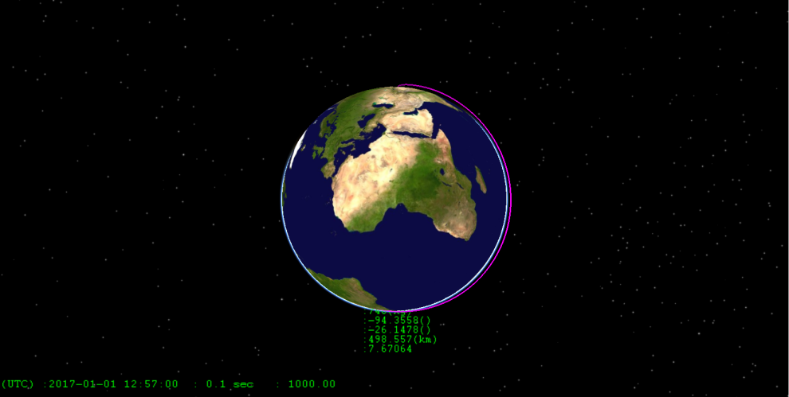

图 24-1 预期发射结果

 

图 24-2 火箭追踪视角

## 二、操作步骤

（参见案例“Demo_0503_Rocket_Launch”）

 

### 1.新建场景

打开SpaceSim软件，点击“新建场景”，输入场景名称，时间参数保持默认，仿真步长调整为0.1秒，点击“OK”完成。

 

### 2.设置火箭参数

在场景中添加一颗导弹，默认命名为DAODAN_1。

进入导弹设置，在“参数选择”界面，选择导弹类型为“快速交会服务”，其他参数均保持默认。

点击左上角“火箭”选项，进入导弹参数设置。根据任务分别选择火箭级数、任务类型，填写载荷质量、发动机平均推力、工作时间、点火质量、燃料加注量，并设置发射点经纬度、高度以及初速度，设置完成如图 24-3所示。

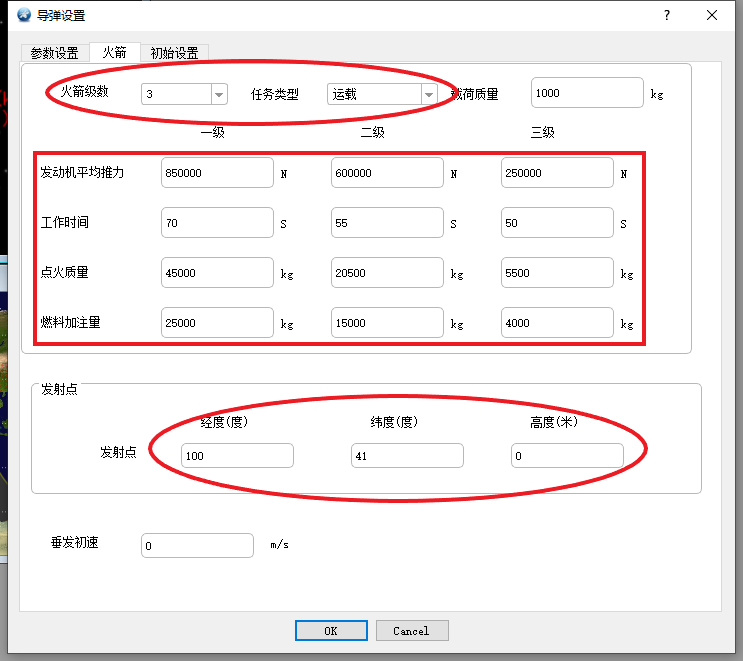

图 24-3 火箭参数设置

 

### 3.添加任务指令

打开指令窗口，为火箭添加任务指令。

将执行时间修改为仿真开始时间，在指令栏中选择“运载火箭发射指令”，装备对象选择为DAODAN_1，指令参数设置为“500,98”，任务名称自动生成，点击“执行”完成任务指令添加，如图 24-4所示。

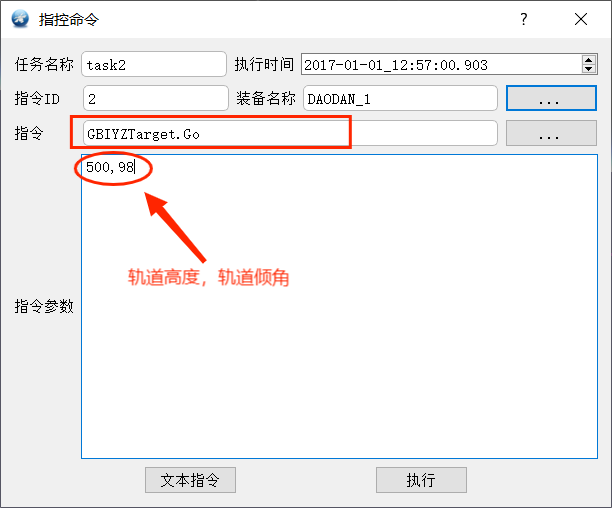

图 24-4 任务指令添加

 

### 4.仿真开始

点击“开始仿真”，播放仿真动画。

 

## 三、结果分析

### 1.仿真结果

在实验过程中，火箭执行发射指令后，将在合适的时机发射并自行调整推进过程，将航天器送入目标轨道，其轨道和飞行示意图如图 24-5、图 24-6所示。

图 24-5 火箭运载轨道

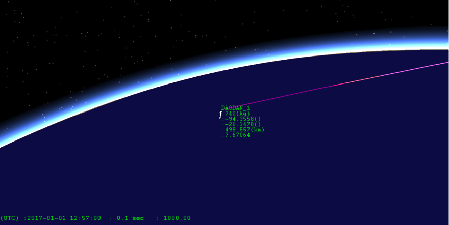

图 24-6 火箭飞行过程

 

### 2.仿真分析

本次仿真任务实现了运载火箭从弹道计算、发射到入轨的过程，基本达成了实验目标。

# 案例25 天线指向覆盖仿真

## 一、任务要求

### 1.实验目的

（1）熟悉SpaceSim中为卫星添加天线，以及圆锥波束天线参数设置、环扫天线参数设置等操作。

（2）了解不同轨道高度天线指向覆盖特点以及环扫

 

### 2.实验内容

在SpaceSim中为3颗卫星添加天线，并设置卫星参数，在软件中观察卫星的覆盖情况。

3颗卫星及天线参数如表 25-1所示。

表 25-1 卫星及天线设置 

| 名称           | SAT_1        | SAT_2        | SAT_3    |
| -------------- | ------------ | ------------ | -------- |
| 近地点高度(km) | 5000         | 20000        | /        |
| 远地点高度(km) | 5000         | 20000        | /        |
| 半长轴(km)     | /            | /            | 42166.3  |
| 偏心率         | /            | /            | 0        |
| 轨道倾角(°)    | 98           | 98           | 50       |
| 升交点赤经(°)  | 0            | 20           | -80      |
| 近地点幅角(°)  | 0            | 0            | 0        |
| 平近点角(°)    | 0            | 0            | 0        |
| 天线波束类型   | 圆锥波束通讯 | 圆锥波束通讯 | 环扫天线 |
| 天线锥角       | 10           | 10           | 5        |
| 环扫幅度(°)    | \            | \            | 2        |
| 环扫速度(°/s)  | \            | \            | 0.5      |

### 3.预期结果

在卫星运行过程中，天线的覆盖因轨道高度、天线类型等因素而出现变化，预期实验结果如图 25-1、图 25-2所示。

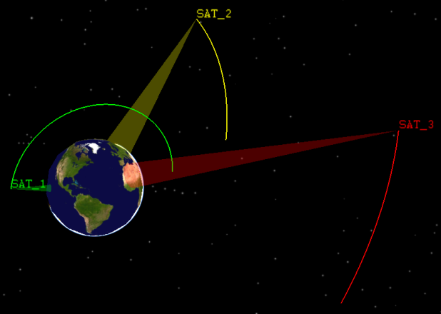

图 25-1 预期结果3D

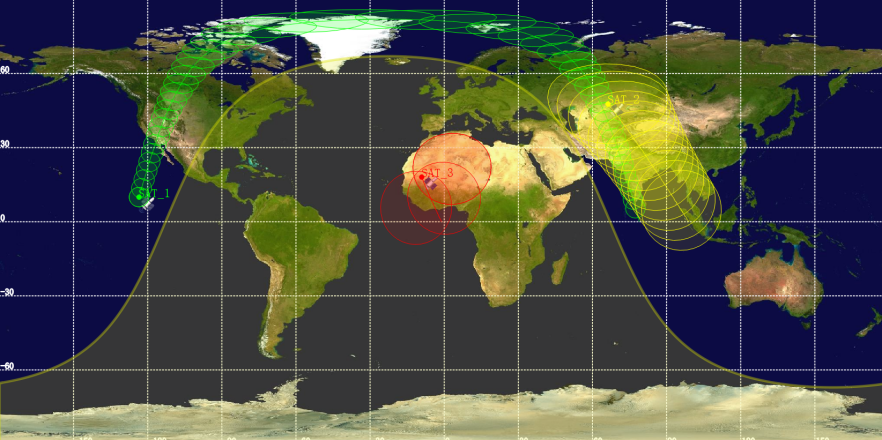

图 25-2 预期结果2D

 

## 二、操作步骤

（参见案例“Demo_0601_ANT_Cover”）

 

### 1.新建场景

打开SpaceSim软件，点击“新建场景”，输入场景名称，时间参数保持默认，仿真步长调整为60s，点击“OK”完成。

 

### 2.设置卫星参数

在场景中添加3颗卫星，默认命名为SAT_1，SAT_2，SAT_3。

分别设置3颗卫星的轨道参数，采用近远地点方法设置卫星轨道，具体参数见表 25-1。

 

### 3.添加天线

添加卫星后，右键卫星名称，选择“添加天线”，可进入天线参数设置窗口，如图 25-3所示。

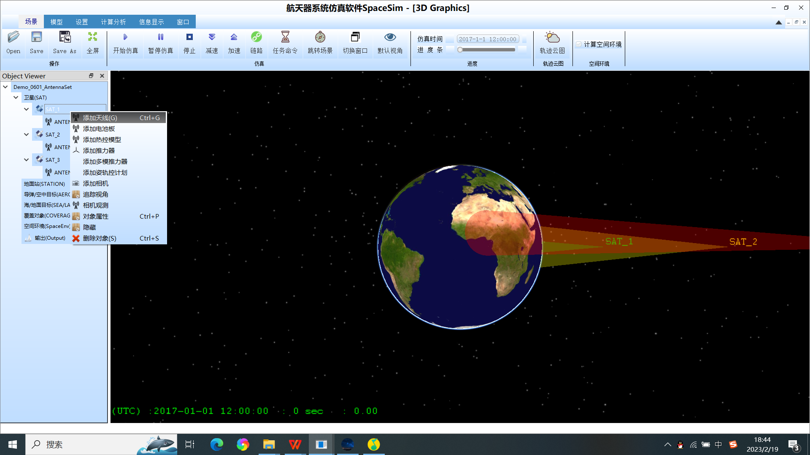

图 25-3 添加天线

 

进入天线设置窗口如图 25-4所示。

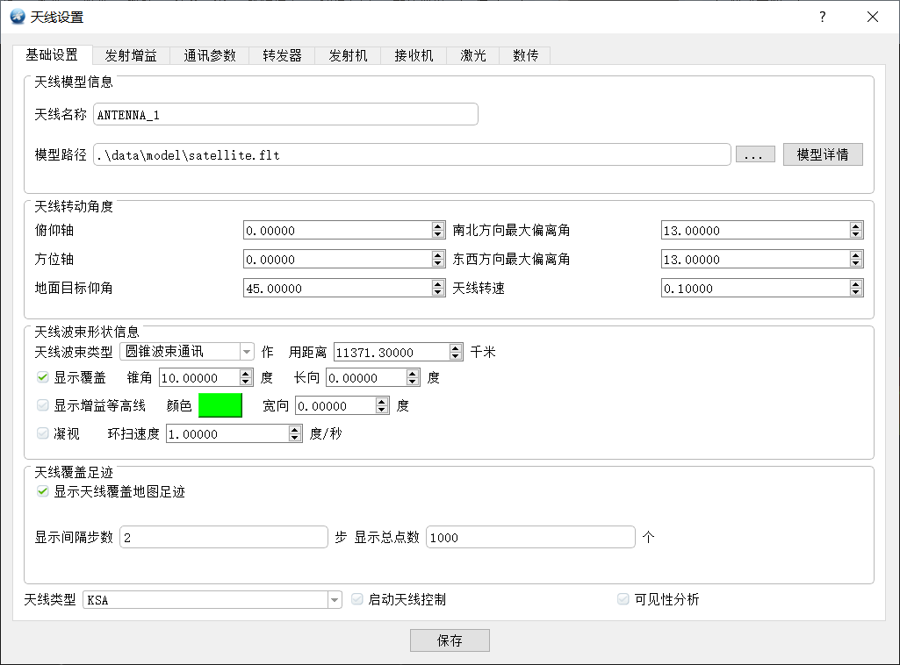

图 25-4 天线设置

 

基础设置中，可以修改天线名称，模型路径保持默认。除基础设置外，通讯参数等设置需与第三方连接使用，如图 25-5所示。

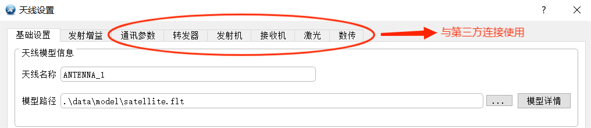

图 25-5 设置天线基本信息

天线参数设置模块的内容较多，按功能大致分类如图 25-6所示。

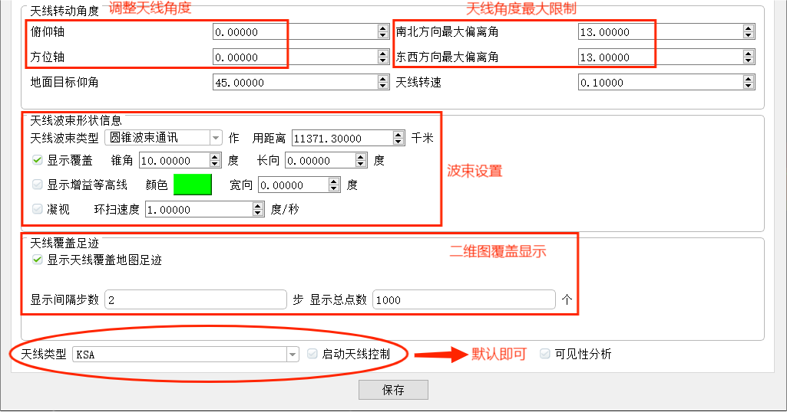

图 25-6 天线参数设置

 其中，天线波束形状信息功能如图 25-7所示。

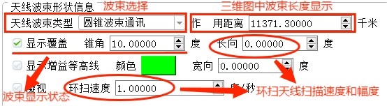

图 25-7 天线波束形状信息设置

 按照表 25-1修改天线参数，其余次要参数可保持默认。

 

### 4.仿真过程

点击“开始仿真”，播放仿真动画。在运行过程中，天线的覆盖情况因轨道高度、天线类型等因素而出现差异，注意观察现象。

 

## 三、结果分析

### 1.仿真结果

仿真结果如所示。

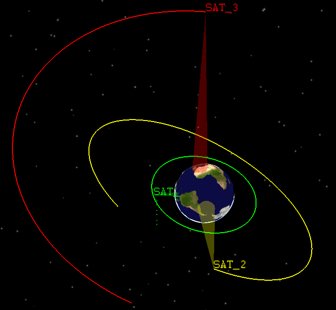

图 25-8 3D视图

 

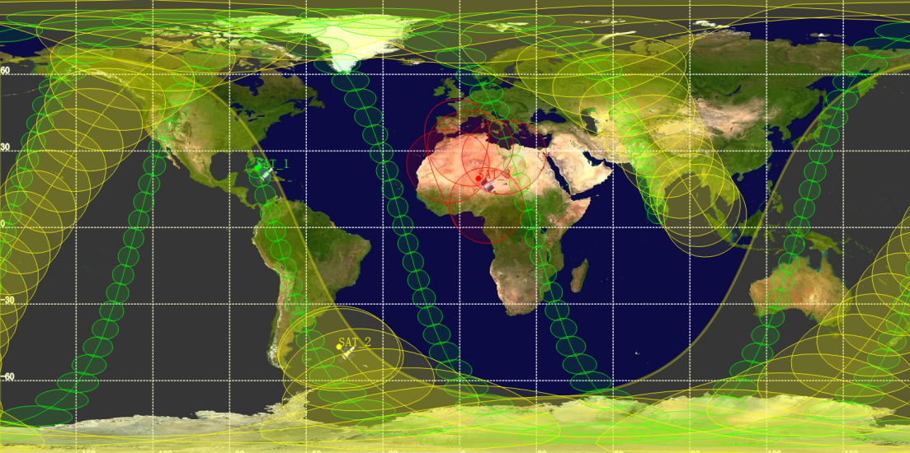

图 25-9 2D视图

### 2.仿真分析

在仿真过程中可以看到，SAT_1和SAT_2因轨道高度不同，地面覆盖特性出现很大差异，高轨卫星SAT_2覆盖范围明显大于低轨卫星SAT_1。在仿真中，也可观察环扫卫星的覆盖特点，即以卫星星下点为中心的环绕覆盖区域。

# 案例26 天线指向控制仿真

## 一、任务要求

### 1.实验目的

（1）熟悉SpaceSim中利用指令实现天线中心指向某固定经纬度、瞬时指向某特定目标以及多波束设置方法。

（2）了解多波束赋形天线指向与星下点轨迹关系。

 

### 2.实验内容

在SpaceSim平台中添加两颗卫星，为卫星1添加多波束赋形天线，卫星2为静止卫星，采用普通圆锥波束。其中，卫星2先通过指令指向经度120°、纬度20°处，经过一段时间后，再转向经度100°、纬度-30°处。在仿真过程中，观察两颗卫星的天线覆盖情况。

卫星及天线详细信息如表 26-1所示。

表 26-1 卫星及天线信息

| 名称          | SAT_1          | SAT_2        |
| ------------- | -------------- | ------------ |
| 半长轴(km)    | 42157.3        | 42166.3      |
| 偏心率        | 0              | 0            |
| 轨道倾角(°)   | 20             | 0            |
| 升交点赤经(°) | -135           | 0            |
| 近地点幅角(°) | 0              | 0            |
| 平近点角(°)   | 0              | 0            |
| 天线波束类型  | 多波束赋形天线 | 圆锥波束通讯 |
| 天线锥角      | \              | 5            |

 

### 3.预期结果

运行过程中，天线的指向和覆盖情况均随时间不断变化，预期仿真结果应如图 26-1所示。

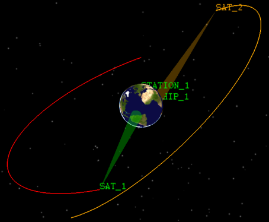 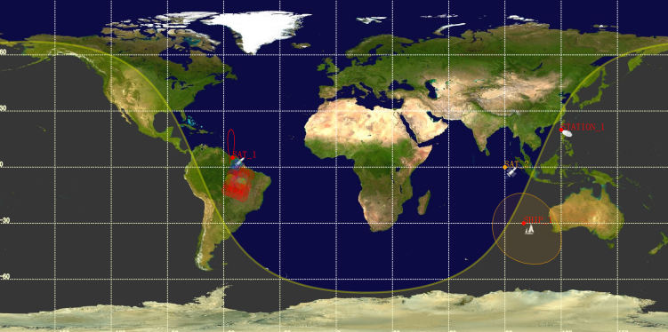

图 26-1 预期仿真结果 

## 二、操作步骤

（参见案例“Demo_0602_ANT_PointCtrl”）

 

### 1.新建场景

打开SpaceSim软件，点击“新建场景”，输入场景名称，时间参数保持默认（案例中仿真开始时间为：2017/1/01_12:00:00，结束时间为：2017/1/05_12:00:00），仿真步长调整为200s，点击“OK”完成。

 

### 2.设置卫星参数

在场景中添加2颗卫星，默认命名为SAT_1，SAT_2。

分别设置2颗卫星的轨道参数，具体参数见表 26-1。

为了便于观察天线指向，在经度120°、纬度20°处添加一个地面站，默认命名为STATION_1；在经度100°、纬度-30°处添加一艘船，默认命名为SHIP_1，其他参数均保持默认。

 

### 3.添加天线

为SAT_1添加天线，基础设置均保持默认。

点击“发射增益”，进入发射增益设置，在“多波束设置”框下，点击按钮，选择多波束增益文件，如图 26-2所示。

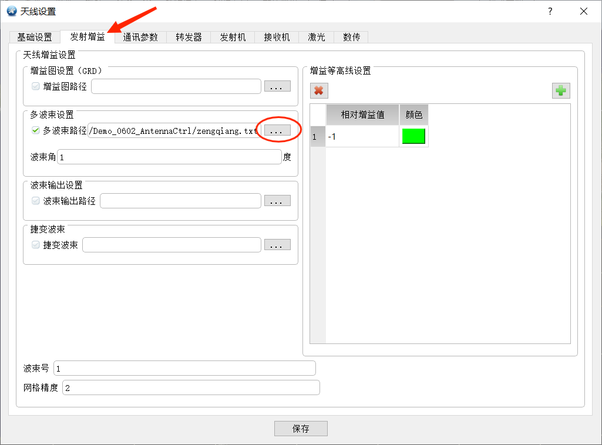

图 26-2 发射增益设置

 

进入SpaceSim的安装目录，进入下列文件夹：

..\SpaceSim\scenes\Demo_0602_AntennaCtrl，找到多波束增益文件zengqiang.txt，点击“打开”选中文件，如图 26-3所示。

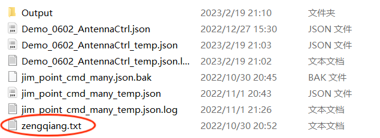

图 26-3 选择增益文件

 

回到图 26-2的发射增益设置界面，点击“保存”。

为SAT_2添加天线，主要修改参数如表 26-1所示，其他参数保持默认。

 

### 4.添加任务指令

打开指令窗口，为SAT_2天线添加任务指令。

执行时间：2017-01-01_13:20:00.000，选择“天线指向中心点经纬度”指令，装备名选择“SAT_2.ANTENNA_2”（即SAT_2天线），指令参数“120,20,0.001”（目标经度、纬度，天线转动速度(单位：度/秒)）。

执行时间：2017-01-01_20:00:00.000，选择“天线瞬时捕获目标”指令，装备名依然选择“SAT_2.ANTENNA_2”，指令参数“SHIP_1”（目标名称）。

指令添加完毕如图 26-4所示。

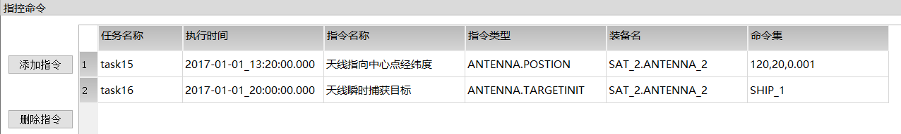

图 26-4 任务指令添加

 

### 5.仿真过程

点击“开始仿真”，播放仿真动画。在运行过程中，注意观察天线的指向和覆盖情况。

 

## 三、结果分析

### 1.仿真结果

在仿真过程中，SAT_2.ANTENNA_2执行不同指令后，完成了对指定地区的指向覆盖，结果如所示。

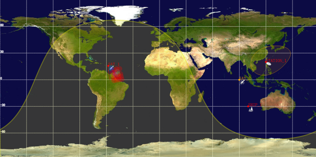 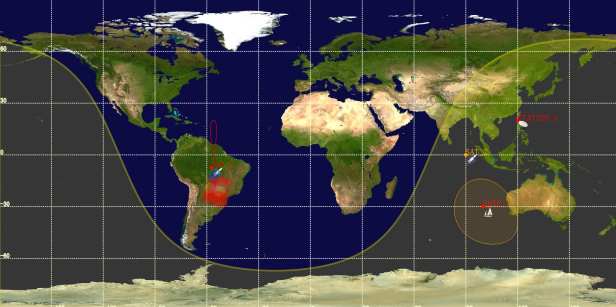

图 26-5 仿真结果

 

### 2.仿真分析

在仿真过程中，SAT_2的天线执行指令后均正确完成了对指定地点的指向覆盖，达到了预期的效果。

SAT_1的多波束天线随着卫星星下点位置的改变，天线的波束覆盖分布也逐渐发生了变化，与初期预想的分布偏离。因此，多波束天线一般用于地球静止轨道卫星，以保证波束分布的稳定性。

# 案例27 通信干扰仿真

## 一、任务要求

### 1.实验目的

（1）熟悉SpaceSim中为卫星天线添加发射机、接收机、干扰机及相关参数设置方法，以及链路信息显示窗口。

（2）了解卫星天线发射机和接收机对准度、频率设置、干扰机设置对链路信息的载干比、误码率等影响。

 

### 2.实验内容

地球静止轨道上存在5颗卫星，其轨道参数如下：

半长轴：42166.3 km

偏心率：0

轨道倾角：0°

升交点赤经：5颗卫星从SAT_1到SAT_5分别为0°，60°，-5°，3°，90°

近地点幅角：0°

平（真）近点角：0°

 

地球表面经度0，纬度0处有一地面站。

5颗卫星和地面站均配备天线与收发设备，其设备类型及参数如所示。

表 27-1 设备类型及参数配置

| 名称         | SAT_1        | SAT_2        | SAT_3        | SAT_4        | SAT_5        | STATION_1    |
| ------------ | ------------ | ------------ | ------------ | ------------ | ------------ | ------------ |
| 天线波束类型 | 圆锥波束通讯 | 圆锥波束通讯 | 圆锥波束通讯 | 圆锥波束通讯 | 圆锥波束通讯 | 圆锥波束通讯 |
| 天线锥角(°)  | 5            | 5            | 5            | 5            | 5            | 5            |
| 设备类型     | 发射机       | 接收机       | 干扰机       | 干扰机       | 发射机       | 接收机       |
| 设备名称     | fasheji_1    | jishouji_1   | fasheji_2    | fasheji_3    | fasheji_4    | jishouji_2   |
| 频率(GHz)    | 14.5         | 14.5         | 14.5         | 20           | 20           | 20           |
| 接收类型     | \            | fasheji_1    | \            | \            | \            | fasheji_4    |

 

通过SpaceSim的任务指令系统使干扰机作用于通信链路，观察干扰对通信链路载干比、误码率等特征的影响。

### 3.预期结果

在仿真中，SAT_1与SAT_2构成通信链路，SAT_5与地面站STATION_1构成通信链路，此时，通信系统应当正常工作。当干扰机的干扰施加于通信链路中时，系统原有的通信性能应下降，出现载干比下降、误码率上升等情况。

 

## 二、操作步骤

（参见案例“Demo_0603_ANT_CommDisturb”）

 

### 1.新建场景

打开SpaceSim软件，点击“新建场景”，输入场景名称，时间参数保持默认（案例中仿真开始时间为：2017/1/01_12:00:00，结束时间为：2017/1/05_12:00:00），仿真步长调整为20s，点击“OK”完成。

 

### 2.设置卫星参数

在场景中添加5颗卫星，默认命名为SAT_1~5。

5颗卫星均为地球静止轨道卫星，半长轴42166.3 km，升交点赤经别为0°，60°，-5°，3°，90°，其他参数均为0。

在地球表面经度0，纬度0处添加1个地面站，默认命名为STATION_1。

 

### 3.添加天线

为所有卫星和地面站添加天线，均采用锥角5°的圆锥波束。

注意：一般天线默认从所在位置指向星下点处，而地面站的天线需要指向正上方，因此地面站天线俯仰角应设置为180°，如图 27-1所示，同时。为保证天线能够自由转动，建议将“南北方向最大偏离角”和“东西方向最大偏离角”均设置为180°。

卫星上的天线俯仰角保持默认0°即可。

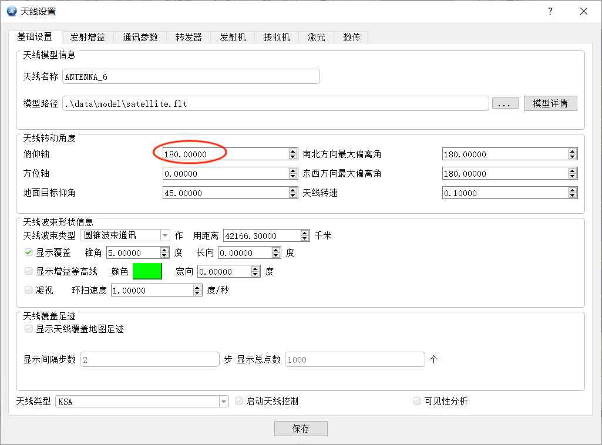

图 27-1 天线俯仰角设置

 

### 4.配置发射机

天线添加完毕后，右键天线名称，点击“配置发射机”，如图 27-2所示

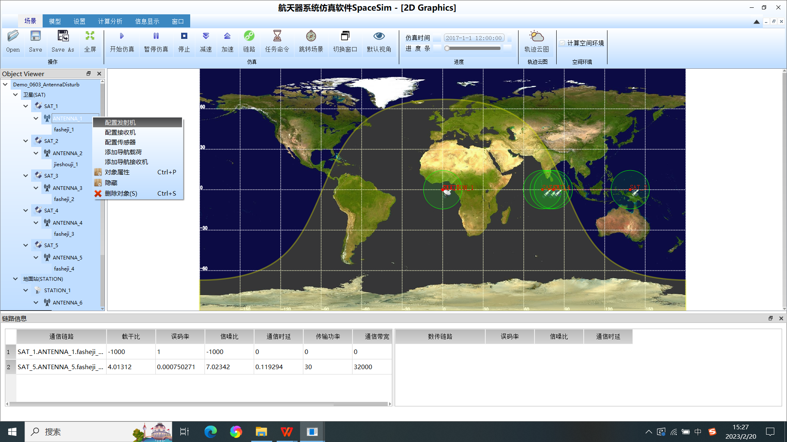

图 27-2 配置发射机

 

进入发射机设置界面，如图 27-3所示。

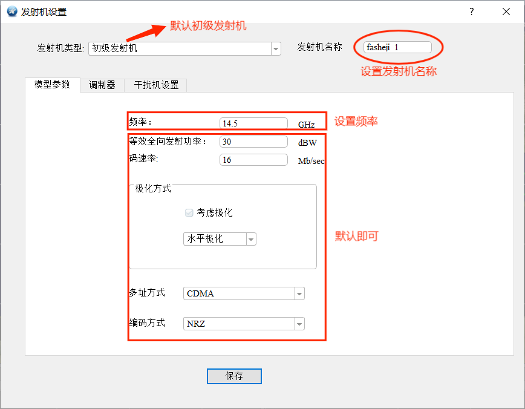

图 27-3 发射机设置

 

本次实验中，仅需设置发射机频率，其他参数保持默认即可。

 

### 5.配置接收机

右键天线名称，点击“配置接收机”，如图 27-4所示。

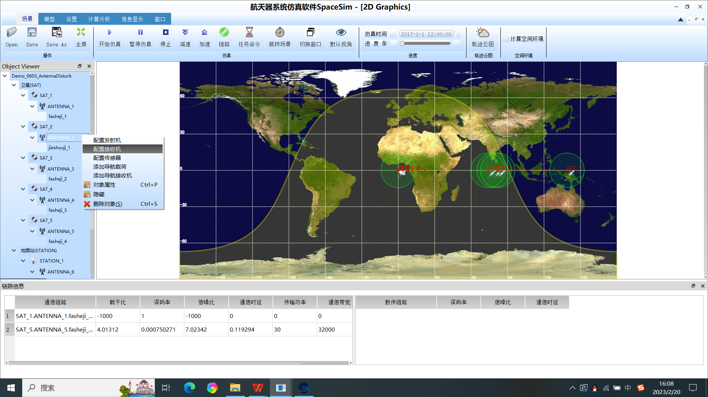

图 27-4 配置接收机

 

进入接收机设置，如图 27-5所示。

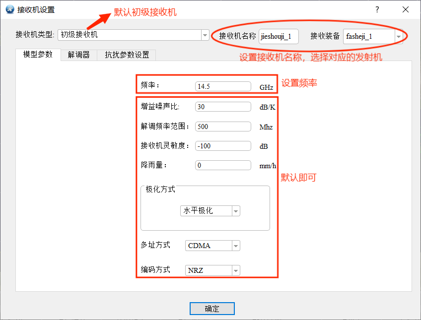

图 27-5 接收机设置

 

在设置中，为接收机选择所对应的发射机，并设置相应频率，其他参数保持默认。

为了更直接地观察干扰对通信质量的影响，需要去除接收机自身的抗干扰能力，操作如下：点击“抗扰参数设置”，将“常规抗扰”、“跳频抗扰”和“扩频抗扰”均取消勾选，即可去除接收机抗干扰能力，如图 27-6所示。

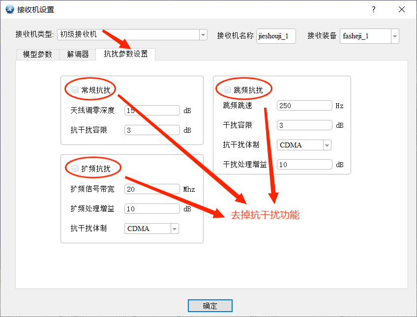

图 27-6 去除抗干扰功能

 

### 6.添加干扰机

为天线配置发射机并设置好发射机频率后，在发射机设置中，点击“干扰机设置”，勾选“干扰机”，将该发射机设置为干扰机，如图 27-7所示。

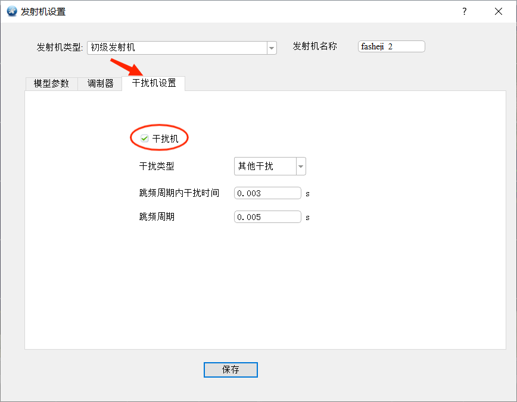

图 27-7 干扰机设置

 

发射机、接收机和干扰机的具体参数参见表 27-1。

 

### 7.添加任务指令

基础设备配置完毕后，打开指令窗口，添加任务指令。

将任务指令按时间整理成表格，如表 27-2所示。

表 27-2 任务指令表

| 序号 | 历元UTC时刻             | 事件             | 装备名          | 命令集 |
| ---- | ----------------------- | ---------------- | --------------- | ------ |
| 1    | 2017-01-01_12:05:00.000 | 天线瞬时捕获目标 | SAT_1.ANTENNA_1 | SAT_2  |
| 2    | 2017-01-01_12:10:00.000 | 天线瞬时捕获目标 | SAT_2.ANTENNA_2 | SAT_1  |
| 3    | 2017-01-01_12:20:00.000 | 天线瞬时捕获目标 | SAT_3.ANTENNA_3 | SAT_2  |
| 4    | 2017-01-01_12:25:00.000 | 天线捕获取消     | SAT_3.ANTENNA_3 | \      |
| 5    | 2017-01-01_12:30:00.000 | 天线瞬时捕获目标 | SAT_4.ANTENNA_4 | SAT_2  |

 

### 8.链路窗口显示

在菜单栏中点击“窗口”，选中“链路窗口显示”，打开链路窗口，如图 27-8所示。在该窗口中，可观察场景中存在的通信链路及通信的实时状态信息。

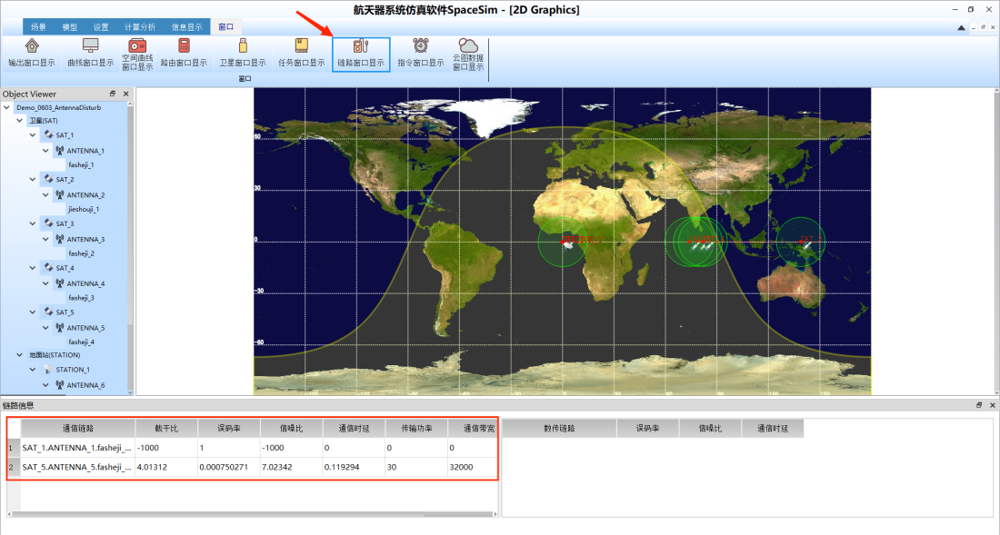

图 27-8 链路窗口

 

### 9.仿真过程

点击“开始仿真”，播放仿真动画。在运行过程中，注意观察链路窗口中的实时状态信息，记录不同程度的干扰对通信链路的影响。

 

## 三、结果分析

### 1.仿真结果

仿真开始，未执行任何指令，链路情况如图 27-9所示，地面站与SAT_5之间的通信正常进行。

 

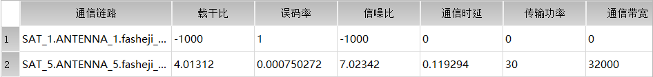

图 27-9 链路状态1

 

若修改地面站接收机的频率为14.5GHz，则地面站与SAT_5之间的通信频率不匹配，无法构建通信链路，链路状态如图 27-10所示。

图 27-10 链路状态2

 

执行指令1，此时SAT_1的天线指向SAT_2，但SAT_2的天线未指向SAT_1，因此没有形成通信链路，链路情况同图 27-9所示。

执行指令2，此时SAT_2的天线指向SAT_1，两颗卫星间形成通信链路，开始进行信息传输，如图 27-11所示。

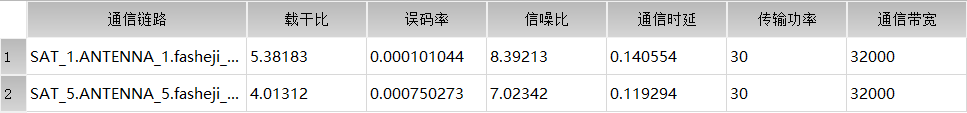

图 27-11 链路状态3

 

执行指令3，此时SAT_3的天线对SAT_1和SAT_2间的通信链路施加干扰，载干比下降，误码率大幅上升，通信质量明显下降，如图 27-12所示。

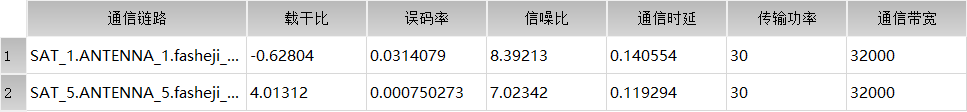

图 27-12 链路状态4

 

执行指令4，此时SAT_3施加的干扰消除，SAT_1和SAT_2间的通信恢复正常，链路情况同图 27-9所示。

执行指令5，此时SAT_4的天线对SAT_1和SAT_2间的通信链路施加干扰，但由于SAT_4施加的干扰与SAT_1和SAT_2间的通信频率不一致，故未对通信质量产生影响，链路情况同图 27-9所示。

 

### 2.仿真分析

从仿真中可以看出，与通信链路频率相同或相近的干扰会使得通信质量大幅下降，而频率相差较大的干扰则没有影响或影响较小。

同时，发射机与接收机应当频率相匹配，否则无法正常构建通信链路。

# 案例28 Walker星座搭建以及路由仿真

## 一、任务要求

### 1.实验目的

（1）熟悉SpaceSim中Walker星座设置、域设置、卫星链路属性设置方法以及路由功能仿真。

（2）了解Walker星座特点及各参数意义，以及动态路由的作用。

 

### 2.实验内容

在SapceSim中构建一个Walker星座，星座参数如下：

轨道面数量：6

起始升交点赤经：0°

面内卫星数量：4

轨道面倾角：75°

轨道高度：22000 km

选取其中任意2颗卫星，添加星间链路，在仿真过程中，观察星链的连通及路由情况。

 

### 3.预期结果

构建完成的Walker星座应当具有对称的星座构型，在2颗卫星互相可视的情况下，可直接形成星间链路；当2颗卫星互相不可视时，可通过其他卫星作为中继星继续维持星间链路。

预期结果如图 28-1所示。

 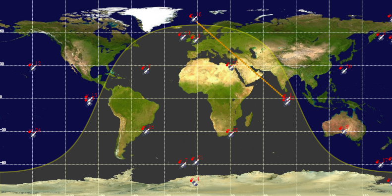

图 28-1 Walker星座预期仿真结果

 

## 二、操作步骤

（参见案例“Demo_0701_Route_Walker”）

 

### 1.新建场景

打开SpaceSim软件，点击“新建场景”，输入场景名称，时间参数保持默认，仿真步长设置为20s，点击“OK”完成。

 

### 2.添加Walker星座

在菜单栏中点击“设置”，选择“Walker星座”，如所示。

图 28-2 添加Walker星座

 

输入Walker星座的参数，如图 28-3所示，点击“确定”完成添加。

图 28-3 Walker星座设置

 

### 3.域设置

同样在菜单栏“设置”窗口下，点击“域设置”，如图 28-4所示。

图 28-4 添加域

 

在域设置界面，点击“添加域”，生成一个新的域，默认命名为yu0。选中“yu0”，点击下方图标，将星座中的所有卫星全部添加到域中，如图 28-5所示。

 

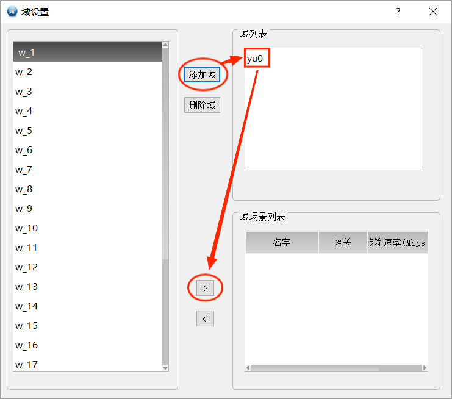

图 28-5 域设置

 

### 4.添加链路

在菜单栏中点击“场景”，选中“链路”，如图 28-6所示。

图 28-6 添加链路

 

完成上述操作后，进入卫星链接属性设置界面，点击添加链路，进入任务设置界面。在任务设置中，分别设置源节点和目标节点（此处源节点为：w_1，目标节点为：w_16），点击“添加”完成设置，如图 28-7所示。

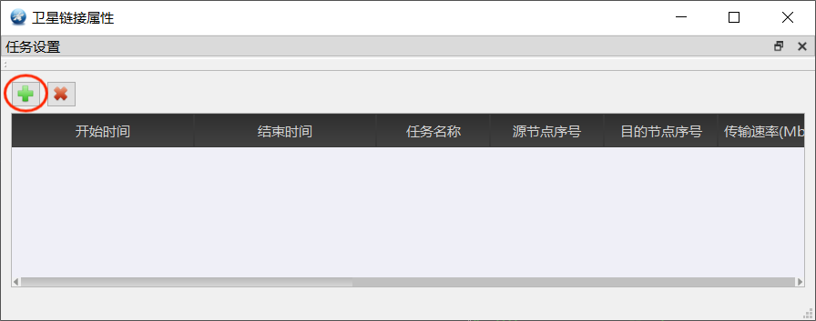 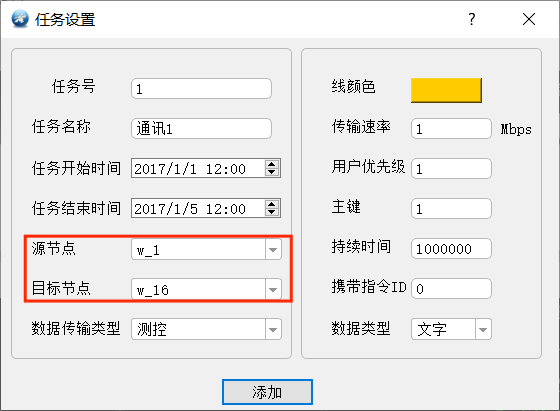

图 28-7 链路设置

 

### 5.路由窗口显示

在菜单栏中点击“窗口”，选择“路由窗口显示”，如图 28-8所示。

图 28-8 路由窗口显示

 

路由窗口如图 28-9所示，仿真开始后，窗口中会显示星座中所存在的链路及其路由状况。

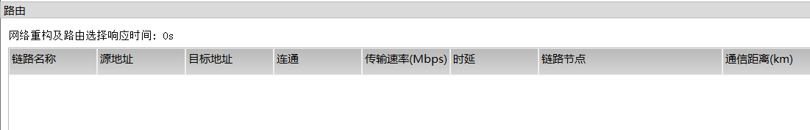

图 28-9 路由窗口

 

## 三、结果分析

### 1.仿真结果

当2颗卫星位于相互可视区域时，卫星间可直接连通，如所示。

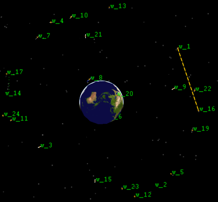 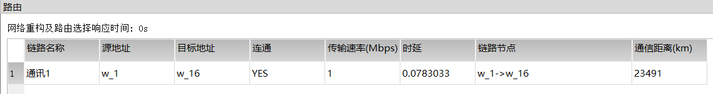

图 28-10 直接连接

 

当2颗卫星彼此不可视时，卫星间无法直接连通，需通过其他中继卫星完成星间链路的构建，如图 28-11所示。

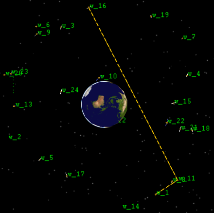

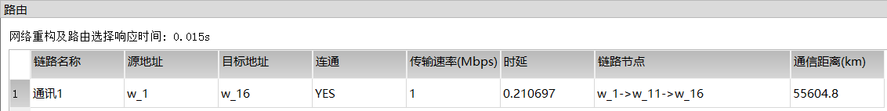

图 28-11 中继连接

 

### 2.仿真分析

本次实验中，Walker星座的运行及星间链路的传输均正常进行，在不同的星座状态下，卫星可通过直接或中继连接维持星链的连通，保证数据传输的正常进行。

# 案例29 Walker星座导航仿真

## 一、任务要求

### 1.实验目的

（1）熟悉SpaceSim中利用txt文件设置飞机运动参数、读取飞机模型，为飞机添加天线和导航接收机设置，为Walker星座添加导航载荷，导航星设置，导航开机指令设置，导航相关输出设置等功能。

（2）了解导航精度GDOP值的意义与计算方法，导航星的优选原则。

 

### 2.实验内容

在SapceSim中构建一个Walker星座，星座参数如下：

轨道面数量：6

起始升交点赤经：0°

面内卫星数量：4

轨道面倾角：75°

轨道高度：22000 km

利用该Walker星座构建导航星座，为地面上的用户提供导航支持，完成仿真，并输出导航过程中的定位误差、GDOP、以及优选定位星等相关信息。

 

### 3.预期结果

在仿真过程中，系统会自行选择出最优导航星为地面用户提供支持，随着卫星及地面用户的运动，导航星也会不断变更。

预期结果如图 29-1所示。

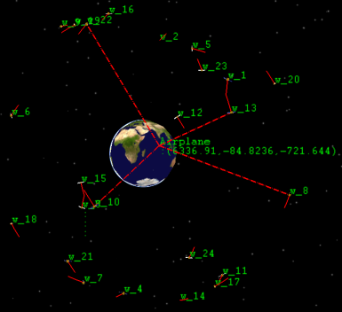 

图 29-1 导航星座预期仿真结果

 

## 二、操作步骤

（参见案例“Demo_0702_Navi_Walker”）

 

### 1.新建场景

打开SpaceSim软件，点击“新建场景”，输入场景名称，时间参数保持默认，仿真步长设置为20s，点击“OK”完成。

 

### 2.添加飞机

在场景中添加1颗卫星，进入卫星设置界面。

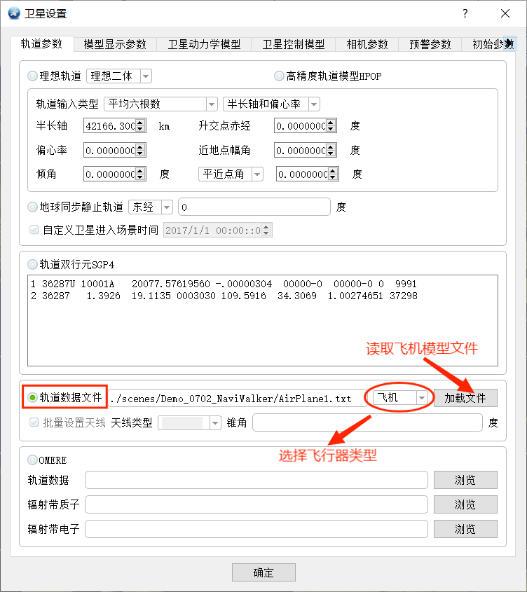

图 29-2 飞机设置

 

如图 29-2所示，在卫星设置界面，勾选“轨道数据文件”，在后方的选项栏中，选择飞行器类型为“飞机”，完成后点击“加载文件”，进入SpaceSim的安装目录，进入下列文件夹：

..\SpaceSim\scenes\Demo_0702_NaviWalker，找到轨道数据文件Airplane1.txt，点击“打开”选中文件，如图 29-3所示。

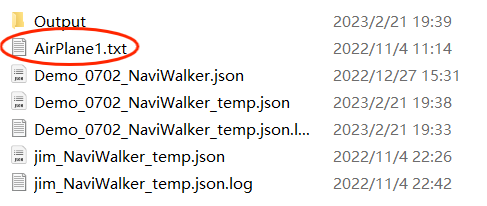

图 29-3 选择轨道数据文件

 

由于飞行器轨道数据通过文件添加，故轨道参数可不作修改。

选择完轨道数据文件后，点击上方“模型显示参数”，修改卫星名称为Airplane，并勾选“二维视窗显示经纬度”，如图 29-4所示。

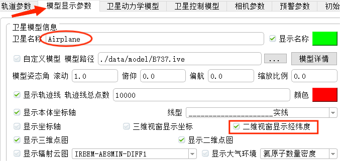

图 29-4 模型显示设置

 

 

### 3.添加Walker星座

输入Walker星座的参数，如图 29-5所示，点击“确定”完成添加。

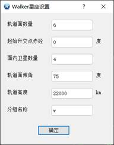

图 29-5 Walker星座设置

 

### 4.为飞机添加天线与导航接收机

为飞机添加锥角为5°的圆锥波束天线，其他参数均保持默认。

天线添加完毕后，右击所添加的天线，选择“添加导航接收机”，完成导航接收机设置，如图 29-6所示。

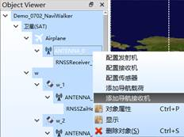

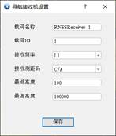

图 29-6 导航接收机设置

### 5.所有导航星添加天线与导航载荷

为所有导航星添加锥角为5°的圆锥波束天线，其他参数均保持默认。

天线添加完毕后，右击所添加的天线，选择“添加导航载荷”，完成导航载荷设置，如图 29-7所示。

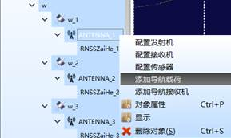

图 29-7 导航载荷设置

 

### 6.导航星设置

在菜单栏点击“设置”，选择“导航星设置”，将Walker星座中的w_1~w_24全部添加至导航星列表，如图 29-8所示。

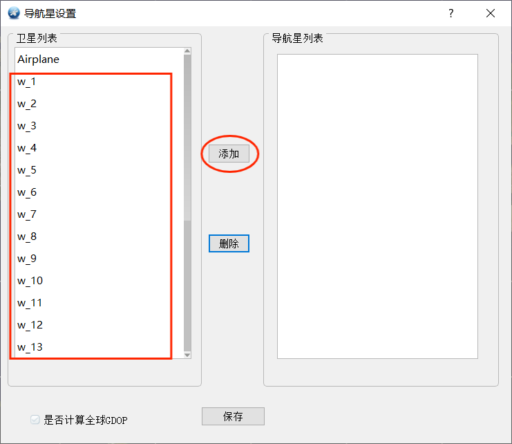

图 29-8 导航星设置

 

### 7.添加任务指令

导航星座设置完成后，打开指令窗口，为Airplane添加任务指令。

在指令命令表中选择“导航开机指令”，如图 29-9所示，选择装备名为“Airplane”，将执行时间修改为仿真开始时间。

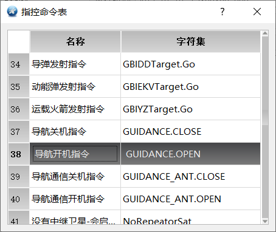

图 29-9 导航开机指令

 

### 8.添加输出

点击“输出（Output）”，选中Airplane，将“定位误差”、“几何精度因子”和“优选定位星”添加至输出，如图 29-10所示。

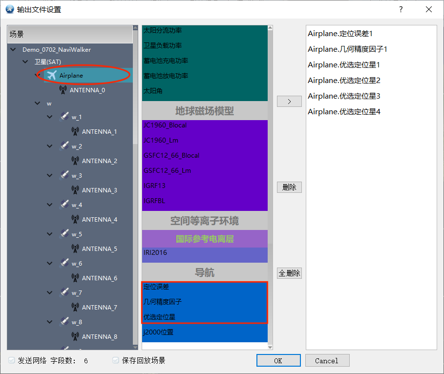

图 29-10 添加输出

 

### 9.仿真过程

点击“开始仿真”，播放仿真动画。在运行过程中，注意观察飞机位置与优选定位星的变化。

 

## 三、结果分析

### 1.仿真结果

仿真过程中，定位星随时间不断改变，如图 29-11所示

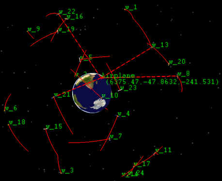 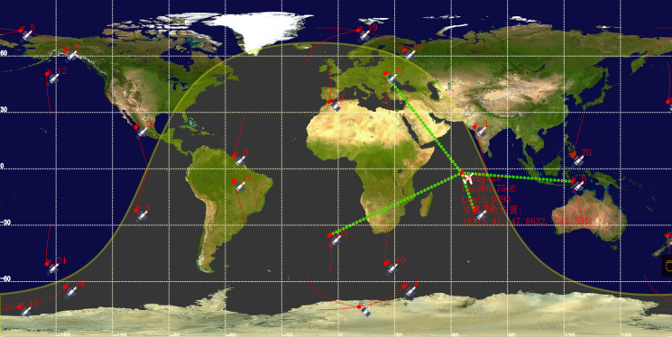

图 29-11 仿真结果

 

输出文件如图 29-12所示。

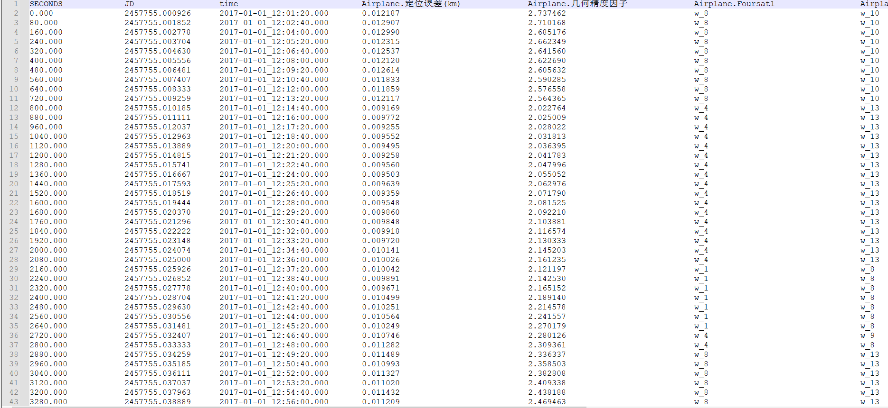

图 29-12 输出文件

 

### 2.仿真分析

本次实验中，导航星座通过几何精度因子（GDOP）进行导航星的优选，有效地实现了对地面用户（飞机）的实时导航定位，完成了任务目标。

# 案例30 GPS导航仿真

## 一、任务要求

### 1.实验目的

（1）熟悉SpaceSim中通过读取双行元文件的形式添加GPS导航星座的方法。

（2）了解GPS星座特点及导航精度。

 

### 2.实验内容

利用GPS星座为地面上的用户提供导航支持，完成仿真，并输出导航过程中的定位误差、GDOP、以及优选定位星等相关信息。

 

### 3.预期结果

GPS星座是一个非对称的导航星座，共24颗星，6个近圆轨道面，每个轨道面非均匀分布4颗卫星。轨道高度20200km的MEO，倾角55°，周期12小时。全球任意点任意时刻，在高度角15°以上，至少观测4颗星，其预期仿真结果如图 30-1所示。

 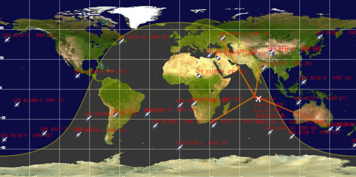

图 30-1 GPS导航星座预期结果

 

## 二、操作步骤

（参见案例“Demo_0703_Navi_GPS”）

 

### 1.新建场景

打开SpaceSim，点击“新建场景”，输入场景名称，时间参数保持默认，仿真步长设置为20s，点击“OK”完成。

 

### 2.添加飞机

在场景中添加1颗卫星，进入卫星设置界面。 

图 30-2 飞机设置

如图 30-2所示，在卫星设置界面，勾选“轨道数据文件”，在后方的选项栏中，选择飞行器类型为“飞机”，完成后点击“加载文件”，进入SpaceSim的安装目录，进入下列文件夹：

..\SpaceSim\scenes\Demo_0703_NaviGPS，找到轨道数据文件Airplane1.txt，点击“打开”选中文件，如图 30-3所示。

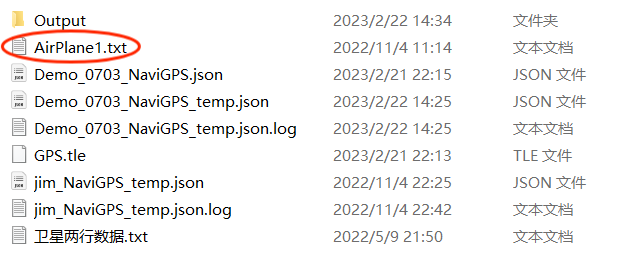

图 30-3 选择轨道数据文件 

选择完轨道数据文件后，点击上方“模型显示参数”，修改卫星名称为Airplane，并勾选“二维视窗显示经纬度”。

 

### 3.添加GPS星座

本次仿真中采用SGP系列模型添加GPS星座。

数据下载处：https://celestrak.org/NORAD/elements/

进入网站，点击“GPS Operational”，如图 30-4所示。

图 30-4 GPS星座参数

 

进入星座参数界面，将网页中参数全部复制，新建txt文本文件，将参数复制到文本文件中保存，并将扩展名保存为“.tle”。

返回SapceSim中，在“卫星（SAT）”选项上右键，选择“文件批量添加卫星”，在批量添加界面，点击“加载文件”后，选择之前保存的tle文件，文件选择完毕后点击“批量添加”，将GPS星座卫星批量添加至SpaceSim中。（详细方法参见“案例20 空间碎片仿真”）

 

### 4.添加天线与接收机

为飞机和GPS星座的所有卫星添加锥角为5°的圆锥波束天线，其他天线参数均保持默认。

天线添加完毕后，为飞机的天线添加导航接收机，为所有导航卫星的天线添加导航载荷，接收机与载荷参数如图 30-5所示。

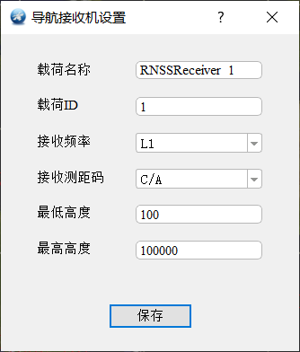 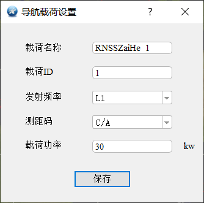

图 30-5 导航接收机与载荷设置 

添加完毕如图 30-6所示。

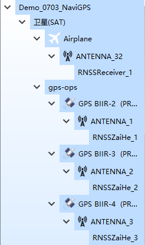

图 30-6 导航设备设置完成

 

### 5.导航星设置

在菜单栏点击“设置”，选择“导航星设置”，将GPS星座中的所有卫星全部添加至导航星列表。

 

### 6.添加任务指令

打开指令窗口，为Airplane添加任务指令。

在指令命令表中选择“导航开机指令”，选择装备名为“Airplane”，将执行时间修改为仿真开始时间。

 

### 7.添加输出

点击“输出（Output）”，选中Airplane，将“定位误差”、“几何精度因子”和“优选定位星”添加至输出。

 

### 8.仿真过程

点击“开始仿真”，播放仿真动画。在运行过程中，注意观察飞机位置与优选定位星的变化。

 

## 三、结果分析

### 1.仿真结果

仿真过程中，GPS星座的优选定位星随时间不断改变，结果如图 30-7所示。

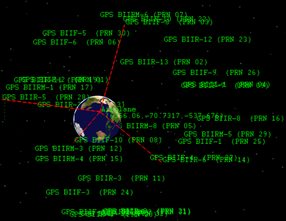 

图 30-7 GPS导航结果

 

输出文件如图 30-8所示。

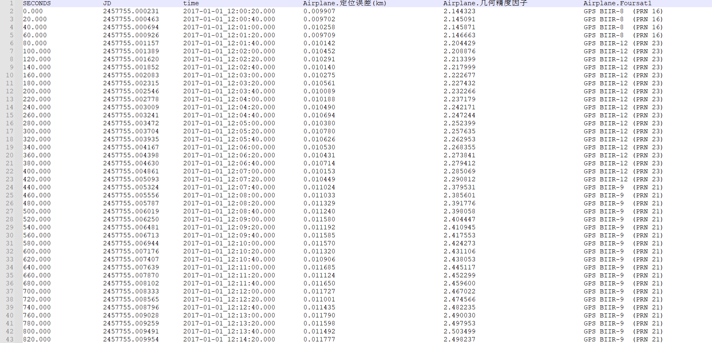

图 30-8 输出文件

 

### 2.仿真分析

仿真中，GPS导航星座顺利完成导航和定位的相关任务。

将输出文件导入matlab等分析软件中，绘制图表，如图 30-9所示。

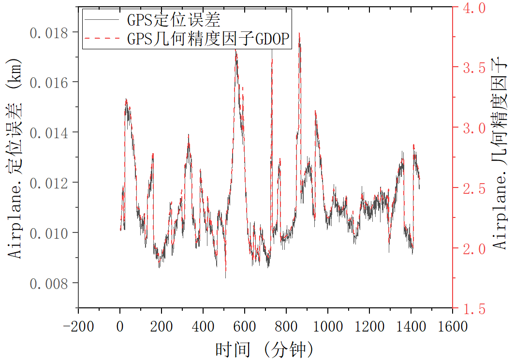

图 30-9 定位误差与几何精度因子

 

从图 30-9可以看出，定位误差与GDOP值基本同步。

# 案例31 Glonass导航仿真

## 一、任务要求

### 1.实验目的

（1）熟悉SpaceSim中通过读取双行元文件的形式添加Glonass导航星座的方法。

（2）了解Glonass星座特点及导航精度。

 

### 2.实验内容

利用Glonass星座为地面上的用户提供导航支持，完成仿真，并输出导航过程中的定位误差、GDOP、以及优选定位星等相关信息。

 

### 3.预期结果

Glonass星座是一个对称的导航星座，由24颗MEO卫星组成，倾角64.8°，轨道高度19100km，分布在3个轨道面，每个轨道面均匀分布8颗卫星，周期11h15min。

对极区的几何分布有利，适于高纬度国家，预期结果如图 31-1所示。

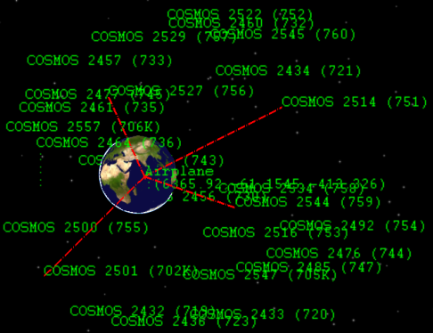 

图 31-1 Glonass星座导航预期结果

 

## 二、操作步骤

（参见案例“Demo_0704_Navi_Glonass”）

 

### 1.新建场景

打开SpaceSim，点击“新建场景”，输入场景名称，时间参数保持默认，仿真步长设置为20s，点击“OK”完成。 

### 2.添加飞机

在场景中添加1颗卫星，进入卫星设置界面。 

图 31-2 飞机设置

 

如图 31-2所示，在卫星设置界面，勾选“轨道数据文件”，在后方的选项栏中，选择飞行器类型为“飞机”，完成后点击“加载文件”，进入SpaceSim的安装目录，进入下列文件夹：

..\SpaceSim\scenes\Demo_0704_NaviGlonass，找到轨道数据文件Airplane1.txt，点击“打开”选中文件。

选择完轨道数据文件后，点击上方“模型显示参数”，修改卫星名称为Airplane，并勾选“二维视窗显示经纬度”。

 

### 3.添加Glonass星座

本次仿真中采用SGP系列模型添加Glonass星座。

数据下载处：https://celestrak.org/NORAD/elements/

进入网站，点击“GLONASS Operational”，如图 31-3所示。

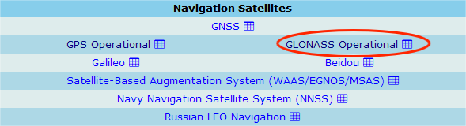

图 31-3 Glonass星座参数

 

进入星座参数界面，将网页中参数全部复制，新建txt文本文件，将参数复制到文本文件中保存，并将扩展名保存为“.tle”。

返回SapceSim中，在“卫星（SAT）”选项上右键，选择“文件批量添加卫星”，在批量添加界面，点击“加载文件”后，选择之前保存的tle文件，文件选择完毕后点击“批量添加”，将Glonass星座卫星批量添加至SpaceSim中。

 

### 4.添加天线与接收机

为飞机和Glonass星座的所有卫星添加锥角为5°的圆锥波束天线，其他天线参数均保持默认。

天线添加完毕后，为飞机添加导航接收机，为所有导航卫星添加导航载荷，接收机与载荷参数如图 31-4所示。

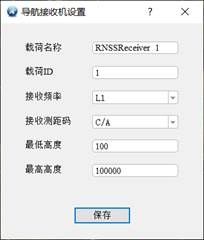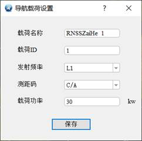

图 31-4 导航接收机与载荷设置

 

### 5.导航星设置

在菜单栏点击“设置”，选择“导航星设置”，将Glonass星座中的所有卫星全部添加至导航星列表。

 

### 6.添加任务指令

打开指令窗口，为Airplane添加任务指令。

在指令命令表中选择“导航开机指令”，选择装备名为“Airplane”，将执行时间修改为仿真开始时间。

 

### 7.添加输出

点击“输出（Output）”，选中Airplane，将“定位误差”、“几何精度因子”和“优选定位星”添加至输出。

 

### 8.仿真过程

点击“开始仿真”，播放仿真动画。在运行过程中，注意观察飞机位置与优选定位星的变化。

 

## 三、结果分析

### 1.仿真结果

Glonass导航星座的仿真结果如图 31-5所示。

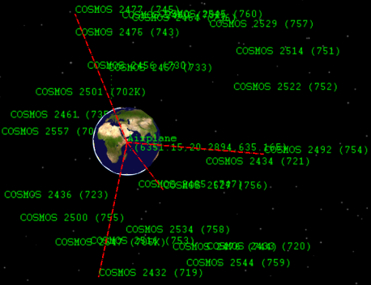 

图 31-5 Glonass导航结果

 

输出文件如图 31-6所示。

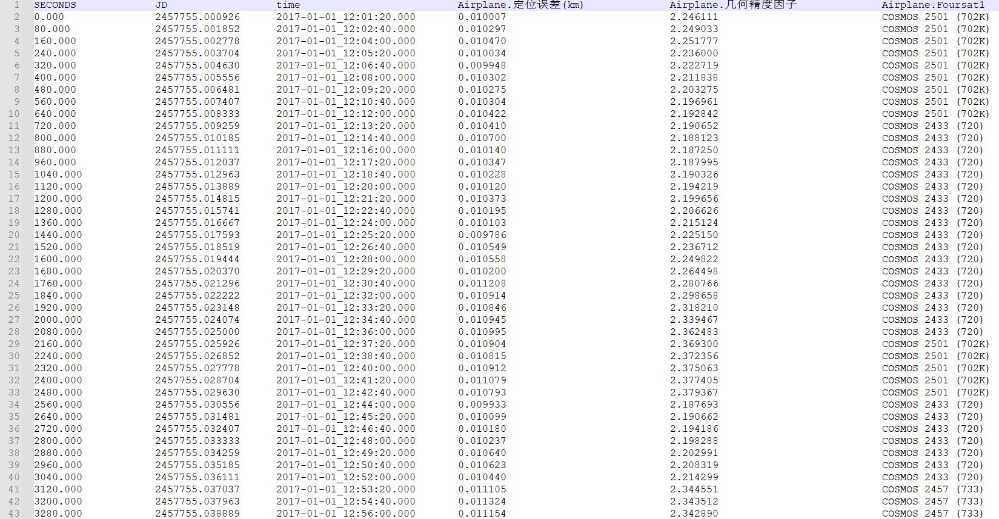

图 31-6 输出文件

 

### 2.仿真分析

仿真中，Glonass导航星座顺利完成导航和定位的相关任务。

将Glonass星座与GPS星座进行对比，如图 31-7所示。

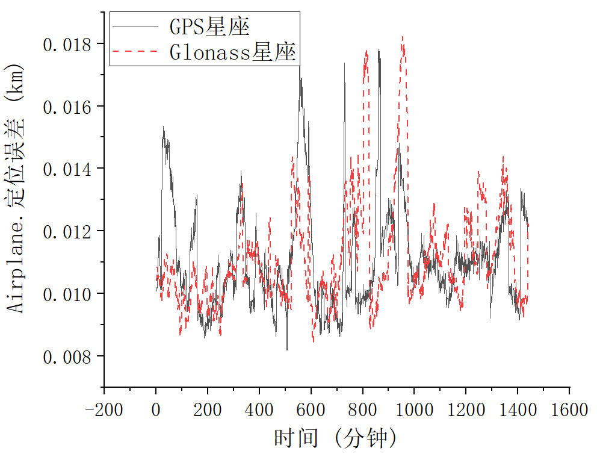

图 31-7 GPS-Glonass对比

 

从图 31-7可以看出，GPS与Glonass精度基本相当，在不同区域有所不同。

 

# 案例32 Galileo导航仿真

## 一、任务要求

### 1.实验目的

（1）熟悉SpaceSim中通过读取双行元文件的形式添加Galileo导航星座的方法。

（2）了解Galileo星座特点及导航精度。

 

### 2.实验内容

利用Galileo星座为地面上的用户提供导航支持，完成仿真，并输出导航过程中的定位误差、GDOP、以及优选定位星等相关信息。

 

### 3.预期结果

Galieo星座是一个对称星座，由27颗工作卫星和3颗备用卫星组成，这30颗卫星均匀分布在3个轨道平面上，卫星高度为23222km，轨道倾角为56°，周期14h22min。

预期结果如图 32-1所示。

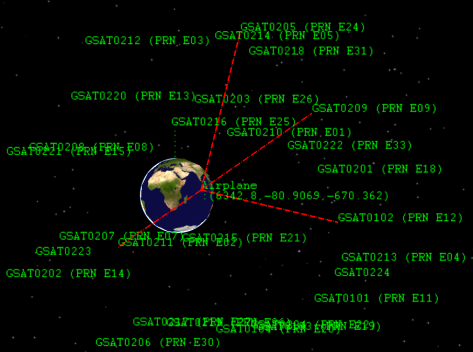 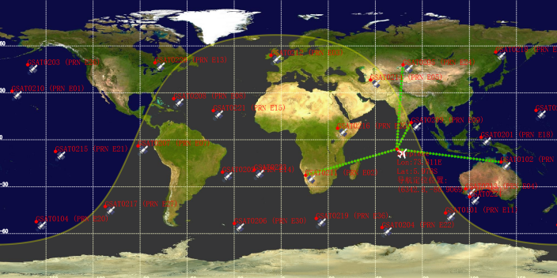

图 32-1 Galieo星座导航预期结果

 

## 二、操作步骤

（参见案例“Demo_0705_Navi_Galileo”）

 

### 1.新建场景

打开SpaceSim，点击“新建场景”，输入场景名称，时间参数保持默认，仿真步长设置为20s，点击“OK”完成。

 

### 2.添加飞机

在场景中添加1颗卫星，进入卫星设置界面。 

图 32-2 飞机设置

 

如图 32-2所示，在卫星设置界面，勾选“轨道数据文件”，在后方的选项栏中，选择飞行器类型为“飞机”，完成后点击“加载文件”，进入SpaceSim的安装目录，进入下列文件夹：

..\SpaceSim\scenes\Demo_0705_NaviGalileo，找到轨道数据文件Airplane1.txt，点击“打开”选中文件。

选择完轨道数据文件后，点击上方“模型显示参数”，修改卫星名称为Airplane，并勾选“二维视窗显示经纬度”。

 

### 3.添加Galieo星座

本次仿真中采用SGP系列模型添加Galieo星座。

数据下载处：https://celestrak.org/NORAD/elements/

进入网站，点击“Galieo”，如图 32-3所示。

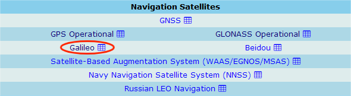

图 32-3 Galieo星座参数

 

进入星座参数界面，将网页中参数全部复制，新建txt文本文件，将参数复制到文本文件中保存，并将扩展名保存为“.tle”。

返回SapceSim中，在“卫星（SAT）”选项上右键，选择“文件批量添加卫星”，在批量添加界面，点击“加载文件”后，选择之前保存的tle文件，文件选择完毕后点击“批量添加”，将Galieo星座卫星批量添加至SpaceSim中。

 

### 4.添加天线与接收机

为飞机和Galieo星座的所有卫星添加锥角为5°的圆锥波束天线，其他天线参数均保持默认。

天线添加完毕后，为飞机添加导航接收机，为所有导航卫星添加导航载荷，接收机与载荷参数如图 32-4所示。

图 32-4 导航接收机与载荷设置

 

### 5.导航星设置

在菜单栏点击“设置”，选择“导航星设置”，将Galieo星座中的所有卫星全部添加至导航星列表。

 

### 6.添加任务指令

打开指令窗口，为Airplane添加任务指令。

在指令命令表中选择“导航开机指令”，选择装备名为“Airplane”，将执行时间修改为仿真开始时间。

 

### 7.添加输出

点击“输出（Output）”，选中Airplane，将“定位误差”、“几何精度因子”和“优选定位星”添加至输出。

 

### 8.仿真过程

点击“开始仿真”，播放仿真动画。在运行过程中，注意观察飞机位置与优选定位星的变化。

 

## 三、结果分析

### 1.仿真结果

Galieo导航星座的仿真结果如图 32-5所示。

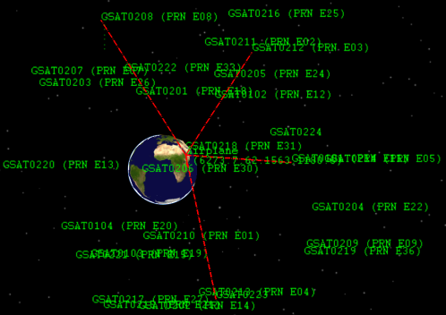 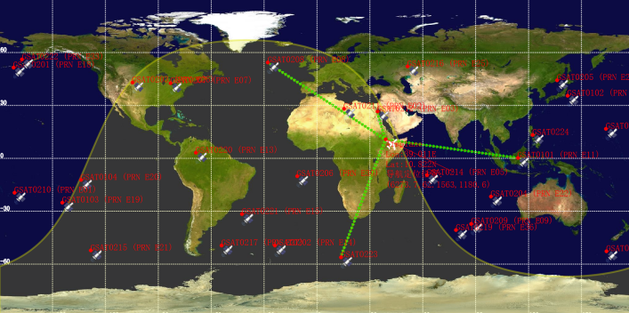

图 32-5 Galieo导航结果

 

输出文件如图 32-6所示。

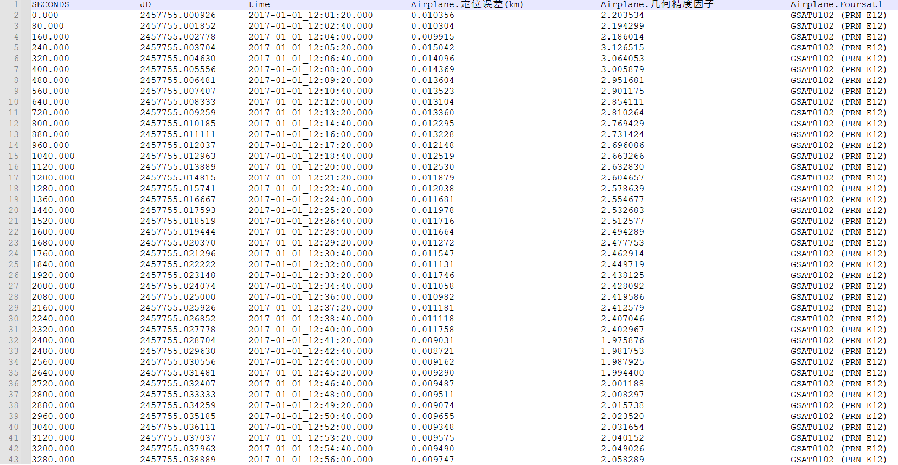

图 32-6 输出文件

 

### 2.仿真分析

仿真中，Galieo导航星座顺利完成导航和定位的相关任务。

将Galieo星座与GPS星座进行对比，如图 32-7所示。

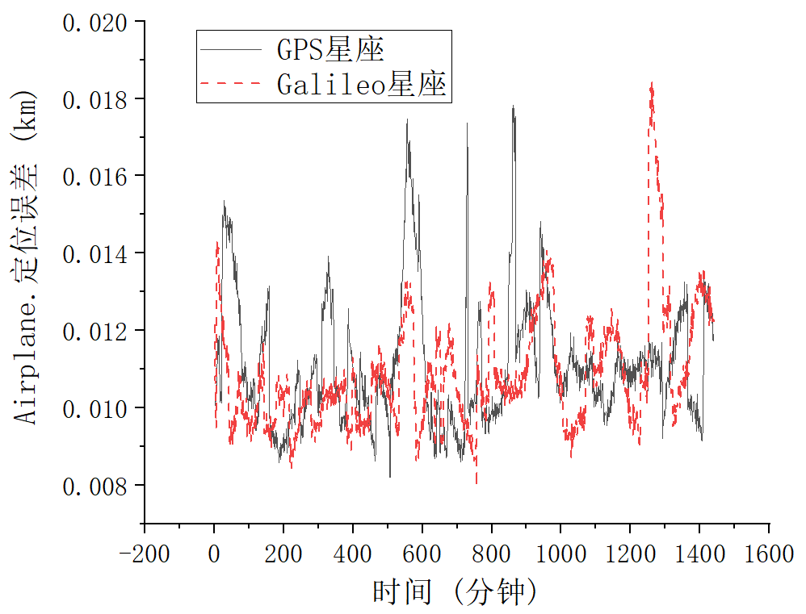

图 32-7 GPS-Galieo对比

 

从图 32-7可以看出，GPS与Glonass精度基本相当，在不同区域有所不同。

# 案例33 北斗导航仿真

## 一、任务要求

### 1.实验目的

（1）熟悉SpaceSim中通过读取双行元文件的形式添加北斗导航星座的方法。

（2）了解北斗星座特点及导航精度。

 

### 2.实验内容

利用北斗导航星座为地面上的用户提供导航支持，完成仿真，并输出导航过程中的定位误差、GDOP、以及优选定位星等相关信息。

 

### 3.预期结果

现服役的北斗导航系统为北斗二号和北斗三号系统。其中，北斗二号：5 GEO+ 5 IGSO+ 4 MEO混合星座；北斗三号：3 GEO+ 3 IGSO+ 24MEO混合星座。MEO轨道高度21528km，MEO和IGSO倾角55°。

预期结果如图 33-1所示。

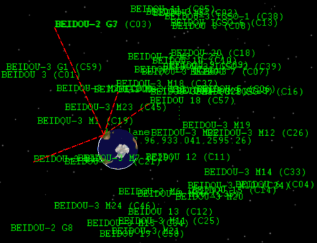 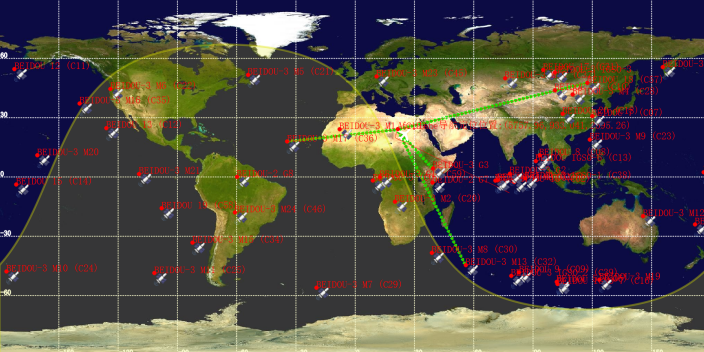

图 33-1 北斗导航星座预期结果

 

## 二、操作步骤

（参见案例“Demo_0706_Navi_Beidou”）

 

### 1.新建场景

打开SpaceSim，点击“新建场景”，输入场景名称，时间参数保持默认，仿真步长设置为20s，点击“OK”完成。

 

### 2.添加飞机

在场景中添加1颗卫星，进入卫星设置界面。

图 33-2 飞机设置

如图 33-2所示，在卫星设置界面，勾选“轨道数据文件”，在后方的选项栏中，选择飞行器类型为“飞机”，完成后点击“加载文件”，进入SpaceSim的安装目录，进入下列文件夹：

..\SpaceSim\scenes\Demo_0706_NaviBeidou，找到轨道数据文件Airplane1.txt，点击“打开”选中文件。

选择完轨道数据文件后，点击上方“模型显示参数”，修改卫星名称为Airplane，并勾选“二维视窗显示经纬度”。

 

### 3.添加北斗星座

仿真中依然采用SGP系列模型添加北斗星座。

数据下载处：https://celestrak.org/NORAD/elements/

进入网站，点击“Beidou”，如所示。

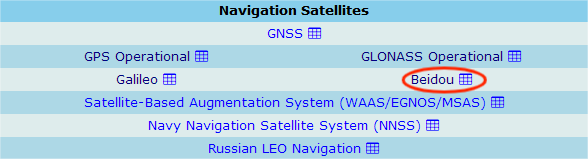

图 33-3 北斗星座参数

 

进入星座参数界面，将网页中参数全部复制，新建txt文本文件，将参数复制到文本文件中保存，并将扩展名保存为“.tle”。

返回SapceSim中，在“卫星（SAT）”选项上右键，选择“文件批量添加卫星”，在批量添加界面，点击“加载文件”后，选择之前保存的tle文件，文件选择完毕后点击“批量添加”，将北斗星座卫星批量添加至SpaceSim中。

 

### 4.添加天线与接收机

为飞机和北斗星座的所有卫星添加锥角为5°的圆锥波束天线，其他天线参数均保持默认。

天线添加完毕后，为飞机添加导航接收机，为所有导航卫星添加导航载荷，接收机与载荷参数如图 33-4所示。

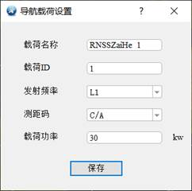

图 33-4 导航接收机与载荷设置

 

### 5.导航星设置

在菜单栏点击“设置”，选择“导航星设置”，将北斗星座中的所有卫星全部添加至导航星列表。

 

### 6.添加任务指令

打开指令窗口，为Airplane添加任务指令。

在指令命令表中选择“导航开机指令”，选择装备名为“Airplane”，将执行时间修改为仿真开始时间。

 

### 7.添加输出

点击“输出（Output）”，选中Airplane，将“定位误差”、“几何精度因子”和“优选定位星”添加至输出。

 

### 8.仿真过程

点击“开始仿真”，播放仿真动画。在运行过程中，注意观察飞机位置与优选定位星的变化。

 

## 三、结果分析

### 1.仿真结果

北斗导航星座的仿真结果如图 33-5所示。

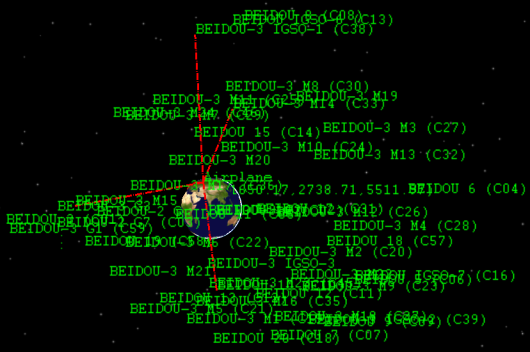 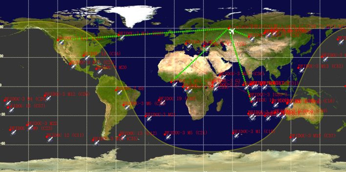

图 33-5 北斗导航结果

 

### 2.仿真分析

仿真中，北斗导航星座顺利完成导航和定位的相关任务。

将北斗星座与GPS星座进行对比，如图 33-6所示。

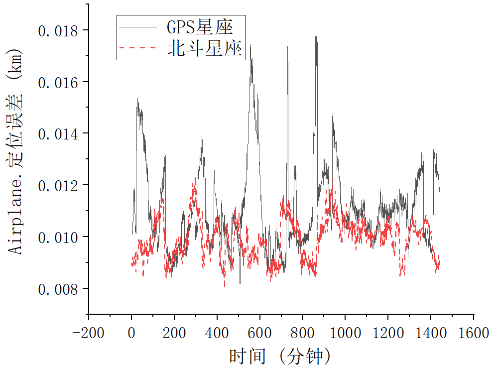

图 33-6 GPS-北斗对比 

从图 33-6可以看出，北斗导航的精度相比GPS更高。

# 案例34 GPS与北斗联合导航仿真

## 一、任务要求

### 1.实验目的

（1）熟悉SpaceSim中通过读取双行元文件的形式添加GPS以及北斗导航星座的方法。

（2）了解GPS与北斗星座联合导航的特点及导航精度。

 

### 2.实验内容

利用GPS和北斗联合导航星座为地面上的用户提供导航支持，完成仿真，并输出导航过程中的定位误差、GDOP、以及优选定位星等相关信息。 

### 3.预期结果

预期结果如图 34-1所示。

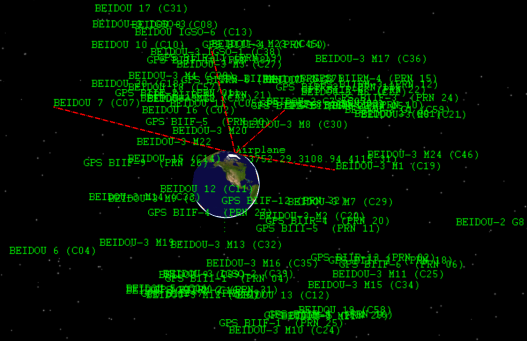 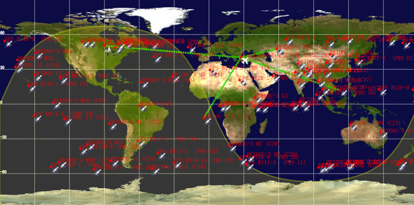

图 34-1 GPS-北斗联合导航预期结果 

## 二、操作步骤

（参见案例“Demo_0707_Navi_GPSBeidou”） 

### 1.新建场景

打开SpaceSim，点击“新建场景”，输入场景名称，时间参数保持默认，仿真步长设置为20s，点击“OK”完成。

 

### 2.添加飞机

在场景中添加1颗卫星，进入卫星设置界面。

图 34-2 飞机设置 

如图 34-2所示，在卫星设置界面，勾选“轨道数据文件”，在后方的选项栏中，选择飞行器类型为“飞机”，完成后点击“加载文件”，进入SpaceSim的安装目录，进入下列文件夹：

..\SpaceSim\scenes\Demo_0707_NaviGPSBeidou，找到轨道数据文件Airplane1.txt，点击“打开”选中文件。

选择完轨道数据文件后，点击上方“模型显示参数”，修改卫星名称为Airplane，并勾选“二维视窗显示经纬度”。 

### 3.添加星座

数据下载处：https://celestrak.org/NORAD/elements/

将GPS星座卫星和北斗星座卫星批量添加至SpaceSim中。

 

### 4.添加天线与接收机

为飞机和星座的所有卫星添加锥角为5°的圆锥波束天线，其他天线参数均保持默认。

天线添加完毕后，为飞机添加导航接收机，为所有导航卫星添加导航载荷，接收机与载荷参数如图 34-3所示。

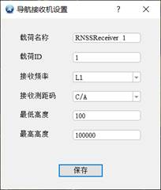 

图 34-3 导航接收机与载荷设置

 

### 5.导航星设置

在菜单栏点击“设置”，选择“导航星设置”，将北斗星座中的所有卫星全部添加至导航星列表。

 

### 6.添加任务指令

打开指令窗口，为Airplane添加任务指令。

在指令命令表中选择“导航开机指令”，选择装备名为“Airplane”，将执行时间修改为仿真开始时间。

 

### 7.添加输出

点击“输出（Output）”，选中Airplane，将“定位误差”、“几何精度因子”添加至输出。

 

### 8.仿真过程

点击“开始仿真”，播放仿真动画。在运行过程中，注意观察飞机位置与优选定位星的变化。

 

## 三、结果分析

### 1.仿真结果

GPS-北斗联合导航仿真结果如图 34-4所示。

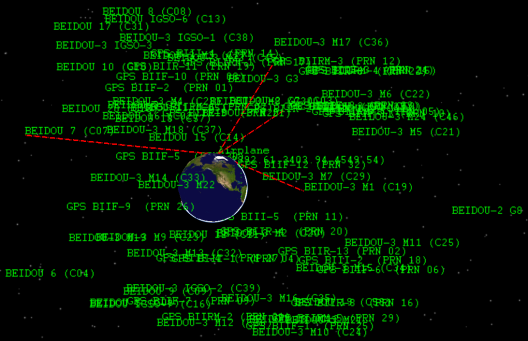 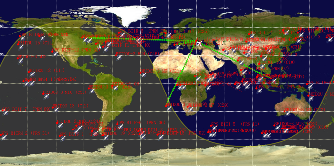

图 34-4 GPS-北斗联合导航结果

 

输出文件如图 34-5所示。

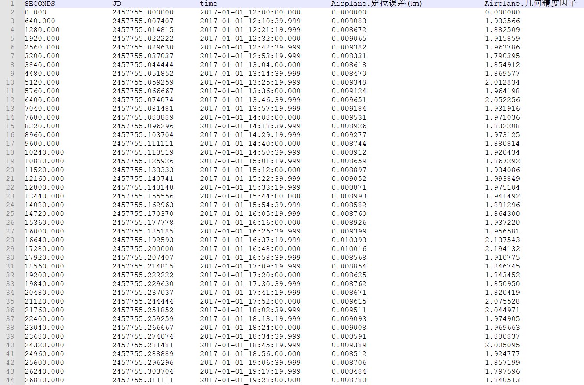

图 34-5 输出文件

### 2.仿真分析

将文件输出结果导出，与GPS、北斗导航进行比较，并绘制分析图样，如图 34-6所示。

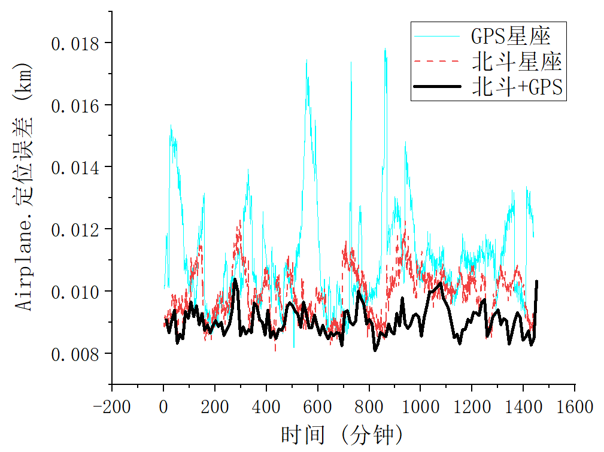

图 34-6 GPS-北斗联合导航分析

 

从图 34-6可以看出，GPS-北斗联合导航相比于各自独立导航在精度上有明显的提升。

# 案例35 印度IRNSS导航仿真

## 一、任务要求

### 1.实验目的

1）熟悉SpaceSim中通过读取双行元文件的形式添加IRNSS导航星座的方法。

（2）了解IRNSS星座特点及导航精度。

 

### 2.实验内容

利用IRNSS导航星座为地面上的用户提供导航支持，完成仿真，并输出导航过程中的定位误差、GDOP、以及优选定位星等相关信息。

 

### 3.预期结果

IRNSS属于印度区域导航系统，空间段由7颗导航卫星组成，其中3颗为GEO卫星，4颗为IGSO卫星；还有一颗为星载原子钟失效的IGSO卫星IRNSS-1A，现在用来发播短报文 。

预期仿真结果如图 35-1所示。

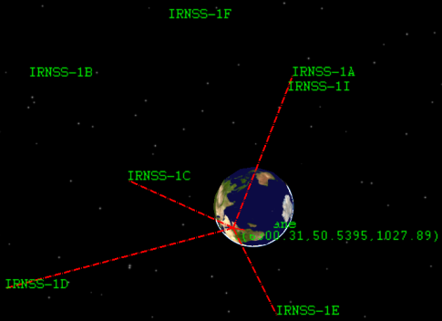 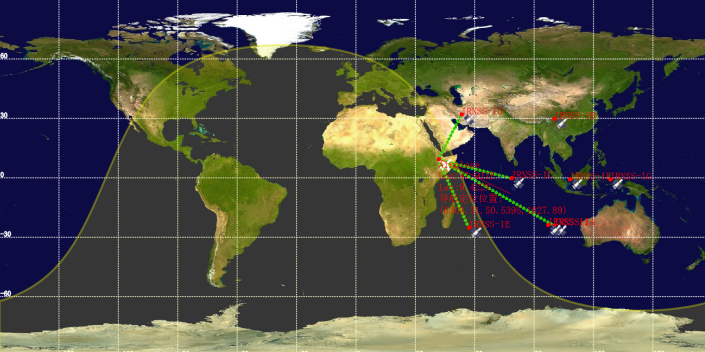

图 35-1 IRNSS导航星座预期结果

 

## 二、操作步骤

（参见案例“Demo_0708_Navi_IRNSS”）

 

### 1.新建场景

打开SpaceSim，点击“新建场景”，输入场景名称，时间参数保持默认，仿真步长设置为20s，点击“OK”完成。

 

### 2.添加飞机

在场景中添加1颗卫星，进入卫星设置界面。

 

图 35-2 飞机设置

 

如图 35-2所示，在卫星设置界面，勾选“轨道数据文件”，在后方的选项栏中，选择飞行器类型为“飞机”，完成后点击“加载文件”，进入SpaceSim的安装目录，进入下列文件夹：

..\SpaceSim\scenes\Demo_0708_NaviIRNSS，找到轨道数据文件Airplane1.txt，点击“打开”选中文件。

选择完轨道数据文件后，点击上方“模型显示参数”，修改卫星名称为Airplane，并勾选“二维视窗显示经纬度”。

 

### 3.添加IRNSS星座

仿真中继续采用SGP系列模型添加IRNSS星座。

数据下载处：https://celestrak.org/NORAD/elements/

将IRNSS星座卫星批量添加至SpaceSim中。

 

### 4.添加天线与接收机

为飞机和IRNSS星座的所有卫星添加锥角为5°的圆锥波束天线，其他天线参数均保持默认。

天线添加完毕后，为飞机添加导航接收机，为所有导航卫星添加导航载荷，接收机与载荷参数如图 35-3所示。

 

图 35-3 导航接收机与载荷设置

 

 

### 5.导航星设置

在菜单栏点击“设置”，选择“导航星设置”，将IRNSS星座中的所有卫星全部添加至导航星列表。

 

### 6.添加任务指令

打开指令窗口，为Airplane添加任务指令。

在指令命令表中选择“导航开机指令”，选择装备名为“Airplane”，将执行时间修改为仿真开始时间。

 

### 7.添加输出

点击“输出（Output）”，选中Airplane，将“定位误差”、“几何精度因子”和“优选定位星”添加至输出。

 

### 8.仿真过程

点击“开始仿真”，播放仿真动画。在运行过程中，注意观察飞机位置与优选定位星的变化。

 

## 三、结果分析

### 1.仿真结果

IRNSS导航星座的仿真结果如图 35-4所示。

 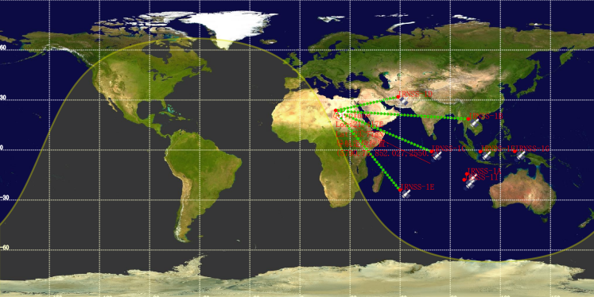

图 35-4 IRNSS导航结果

 

### 2.仿真分析

由于IRNSS为区域导航系统，随着飞机逐渐远离印度区域，导航系统的GDOP值迅速上升，导航精度显著下降。

将IRNSS与GPS进行对比，绘制分析图样如图 35-5所示。

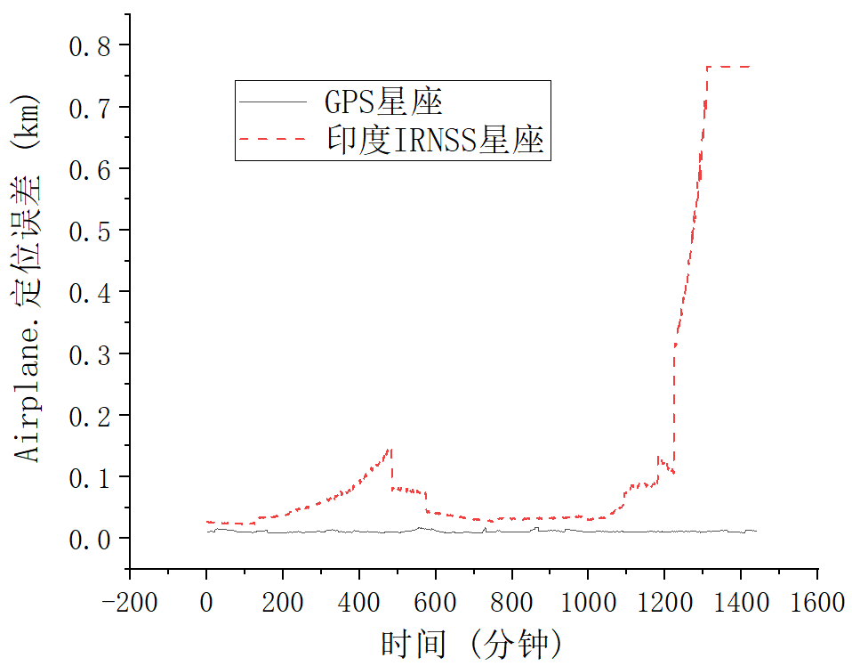

图 35-5 GPS-IRNSS对比

 

从图 35-5可知，GPS精度更高，且IRNSS无法做到全球覆盖，当用户远离印度范围时，星座无法正常提供服务。

# 案例36 覆盖效能仿真

## 一、任务要求

### 1.实验目的

（1）熟悉SpaceSim中卫星分组的添加方法、覆盖对象的添加以及参数设置方法，星座覆盖效能计算功能。

（2）了解卫星覆盖效能的计算方法以及不同星座对不同区域的覆盖特点。

 

### 2.实验内容

测试Walker星座与双星系统对地面特定区域的覆盖情况。

Walker星座参数如下：

轨道面数量：3

起始升交点赤经：0°

面内卫星数量：4

轨道面倾角：55°

轨道高度：15000 km

 

测试Walker星座覆盖的区域是一个由4点确定的规则区域（命名为center），其4个点的位置（经度，纬度）分别为（-10,10）（10,10）（10，-10）（-10，-10）。

 

双星系统两颗卫星采用近远地点方法添加，参数如下：

卫星1：

近地点高度：5000 km

远地点高度：5000 km

倾角：40°

其他参数均为0

 

卫星2：

近地点高度：2000 km

远地点高度：2000 km

倾角：50°

升交点赤经：10°

其他参数均为0

 

测试双星系统覆盖的区域是一个由8个点确定的多边形不规则区域（命名为target），其边界点位置为（125,35）（120,30）（110,15）（100,10）（90,15）（90,20）（100,25）（110,35）

 

### 3.预期结果

星座运行过程中，对地覆盖情况及覆盖重数均会不断改变，预期仿真结果如图 36-1所示。

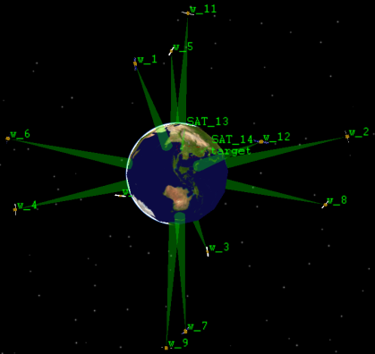 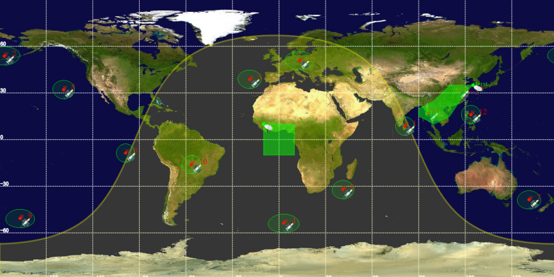

图 36-1 星座覆盖效能预估

 

## 二、操作步骤

（参见案例“Demo_0801_CoverEffi”）

 

### 1.新建场景

打开SpaceSim，点击“新建场景”，输入场景名称，时间参数保持默认，仿真步长设置为20s，点击“OK”完成。

 

### 2.添加Walker星座

设置-walker星座，在场景中添加一组Walker星座（详细参数见“实验内容”部分），并为星座中每一颗卫星配置锥角为5°的圆锥波束天线。

 

### 3.添加双星系统

右键点击“卫星（SAT）”，选择“添加分组”，进入分组设置，输入分组名称“双星”，点击“OK”完成添加，如图 36-2、图 36-3所示。

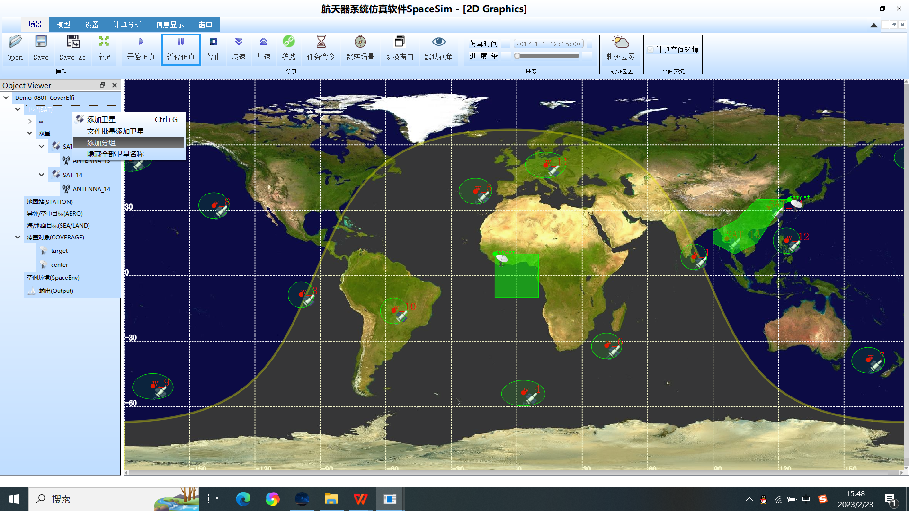

图 36-2 添加分组

 

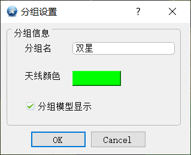

图 36-3 分组设置

 

在“双星”分组上右键，点击“添加卫星”，加入2颗卫星（详细参数见“实验内容”部分），如图 36-4所示。

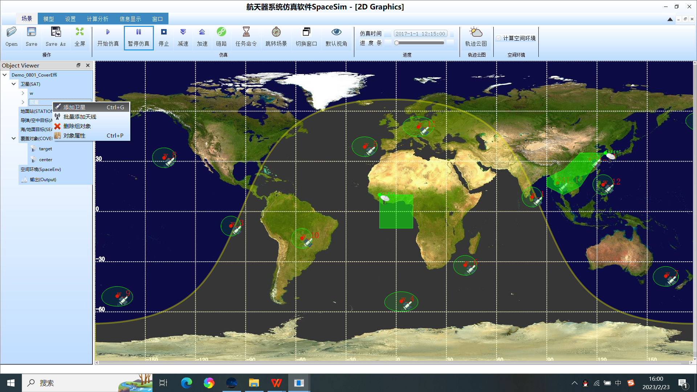

图 36-4 双星系统添加卫星

为双星系统中每一颗卫星配置锥角为5°的圆锥波束天线。

 

 

### 4.添加覆盖对象

右键点击“覆盖对象”，选择“添加覆盖对象”，如图 36-5所示。

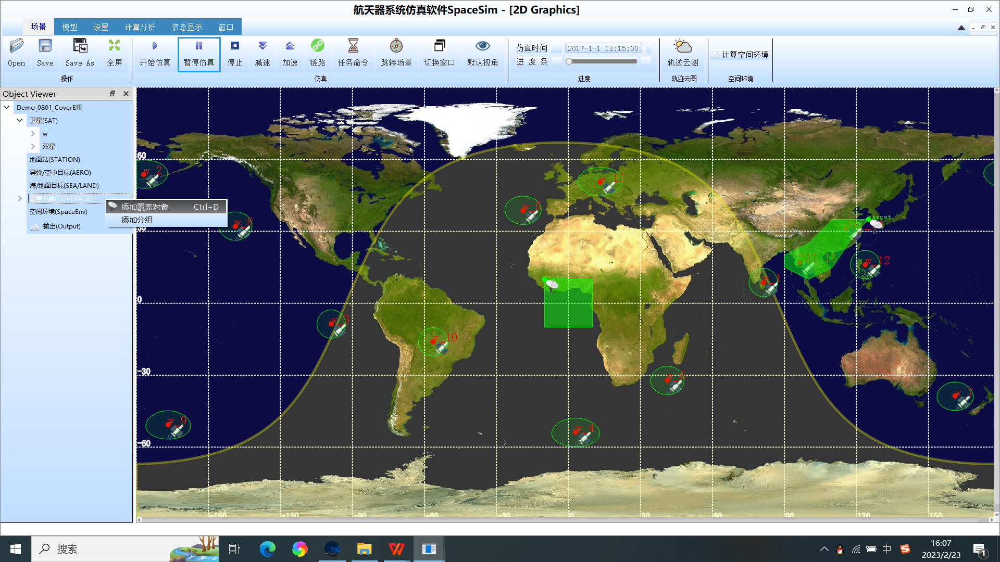

图 36-5 添加覆盖对象

 

进入设置界面，修改对象名称为“target”，将开始和结束时间调整为与仿真开始结束时间相一致，选择对象类型为“Constellation_Area”，如图 36-6所示。

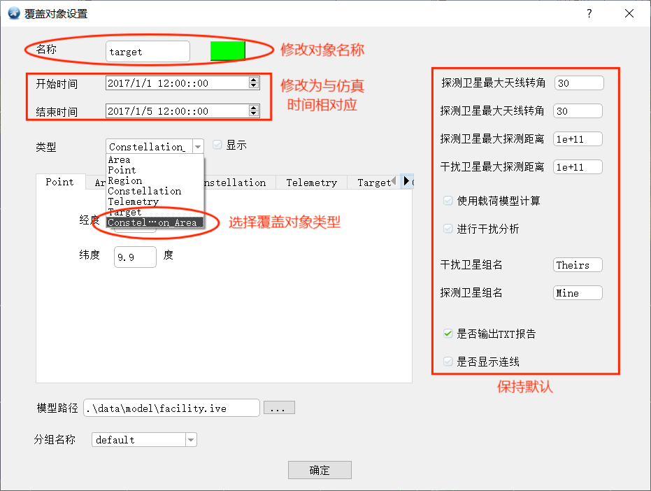

图 36-6 覆盖对象设置

 

在下方覆盖区域设置中，选择“Constellation_Area”，输入所测试的星座对象名称“双星”，并添加覆盖区域边界点，如图 36-7所示。

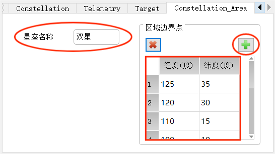

图 36-7 覆盖区域设置

 

用同样的方式添加Walker星座的覆盖对象“center”，添加完毕如图 36-8所示。

 

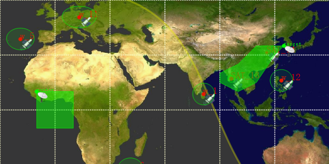

图 36-8 覆盖对象添加完毕

 

### 5.打开星座覆盖效能窗口

保存场景并重新加载场景后，在菜单栏选择“信息显示”，点击“星座覆盖效能”，打开星座覆盖效能窗口，如图 36-9、图 36-10所示。

图 36-9 星座覆盖效能

 

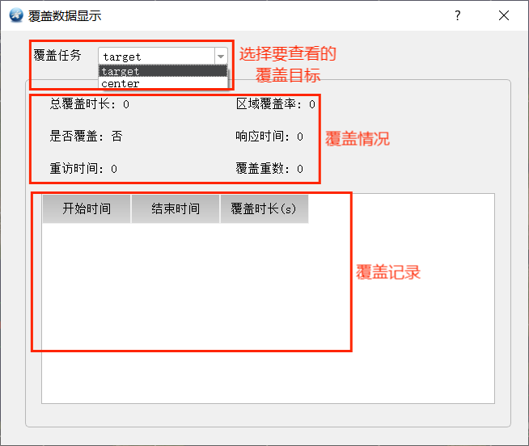

图 36-10 覆盖数据显示

 

### 6.仿真过程

点击“开始仿真”，播放仿真动画。在运行过程中，注意观察二维视图中所选区域的覆盖情况，及覆盖效能窗口的实时数据显示。

 

## 三、结果分析

### 1.仿真结果

仿真运行结果如图 36-11、图 36-12所示。

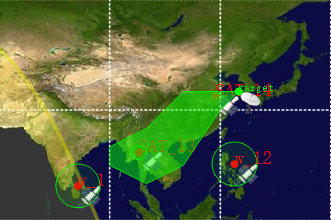 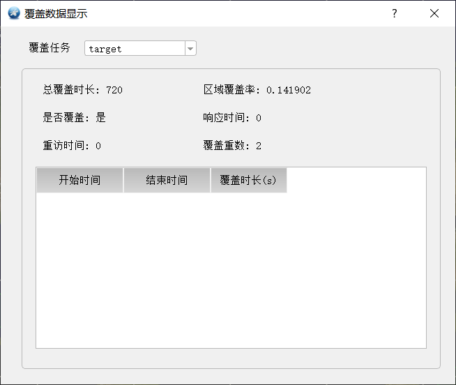

图 36-11 双星系统覆盖情况

 

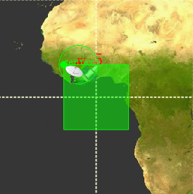 

图 36-12 Walker星座覆盖情况

 

运行一段时间后，总体覆盖情况如图 36-13所示。

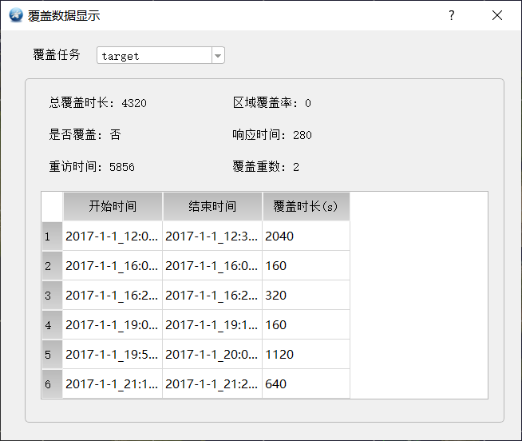 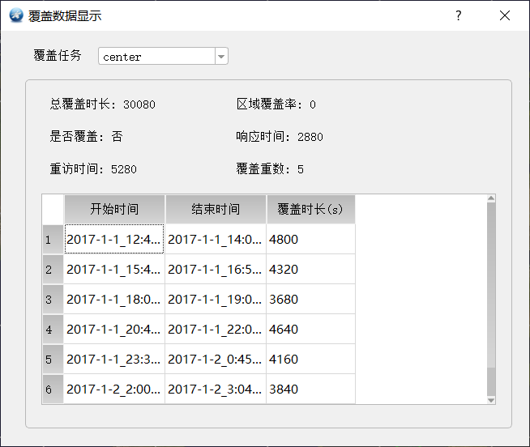

图 36-13 总体覆盖情况

 

### 2.仿真分析

在仿真过程中，SpaceSim实时分析和计算星座对地面指定区域的覆盖情况，同时进行记录，有效地完成对星座覆盖性能的展现。

# 案例37 遥感卫星对地成像仿真

## 一、任务要求

### 1.实验目的

（1）熟悉SpaceSim中为卫星添加相机以及相机参数设置方法，打开相机窗口以及拍照保存设置方法。

（2）了解不同轨道高度卫星成像特点以及光照对成像的影响。

 

### 2.实验内容

现有3颗遥感卫星，均位于太阳同步轨道，其轨道参数如表 37-1所示。

表 37-1 遥感卫星参数

| 名称            | SAT_1   | SAT_2   | SAT_3   |
| --------------- | ------- | ------- | ------- |
| 半长轴(km)      | 6978.14 | 7378.14 | 6978.14 |
| 偏心率          | 0       | 0       | 0       |
| 轨道倾角(°)     | 97.7924 | 99.4843 | 97.7924 |
| 升交点赤经(°)   | 78.8337 | 78.8337 | 18.8337 |
| 近地点幅角(°)   | 0       | 0       | 0       |
| 平(真)近点角(°) | 0       | 0       | 0       |
| 降交点地方时    | 10:30AM | 10:30AM | 6:30AM  |
| 轨道模型        | J2摄动  |         |         |

 

在3颗卫星的降交点处，分别设置一艘船，3艘船的位置如表 37-2所示。

表 37-2 船只位置

| 名称     | SHIP_1  | SHIP_2 | SHIP_3  |
| -------- | ------- | ------ | ------- |
| 经度     | -37.371 | -35.42 | -94.352 |
| 纬度     | 0.0029  | 0.037  | 0.05    |
| 对应卫星 | SAT_1   | SAT_2  | SAT_3   |

 

试使用遥感卫星的相机完成对船只的拍摄任务。

 

### 3.预期结果

当卫星飞过船只上方时，用相机对其进行拍照和保存，理想的拍摄状况如所示。

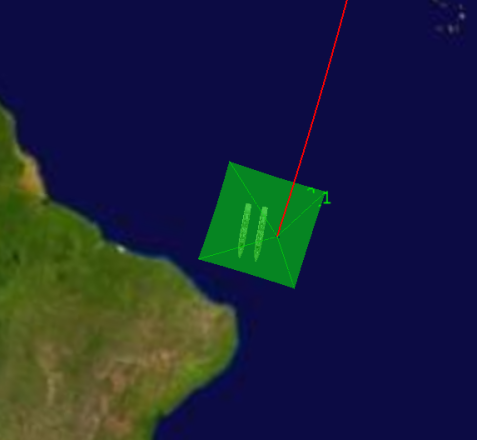 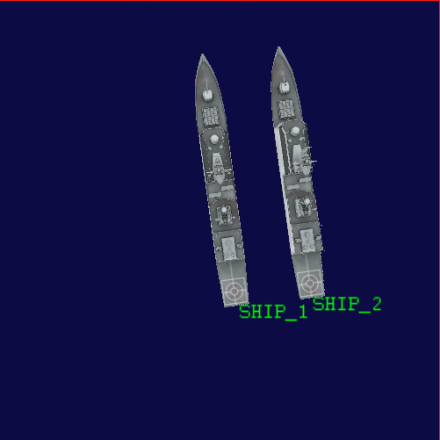

 

## 二、操作步骤

（参考案例“Demo_0802_RS_ImageBasic”）

 

### 1.新建场景

打开SpaceSim，点击“新建场景”，输入场景名称，由于卫星的升交点赤经值由仿真时间计算所得，需要将仿真时间与案例中统一，仿真开始时刻设置为2017/1/1_12:00:00，仿真结束时间设置为2017/1/5_12:00:00。

由于需要采用相机拍摄，故仿真步长应当极可能小，设置为0.5s，点击“OK”完成。

 

### 2.添加遥感卫星

在场景中添加3颗卫星，轨道参数如表 37-1所示（降交点地方时不用设置），将轨道模型修改为J2摄动。

右键点击卫星，选择“添加相机”，进入相机设置界面。点击左上角“相机观测任务”，由于卫星需要对地成像，因此勾选下方“指定角度”，并将俯仰角和方位角均设置为0，如图 37-1所示。

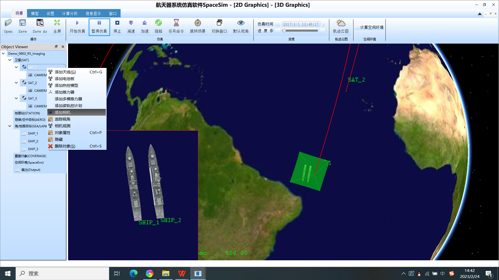 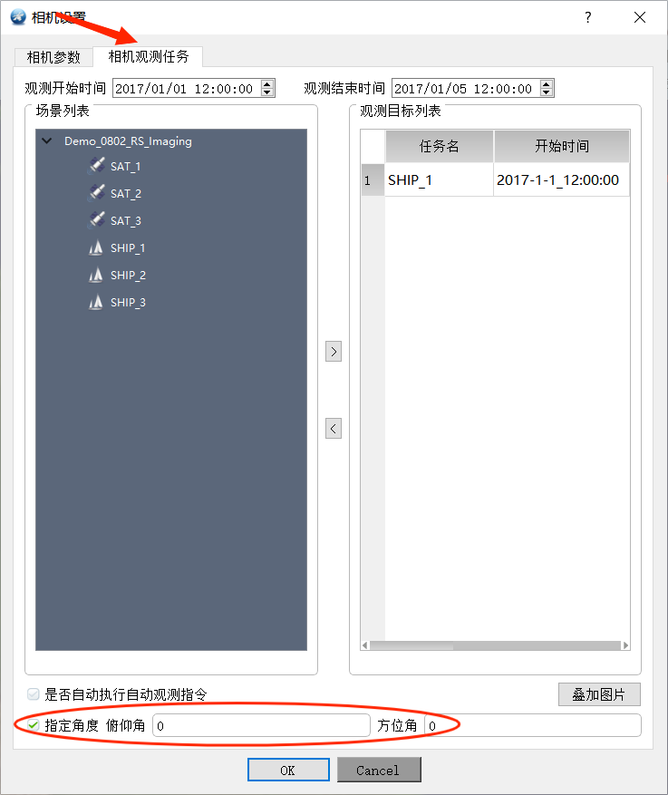

图 37-1 添加相机

如需对相机进行更详细的设置，可以在相机参数自行调整，如图 37-2所示。本次实验中，可以勾选“保存图片”将拍摄画面输出。

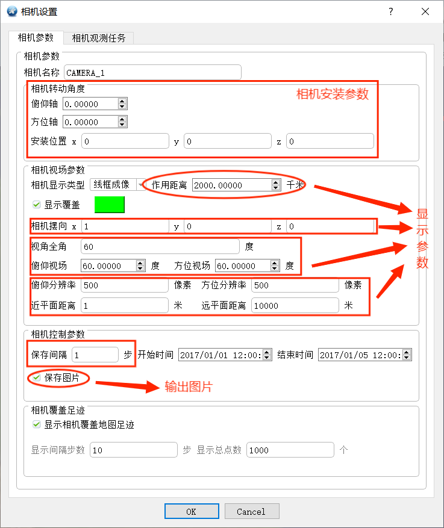

图 37-2 相机参数

 

设置完成后，可双击相机打开相机视窗，如图 37-3所示（由于CAMERA_1此时位于海域上方，故无画面显示），再次双击可关闭画面。

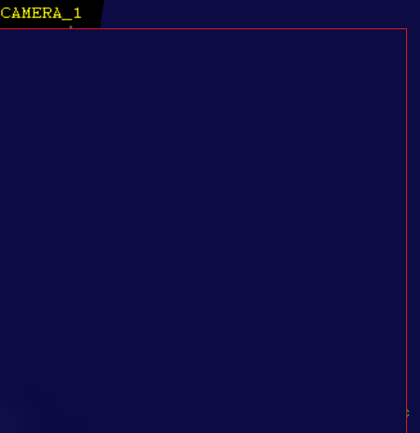

图 37-3 相机视窗

 

### 3.添加船只

在3颗卫星的降交点处分别设置一艘船，位置如表 37-2所示。

 

### 4.仿真过程

点击“开始仿真”，播放仿真动画。

拍照功能启动条件：

1.相机参数中勾选了“保存图片”；

2.双击相机名称，打开相机视角。此时才会根据设定的拍照间隔保存图片、显示轨迹。

相机所拍摄的图像将存储在安装目录\scenes\场景名\Output \OutputScreen\SAT_1(2,3)中。

 

## 三、结果分析

### 1.仿真结果

3颗卫星的拍摄结果如图 37-4、图 37-5、图 37-6所示。

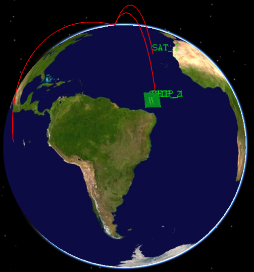 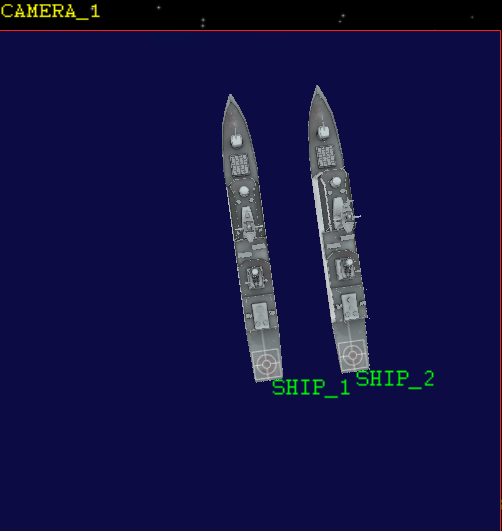

图 37-4 SAT_1拍摄结果

 

 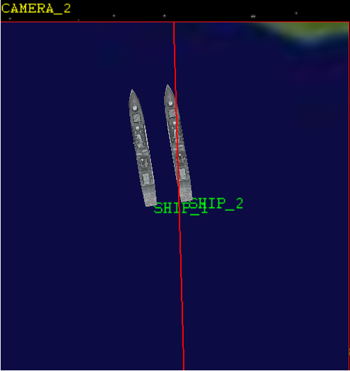

图 37-5 SAT_2拍摄结果

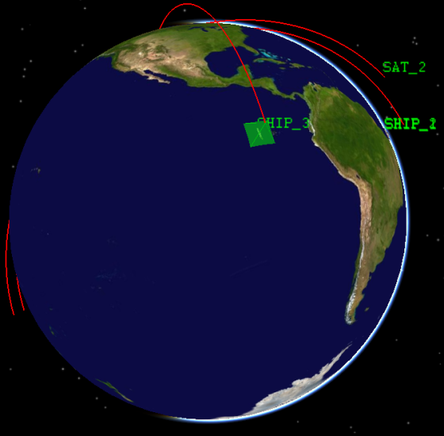 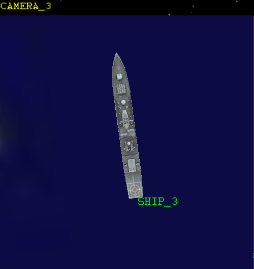

图 37-6 SAT_3拍摄结果

 

### 2.仿真分析

在相同视场角下，高轨道卫星拍摄的幅宽更大（SAT_2），SAT_1和SAT_2在相同光照条件下成像，与SAT_3不同，目前软件还不具备在照片中显示光影的功能，有待后续添加。

# 案例38 遥感卫星成像控制仿真

## 一、任务要求

### 1.实验目的

（1）熟悉SpaceSim中卫星相机指定角度拍摄的设置方式以及跟踪成像的设置方式。

（2）了解卫星侧视成像、顺轨成像、跟踪成像的成像特点与应用领域。

 

### 2.实验内容

场景中存在3颗卫星，其轨道参数如表 38-1所示。

表 38-1 卫星轨道参数

| 名称          | SAT_2  | SAT_3  | SAT_4  |
| ------------- | ------ | ------ | ------ |
| 半长轴(km)    | 7171.3 | 7171.3 | 7171.3 |
| 偏心率        | 0      | 0      | 0      |
| 轨道倾角(°)   | 98     | 0      | 60     |
| 升交点赤经(°) | 0      | -30    | -60    |
| 近地点幅角(°) | 0      | 0      | 0      |
| 平近点角(°)   | 0      | 0      | 40     |

 

其中，SAT_2配备追踪相机，用于跟踪运动中的飞机；SAT_3配备顺轨相机，用于观测运行路线的前方；SAT_4配备侧视相机，用于观察卫星侧向。

为了更直观地观察卫星的成像效果，在地面添加若干地面站和船只，具体位置如表 38-2所示。

表 38-2 地面观测目标

| 名称 | STATION_1 | STATION_2 | STATION_3 | SHIP_1 |
| ---- | --------- | --------- | --------- | ------ |
| 经度 | 90        | 120       | 30        | 150    |
| 纬度 | 55        | 52        | 15        | 40     |

 

在SpaceSim中完成3颗卫星各自的成像任务。

 

### 3.预期结果

SAT_1为追踪成像，其视场中应当始终有飞机的影像；SAT_2为前视视角，SAT_3为侧向视角，当其掠过地面目标时，观测相机应当能够捕捉到相关影像。

 

## 二、操作步骤

（参见案例“Demo_0803_RS_ImageCtrl”）

 

### 1.新建场景

打开SpaceSim，点击“新建场景”，输入场景名称。由于需要采用相机拍摄，故仿真步长应当极可能小，设置为1s，点击“OK”完成。

 

### 2.添加飞机

在场景中添加1颗卫星，进入卫星设置界面。轨道数据文件后面选择“飞机”，轨道数据文件路径如图 38-1所示，

图 38-1 飞机设置

在卫星设置界面，勾选“轨道数据文件”，在后方的选项栏中，选择飞行器类型为“飞机”，完成后点击“加载文件”，进入SpaceSim的安装目录，进入下列文件夹：

..\SpaceSim\scenes\Demo_0803_RS_ImageCtrl，找到轨道数据文件Airplane1.txt，点击“打开”选中文件。

选择完轨道数据文件后，点击上方“模型显示参数”，修改卫星名称为Airplane，并勾选“二维视窗显示经纬度”。

 

### 3.添加遥感卫星

在场景中添加3颗卫星，轨道参数如表 38-1所示。

为SAT_2添加相机，在“相机观测任务”中，勾选“是否自动执行自动观测指令”，在上方场景列表中，将Airplane添加至观测目标列表中，如图 38-2所示。完成后将观测开始和结束时间修改至与仿真时间一致。

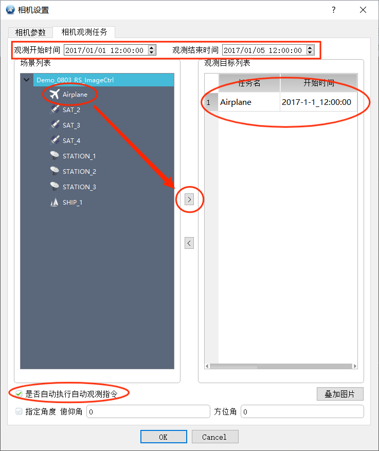

图 38-2 追踪观测

 

为SAT_3，SAT_4添加相机，在“相机观测任务”中，勾选“指定角度”，将SAT_3相机设置为：俯仰角90°，方位角0°；SAT_4相机设置为：俯仰角0°，方位角-30°。

 

### 4.添加地面目标

为使得观测结果更明显，在地面添加若干地面站和船只，具体位置如表 37-2所示。

 

### 5.仿真过程

点击“开始仿真”，播放仿真动画。在仿真中可随时打开各相机的观测窗口，查看相机的拍摄情况。

 

## 三、结果分析

### 1.仿真结果

SAT_2追踪成像结果如图 38-3所示。

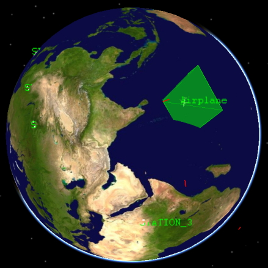 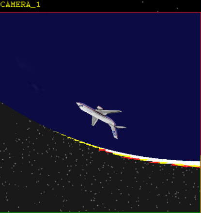

图 38-3 SAT_2追踪成像结果

 

SAT_3顺轨成像结果如图 38-4所示。

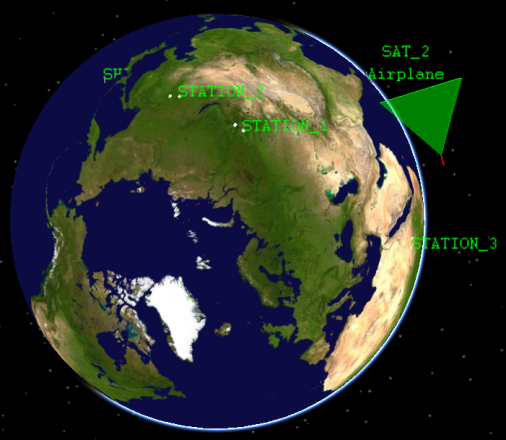 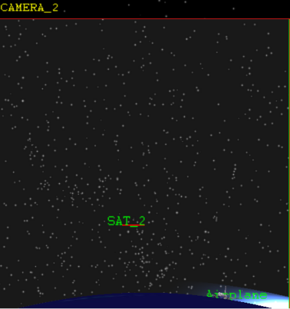

图 38-4 SAT_3顺轨成像结果

 

SAT_4侧视成像结果如图 38-5、图 38-6所示。

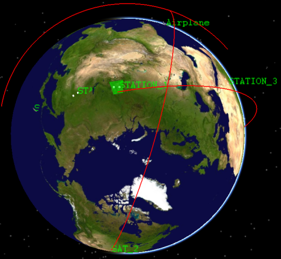 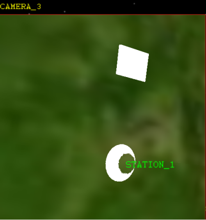

图 38-5 SAT_4侧视对地面站成像

 

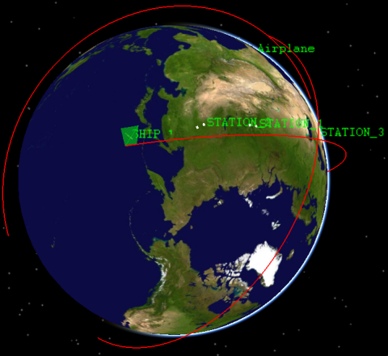 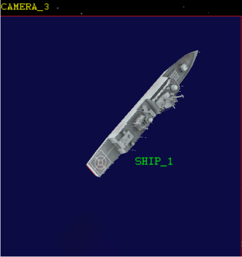

图 38-6 SAT_4侧视对船成像

 

### 2.仿真分析

在本次仿真中，3颗卫星都顺利地完成了各自的成像任务。

# 案例39 侦察与跟踪仿真

## 一、任务要求

### 1.实验目的

（1）熟悉SpaceSim利用侦察指令实现卫星对特定目标的发现与跟踪。

（2）了解卫星侦察目标并跟踪目标的原理。

 

### 2.实验内容

轨道上存在1颗侦察卫星，现使用该卫星探测和侦察海面上的一艘船，并使卫星在侦测到船后始终保持对船的跟踪。

侦察卫星轨道参数如下：

半长轴：17166.3 km

偏心率：0

倾角：60°

升交点赤经：-70°

近地点幅角：0°

平近点角：-30°

 

### 3.预期结果

当船进入侦察卫星的侦察范围后，卫星应当迅速捕捉到船的位置，将船调整至视野中央，并进行长时间跟踪观察，预期结果如图 39-1所示。

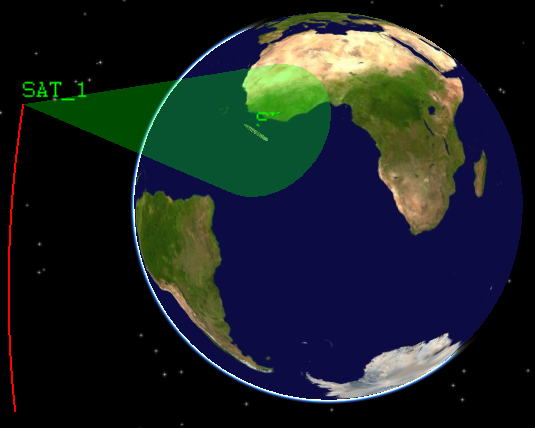 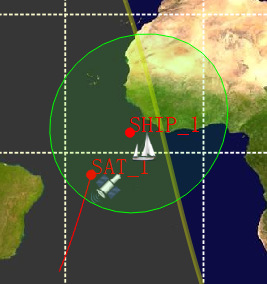

图 39-1 侦察卫星捕捉目标

 

## 二、操作步骤

（参见案例“Demo_0804_RS_Inspect”）

 

### 1.新建场景

打开SpaceSim，点击“新建场景”，输入场景名称。

### 2.设置卫星参数

在场景中添加1颗卫星，默认命名为SAT_1，轨道参数见“实验内容”部分。

 

### 3.添加天线

为SAT_1添加锥角为20°的圆锥波束天线。

 

### 4.添加侦察目标

在场景中添加1艘船，进入船舶设置界面，如图 39-2所示。

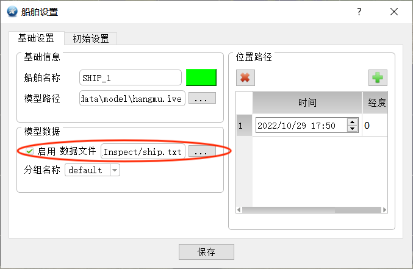

图 39-2 船舶设置

 

在“模型数据”板块中，勾选“启用数据文件”，点击进入SpaceSim的安装目录，进入下列文件夹：

..\SpaceSim\scenes\Demo_0804_RS_Inspect，找到船舶数据文件ship.txt，点击“打开”选中文件。

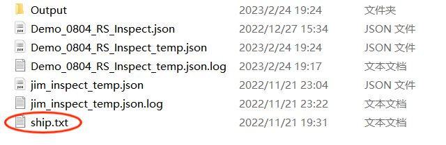

图 39-3 船舶数据文件

 

### 5.添加任务指令

打开指令窗口，添加任务命令。

选择“天线侦察”指令，装备名选择“SAT_1.ANTENNA_1”（即SAT_1天线），指令参数“SHIP_1”（侦察对象）

### 6.仿真过程

点击“开始仿真”，播放仿真动画。在仿真过程中，注意观察侦察卫星天线覆盖情况的变化。

 

## 三、结果分析

### 1.仿真结果

运行过程中，当船出现在侦察卫星天线的覆盖范围中时，侦察卫星将迅速锁定目标，并调整天线指向使得船位于天线覆盖中心，如图 39-4所示。

 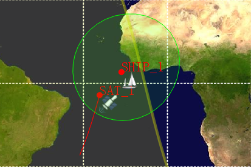

图 39-4 侦察锁定目标

 

随后，卫星和船继续运行，此时卫星天线指向将始终跟随船移动，完成对船舶的追踪，如图 39-5所示。

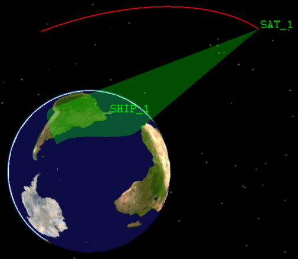 

图 39-5 追踪目标

 

### 2.仿真分析

仿真中，侦察卫星顺利完成对目标船只的侦察、锁定和跟踪任务。

 

# 案例40 天基观测目标仿真

## 一、任务要求

### 1.实验目的

（1）熟悉SpaceSim中天基观测的设置方式以及图片叠加功能。

（2）了解天基观测与天基定轨的原理。

 

### 2.实验内容

使用低轨卫星观测高轨卫星，为高轨卫星的天基定轨提供参数。

两颗卫星的轨道参数如表 40-1所示。

表 40-1 卫星轨道参数

| 名称            | SAT_1(低轨) | SAT_2(高轨) |
| --------------- | ----------- | ----------- |
| 半长轴(km)      | 7166.3      | 7378.14     |
| 偏心率          | 0.005       | 0           |
| 轨道倾角(°)     | 15          | 12          |
| 升交点赤经(°)   | 0           | 0           |
| 近地点幅角(°)   | 0           | 0           |
| 平(真)近点角(°) | 0           | 0           |

 

### 3.预期结果

如图 40-1所示，在仿真中，低轨卫星上的相机应完成对高轨卫星的连续拍摄，从而实现天基定轨。

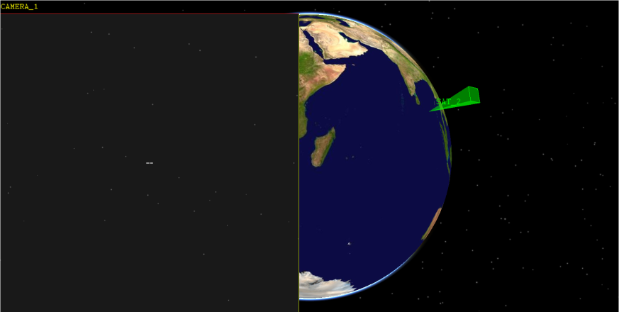

图 40-1 天基观测预期结果

 

## 二、操作步骤

（参见案例“Demo_0805_RS_SpaceObserve”）

 

### 1.新建场景

打开SpaceSim，点击“新建场景”，输入场景名称。由于需要采用相机拍摄，故仿真步长应当极可能小，设置为1s，点击“OK”完成。

 

### 2.设置卫星参数

在场景中添加2颗卫星，默认命名为SAT_1，SAT_2。

设置2颗卫星的轨道参数，详细参数如表 40-1所示。

 

### 3.添加相机

为SAT_1添加遥感相机，在“相机观测任务”中，勾选“指定角度”，将相机的俯仰角设置为180°，方位角0°，以实现天基观测，如图 40-2所示。

图 40-2 指定相机角度

 相机参数-相机视场参数中，俯仰视场为15度，方位视场为15度，俯仰分辨率400像素，方位分辨率400像素。如图**所示：

Sat_2卫星卫星设置中，初始参数->缩放大小 设置为200 

------

将观测开始和结束时间修改至与仿真时间一致。

 

由于本次实验中，需要使用到图片叠加的功能，故需要勾选“保存图片”，如图 40-3所示。

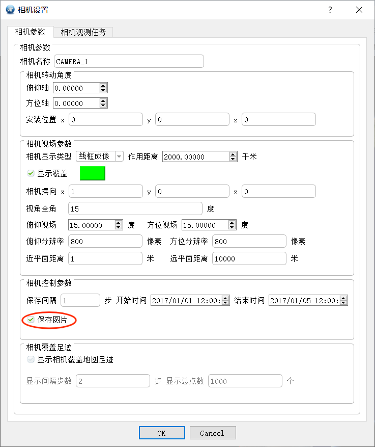

图 40-3 保存图片

 

### 4.仿真过程

点击开始仿真，播放仿真动画。在SAT_1相机观测视角中，可以观察到SAT_2卫星在缓慢运动。

当SAT_2接近相机视野边界时，点击“暂停仿真”，进入相机设置界面。在“相机观测任务”栏下，点击“叠加图片”，完成图片叠加，如图 40-4所示。

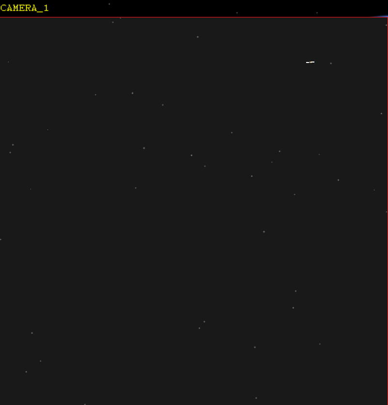 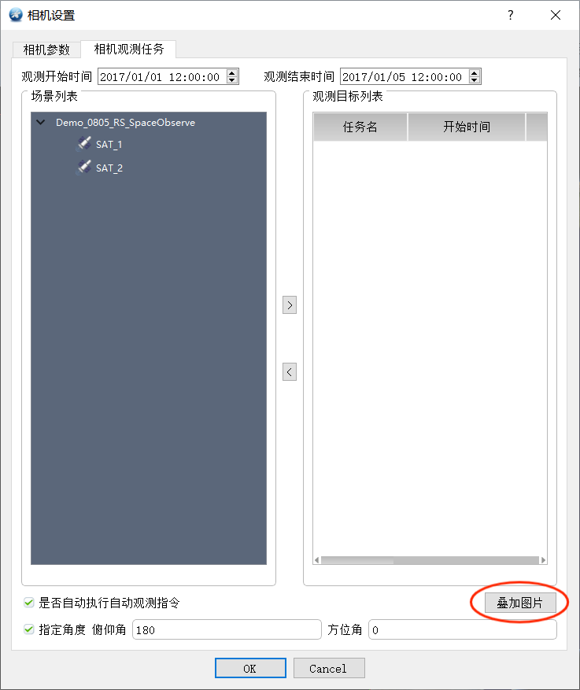

图 40-4 叠加图片

 

## 三、结果分析

### 1.仿真结果

仿真过程中生成的叠加图片如图 40-5所示。

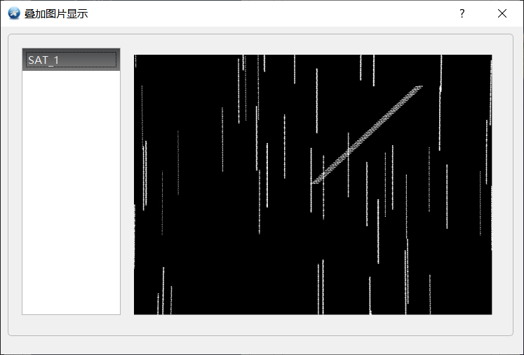

图 40-5 图片叠加结果

 

### 2.仿真分析

在实际天基观测中，通过如图 40-5所示的叠加图片经过具体计算可从中获得SAT_2卫星相关的轨道参数信息，称为天基定轨。

 

 

# 指令列表

 

 

 
